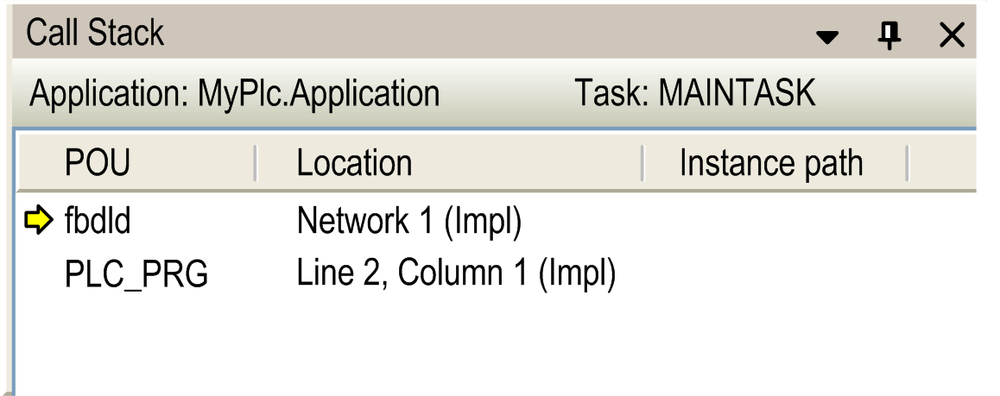

# Call Stack

## Overview

The View > Call Stack command opens the Call Stack view. When you are stepping through a program in online mode, this view indicates the currently reached step position with its complete call path.

The Call Stack view displays the name of the currently concerned Application and the name of the Task controlling the currently reached POU below the title bar.

The call stack is displayed as a list of positions, each described by POU name, Location and - in case of instances - with the Instance path. Depending on the editor, the location is described by the line and column numbers (text editor) or by the network or element numbers (graphic editors).

The first line in this list, indicated with a yellow arrow, describes the current step position. If this position is within a POU which is called by another POU, the position of the call will be described in the next line. If this POU again is called by another POU, the call position follows in the third line, and so on.

The Call Stack view is also available in offline mode or during normal online run. In this case,the position which was last viewed during an online stepping session will still be displayed, but in grayed letters.

Call Stack view, current position fbdld, called by PLC\_PRG

In contrast to this Call Stack view, the Call Tree [view](D-SE-0083923.html#D-SE-0083923) provides information on the calls of a POU even before compiling the application.

EIO0000002860.10