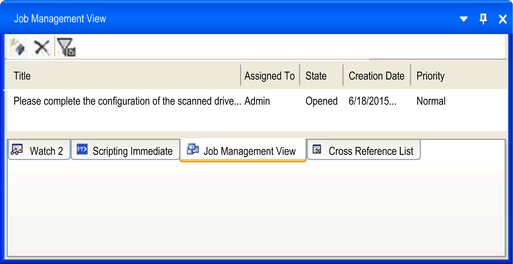
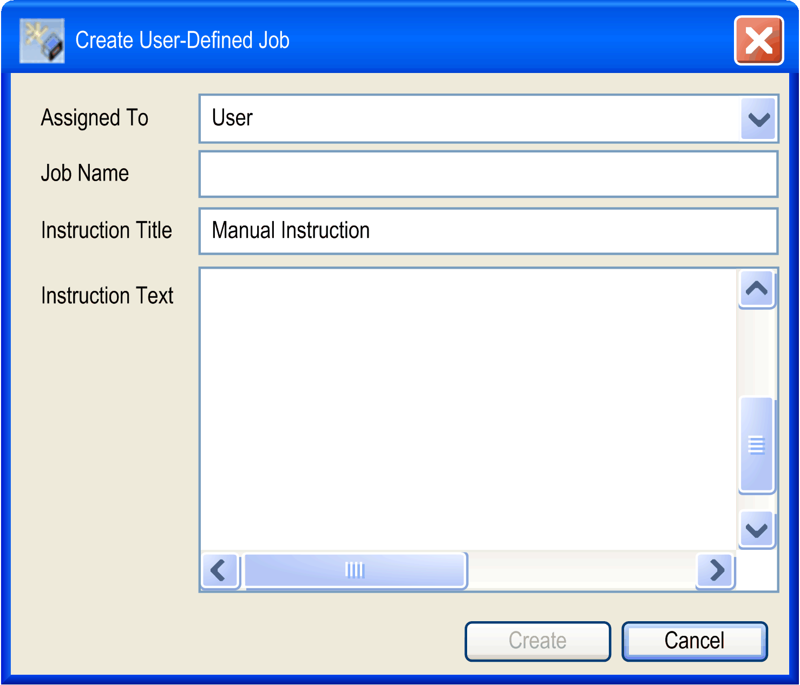
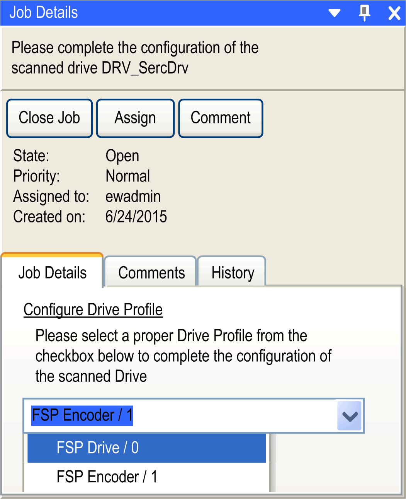

# Job List / Job Management View

## Overview

Use the View → Job List command to open the Job Management View in the bottom part of the EcoStruxure Machine Expert window.

NOTE: If the command Job List is not displayed in the View window, open the Tools → Options → [**Job Management**](D-SE-0084049.html#D-SE-0084049) dialog box and select the option Enable Job Management Feature.

## General Information

The Job Management automatically creates [jobs](#D-SE-0083930__D-SE-0083930.11) (tasks) and also allows you to create jobs manually.

The Job Management View:

* Provides an overview of jobs you need to perform or complete. You can assign these jobs to another user.
* Can be used as a to-do list and provides a history for tracking the creation or completion of jobs.
* Shows both the automatically and manually created jobs.

## Presentation of the Job Management View

The Job Management View shows both the automatically and manually created jobs.

The jobs are created by the Logic Builder in some [cases](#D-SE-0083930__D-SE-0083930.14).

The automatically created jobs include actions, such as:

* Opening an object editor
* Executing commands
* Opening the online help
* Perform custom actions such as device configuration

| Element | Description |
| --- | --- |
|  | [Creates a job](#D-SE-0083930__D-SE-0083930.10). |
|  | Deletes the selected job. |
|  | Hides closed jobs. |
| Title | Displays a short description of the job (task). |
| Assigned To | The name of the user the job is assigned to. |
| State | The job states:   * Open * InProgress * Closed   When a job has been created, the state is automatically set to Open.  As soon as the job is opened in Job Details dialog, the state is set to InProgress. |
| Creation Date | Indicates the creation date of the job. |
| Priority | Indicates the job priority in order of their importance:   * High * Normal * Low   The priority is assigned automatically and cannot be changed.   * Automatic jobs: the priority is assigned by the system. * Manual job creation: the priority is set to normal by the system. |
| Sort up, Sort down or Delete filter | Click the column header to set a filter, for example for State, and sort the Job Management View list. |

## Manual Job Creation: Create a User-Defined Job

To create a job, click the button  . The Create User-Defined Job dialog box opens:

Select the name of the user the job is to be assigned to, enter a Job Name, an Instruction Title and add a detailed Instruction Text.

## Job Details

Double-click a job in the Job Management View to open the Job Details dialog box on the right part of the window. The Job Details dialog displays the Job Name and the instructions.

| Element | Description |
| --- | --- |
| Close Job and Reopen button | Closes a job and reopens it.  The History tab shows these job modifications by listing the Old State and the New State. |
| Assign button | Assigns a job to another user. Click this button to open a list, where you can select or enter the name of the user to assign the job to. |
| Comment button | Opens a text field for comments. |
| Job Details tab | Provides a description of what you need to do within the context of the job, along with the means to do so. For example, as indicated above, the selection and setting of a Drive Profile. |
| Comments tab | Shows the comments that have been added. |
| History tab | Shows the history of the recorded actions. |

## Cases of Automatic Job Creation

The following four cases provide examples for the automatic job creation:

* Case 1: [User-defined motion profiles in SVN controlled projects](#D-SE-0083930__D-SE-0083930.11)
* Case 2: [Automatic job creation via device addressing](#D-SE-0083930__D-SE-0083930.9)
* Case 3: [Converting Vijeo-Designer HMI devices](#D-SE-0083930__D-SE-0083930.12).
* Case 4: [Update of the Sercos Master node](#D-SE-0083930__D-SE-0083930.13)

## Automatic Job Creation - User-Defined Motion Profiles in SVN Controlled Projects

In this example two programmers, **User A** and **User B**, work through SVN on the same project.

Example for case 1, actions of **User A**:

| Step | Action |
| --- | --- |
| 1 | In this example, you have imported a user-defined profile, as displayed in the POUs tree. |
| 2 | Start an upload of your modified project to the SVN server to share it with **User B**. To do this, open the menu Project → Subversion →Commit Project... |
| 3 | The Commit dialog opens showing the modifications: |

Example for case 1, actions of **user B**:

| Step | Action |
| --- | --- |
| 1 | Right-click the Application node in the Devices tree and select Subversion → Update.  NOTE: The node CamDiagram is displayed under the node Application. However, the whole project is to be updated. Result:The Job Management View shows the corresponding job: Resolve Project inconsistency by performing further SVN updates with the Priority set to High. |
| 2 | In the Job Details dialog, click the Execute Activity button.  Result: The activity is executed automatically and the job has the state Closed. |

## Automatic Job Creation With Device Addressing

The following case describes how a job is created automatically as a result of unconfigured device objects and viewed in the Job Management View:

| Step | Action |
| --- | --- |
| 1 | Double-click the node Device Addressing in the Devices tree. |
| 2 | In the tab Device Addressing, click the button Start SERCOS scan. |
| 3 | If the Sercos scan detects devices, that are not yet configured, a dialog box appears. It prompts you to confirm that devices that have not been configured. |
| 4 | If you click Yes, the corresponding object is added to the Devices tree. If there is more than one device object that matches that which is found in the Sercos scan, then a job will also be added in the Job Management View with associated actions to choose the device object type that you can treat at a later time. |

## Automatic Job Creation - Converting Vijeo-Designer HMI Devices

If you have converted an HMI in your project to a project of a lower resolution, you have to adapt the screens and icons in Vijeo-Designer manually.

The corresponding job is created automatically, indicating that you have to adapt your Vijeo-Designer content.

| Step | Action |
| --- | --- |
| 1 | In the Job Details dialog, click the Execute Activity button.  Result: The Vijeo-Designer opens automatically. |
| 2 | Adapt your Vijeo-Designer object to the new screen resolution. |
| 3 | Save your project and return to the Logic Builder. |
| 4 | Click the Close Job button in the Job Details dialog. |

## Automatic Job Creation - SVN Update of the Sercos Master Node

You have the information that another user has added a Safety Logic Controller (SLC) under the Sercos Master node in the Devices tree of the Logic Builder.

| Step | Action |
| --- | --- |
| 1 | Right-click the Sercos Master node and select Update Device... from the contextual menu.  Result: A node for the SLC is created under the Sercos Master node. However, this is not sufficient because the SoSafe container for the SLC is still missing in the container. |
| 2 | Click Execute Activity to update the whole project to the latest SVN revision. |
| 3 | When your project has been updated, right-click the SLC node and select Open SoSafe. |

EIO0000002860.10