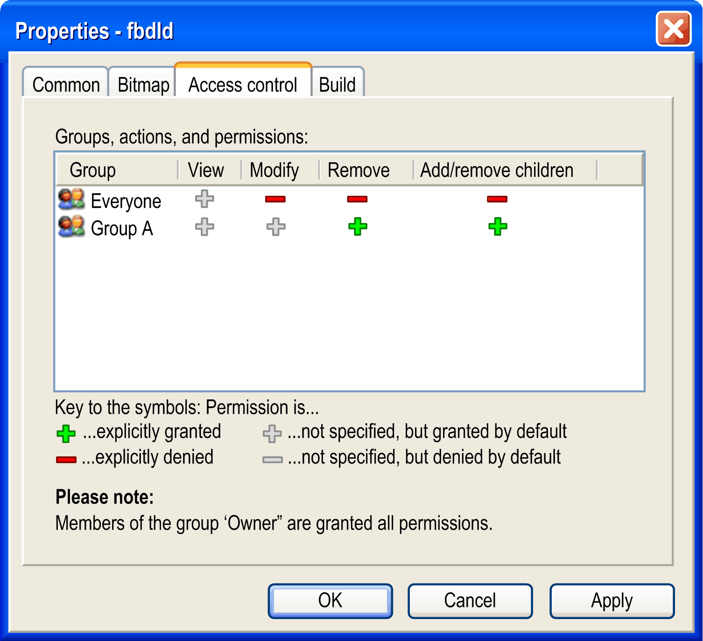
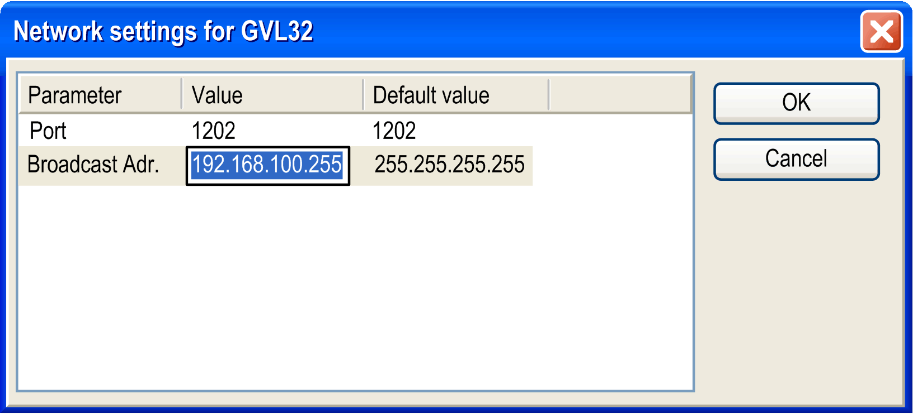

# Properties...

## Overview

The View > Properties... command opens the Properties dialog box. The properties of the selected object in the Devices tree, Applications tree, or Tools tree is displayed on various tabs, the availability of which depends on the type of the selected object.

| Properties Tab | Description |
| --- | --- |
| [**Common**](#D-SE-0083921__D-SE-0083921.3) | Information on the object. |
| [**Information**](#D-SE-0083921__Information-D0C672F3) | For application-specific properties. |
| [**Boot Application**](#D-SE-0083921__D-SE-0083921.4) | Device-dependent available settings concerning the boot application. |
| [**Security**](#D-SE-0083921__D-SE-0083921.25) | For the encryption of downloads, online changes, and boot applications. |
| [**Bitmap**](#D-SE-0083921__D-SE-0083921.5) | For characterizing objects by bitmaps. |
| [**External File**](#D-SE-0083921__D-SE-0083921.7) | For an object added as external file. |
| [**Target memory settings**](#D-SE-0083921__D-SE-0083921.18) | These settings for an application overwrite the default memory size definitions for inputs, outputs, and memory locations on the target controller. |
| [**Options (controller)**](#D-SE-0083921__D-SE-0083921.19) | Options of the controller. |
| [**Monitoring**](#D-SE-0083921__D-SE-0083921.24) | For SFC transition objects. |
| [**Application Build Options**](#D-SE-0083921__D-SE-0083921.6) | Memory allocation on the controller, generating application information, and encryption for the application. |
| [**Access Control**](#D-SE-0083921__D-SE-0083921.8) | User access to the object. |
| [**Build**](#D-SE-0083921__D-SE-0083921.10) | Exclude from build, Enable system call, External implementation, Link always, Compiler defines. |
| [**Network Variables**](#D-SE-0083921__D-SE-0083921.11) | For global variable list read from an external file. |
| [**Network Settings**](#D-SE-0083921__D-SE-0083921.12) | For global network variable list. |
| [**CFC Execution Order**](#D-SE-0083921__D-SE-0083921.26) | Execution order for CFC objects. |
| [**SFC Settings**](#D-SE-0083921__D-SE-0083921.13) | Flags for SFC. |
| [**Link to File**](#D-SE-0083921__D-SE-0083921.14) | For global variable lists, export and import. |
| [**CAM**](#D-SE-0083921__D-SE-0083921.21) | For Cam objects. |
| CNC | Properties of a CNC object. |
| [**Documentation**](#D-SE-0083921__D-SE-0083921.16) | Documentation for folder. |
| [**Text list**](#D-SE-0083921__D-SE-0083921.22) | For text lists |
| [**Image pool**](#D-SE-0083921__D-SE-0083921.23) | For image pools |

## Common

Provides information on the object:

|  |  |
| --- | --- |
| Full name | Object name as used in the tree views (Devices tree, Applications tree, or Tools tree). |
| Object type | Type of the object (for example, POU, Application, Interface and so on). |
| Open with | Type of the editor which is used to edit the object. |

## Information

Provides application-specific properties:

|  |  |
| --- | --- |
| Author | Author of the application. |
| Version | Version of the application, for example, `0.0.0.1`. |
| Description | Description of the application. |
| Reset to Values from Project Information button | Click the button to reset the values to the values from the [Project Information](../../../../../api/crossBook?lang=en-US&virtualBookName=SoMMenu&topicID=D_SE_0083944). |

## Boot Application

It depends on the device whether these settings are available:

|  |  |
| --- | --- |
| Implicit boot application on download | If activated, at a download of the project automatically a boot application will be created. |
| Implicit boot application on Online Change | If activated, at an online change automatically a boot application will be created. |
| Remind boot application on project close | If activated, when closing the project you will be asked whether the boot application should be updated/created. |
| Verify boot application after creation | If activated, each boot application that is created is automatically verified for correctness. |

## Security

The Security tab contains the properties of the application for the encryption of downloads, online changes, and boot applications.

|  |  |
| --- | --- |
| Encryption Technology section: | NOTE: If the option Enforce encryption of downloads, online changes and boot applications is selected in the User tab of the Security Screen [editor](D-SE-0099371.html#D-SE-0099371), the option Encryption Technology is set to Encryption with certificates and cannot be modified in this tab. This function is not available for all supported controllers. Consult the *Programming Guide* specific to your controller for further information. |
| No Encryption | The application is not encrypted. |
| Simple Encryption | To download the boot application to the controller, you must connect the defined dongle (license key) to the computer.  The Firm Code is displayed. Enter the Product Code you received from Schneider Electric. |
| Encryption with license management | To download the boot application to the controller, you must enter the Firm Code and the Product Code as configured here. Furthermore, the dongles must be connected to both the development computer and the controller, respectively. |
| Encryption with certificates | This option is selected and cannot be modified in this dialog box if the option Enforce encryption of downloads, online changes and boot applications is selected in the User tab of the Security Screen [editor](D-SE-0099371.html#D-SE-0099371).  To download the boot application to the controller, a valid certificate must be available.  Additionally, you can select the option Digitally sign application code from the Certificates section. |
| Sign with certificate | To download the application code to the controller it must be signed with a valid certificate. Encryption is not required. |
| Certificates section | |
|  | Click the icon to open the Certificate Selection dialog box. Select certificates of controllers that you have installed previously and that are stored in the local Windows certificate store.  If the certificates of your controller are not available in the directory, then they must be loaded from the controller and installed to the directory. For information on handling controller certificates, refer to the [*How To Manage Certificates on the Controller User Guide*](../../../../../api/crossBook?lang=en-US&virtualBookName=HowMgCer&topicID=D_SE_0095876). |
| Digitally sign application code | If this option is selected, the application is signed with a digital signature. The certificate for the Digital signature is specified in the User tab of the Security Screen [editor](D-SE-0099371.html#D-SE-0099371). |
| Area for displaying the selected certificates with corresponding information | Information provided per certificate:   * Issued for * Issued by * Valid from * Valid until * Thumbprint |

## Bitmap

In the Bitmap tab, you can associate a bitmap to the current object or remove a currently associated bitmap. The bitmap is used in the graphical display of the object in the [**Library Manager**](../../../../../api/crossBook?lang=en-US&virtualBookName=SoLibref&topicID=D_SE_0081233) and in the [toolbox](../../../../../api/crossBook?lang=en-US&virtualBookName=SoMProg&topicID=D_SE_0083473) of the FBD/LD/IL editor. For specifying the transparency of the bitmap, you can activate the option Render pixels of this color transparently and with a mouse-click on the color rectangle select the color to be made transparent.

|  |  |
| --- | --- |
| Render pixels of this color transparently | Specifies the transparency color of the bitmap. |

## Application Build Options

Consult the *Programming Guide* specific to your controller for whether the following options are available on your controller.

These settings define whether during compilation some information on the [application](../../../../../api/crossBook?lang=en-US&virtualBookName=SoMProg&topicID=D_SE_0083435) content is downloaded, how the memory will be allocated on the controller and whether and how the application gets encrypted.

|  |  |
| --- | --- |
| Download Application Info | If this option is activated, information on the content of the application is downloaded to the controller: As a precondition, the compiler version must be ≥ 3.5.0.0 and the runtime version ≥ 3.5.0.0. An implicitly generated variable <devicename>.App.\_\_ApplicationInfoVariables.appContent stores information and checksums concerning the number of POUs, data, and memory locations. This allows checking for differences between the current project and the downloaded project. The content information is visible by clicking the Content button in the Applications [view](../../../../../api/crossBook?lang=en-US&virtualBookName=SoMProg&topicID=D_SE_0083388) of the device editor as well as in the message box which appears when you are going to download an application different to that already available on the controller. |
| Stop parent application in case of exception | This function is not supported and therefore not available for selection. |
| Dynamic memory settings | |
| Use dynamic memory allocation | Activate this option to allocate memory dynamically for the application, for example, when using the [\_\_NEW](../../../../../api/crossBook?lang=en-US&virtualBookName=SoMProg&topicID=D_SE_0083755) operator. In this case, enter the desired Maximum size of memory (bytes).  NOTE: The complete memory is not available for dynamic object creation. A part of it is used for system management. The maximum admissible value for the parameter Maximum size of memory (bytes) depends on the individual controller (PacDrive LMC Eco, PacDrive LMC Pro, PacDrive LMC Pro2) as they incorporate different sizes of random access memory, and on the size of the present application. If the threshold value is exceeded, download operations will not be executed successfully. |

## Target Memory Settings

These settings for an application overwrite the device-specific memory size definitions for inputs, outputs, and memory locations:

|  |  |
| --- | --- |
| Override target memory settings | The maximum data sizes for the input, output, and memory location memory, defined by the target device, is overridden by the sizes defined below. |
| Input size [bytes] | Memory space for variables assigned to input addresses of the target device.  Declaration `AT %I`. |
| Output size [bytes] | Memory space for variables assigned to output addresses of the target device.  Declaration `AT %Q`. |
| Memory size [bytes] | Memory space for variables assigned to memory location addresses of the target device.  Declaration `AT %M`. |

NOTE: Whether these settings are available depends on the controller. For more information, refer to the Programming Guide of your controller.

## Options (Controller)

The Options (controller) tab is available in the properties of a selected application. The content depends on the device.

This function is not available for all supported controllers. Consult the *Programming Guide* specific to your controller.

|  |  |
| --- | --- |
| Monitoring interval (ms) | Specifies the time interval for the monitoring (10 ms...1000 ms). |

The Interactive Login Mode helps to avoid an unintended login to a different controller.

|  |  |
| --- | --- |
| None | No interaction with the user while login. Corresponds to the behavior of earlier versions. |
| Enter ID | While login, the user is prompted to enter an ID. The ID is stored in the controller. A valid ID is necessary to login.  While login a second time, the user is not asked again for the ID if the computer name, the user name, the device name, and the device address has not changed. The information is stored in the project options. |
| Press key | While login, a dialog box appears prompting the user to press a key on the controller. The timeout for this action is defined in the device description. |

|  |  |
| --- | --- |
| Symbol configuration | By default, this option is not activated. Consistent access by the system is not always available.  Activate the option Access variables in sync with IEC tasks to allow symbolic clients (for example, visualizations or database connections based on the PLCHandler) a consistent read and write access that is synchronized with the IEC tasks. Also refer to the *Additional Information on the Option* Configure synchronisation with IEC tasks... in the [Programming Guide](../../../../../api/crossBook?lang=en-US&virtualBookName=SoMProg&topicID=D_SE_0083586).  In order for the setting to take effect, the applications and boot applications must be downloaded to the controller. |

## Monitoring

The Monitoring tab allows you to configure the monitoring of transitions in SFC.

|  |  |
| --- | --- |
| Enable monitoring | If the Enable monitoring option is activated, the variable is assigned when the application calls the transition. The last value that has been stored for the variable is displayed in the monitoring. |
| Monitoring using call | If the Monitoring using call option is activated, the transition to be monitored is read by directly calling the transition.  NOTE: When you activate this option, be aware that additional operations may have been implemented in the transition and would be executed. |

## External File

The External File tab allows you to view and edit the properties of an external file. The properties were defined when the object was created. Also refer to the Add External File [dialog box](../../../../../api/crossBook?lang=en-US&virtualBookName=SoMProg&topicID=D_SE_0083431).

To apply the settings for the external file object, click the OK button.

Elements of the File Handling section:

| Element | Description |
| --- | --- |
| Remember the link | The file is accessible from the project as long as it is not removed from the folder where it is stored. |
| Remember the link and embed into project | In addition to the link to the folder location, an internal copy of the file is saved with the project. The option for updating the file is available as long as the external file is available at the defined folder. When the source file is removed from the folder, the copy of the file saved with the project is used. |
| Embed into project | A copy of the file is saved with the project. The link to the external source file is not preserved. When you open the external file (using the Edit > Object command), a temporary file is created for editing. |

The elements of the When the external file changes, then section are only available if the option Remember the link and embed into project is selected:

| Element | Description |
| --- | --- |
| Reload the file automatically | If the external file is modified, the file in the project is updated. |
| Prompt whether to reload the file | If the external file is modified, a dialog box is displayed requesting you to decide whether the file in the project is to be updated. |
| Do nothing | The file in the project remains unchanged, even if the external file is modified. |

The elements of the Linked File section are only available if either the option Remember the link or Remember the link and embed into project is selected:

| Element | Description |
| --- | --- |
| Name, Location, Size, Changed | Provides information about the external file. |
| Display File Properties button | Opens the Properties of <file name> dialog box, identical to the Windows dialog box that opens upon right-clicking a file. |

Elements of the Embedded File section:

| Element | Description |
| --- | --- |
| Size, Changed | Provides information about the external file. |
| Update the embedded file option | If selected, the file embedded in the project is updated if the external file located at the specified folder is modified. |

Elements of the Online handling section:

| Element | Description |
| --- | --- |
| Transfer with Download/Online Change | If selected, the external file is stored in the folder specified with Target path (relative to "$PlcLogic$" on the device) after download / online change.  NOTE: `$PlcLogic$` is a placeholder for the folder on the controller that contains the application.  NOTE: External files that are inserted in the Global node of the Applications Tree or Tools Tree are transferred to all controllers in the project during the download. This option has no effect on external files in libraries. These files are not transferred. |
| Target path (relative to "$PlcLogic$" on the device) | You can specify the target path as follows:   * For the `$PlcLogic$` root directory: Leave the input field blank. * Folder of the application (below `$PlcLogic$`)  Example for the "App123" application: `App123` * Nested folder structure below the application folder  Example: `App123/Sub01/SubSub01` * Using another available placeholder  Example for the visualization: `$visu$`   NOTE: The paths are case-sensitive.  NOTE: `$PlcLogic$` is a placeholder for the folder on the controller that contains the application. |

## Access Control

The Access Control tab allows you to configure the access rights on the current object for the available user groups. This corresponds to the configuration with the Permissions [dialog box](D-SE-0083975.html#D-SE-0083975) which is available in the Project > User Management menu.



To edit the right for a certain action and group, select the respective field in the table, click or press SPACE to open the selection list, and choose the desired right.

For a description on possible actions, rights and the symbols refer to the [**Permissions...** dialog box](D-SE-0083978.html#D-SE-0083978).

## Build

Concerning the compilation ([**Build**](D-SE-0083980.html#D-SE-0083980)), you can activate the following options:

|  |  |
| --- | --- |
| Exclude from build | The object and recursively its child objects will not be considered during the next Build run. The object node is displayed in green in the Devices tree or Applications tree.  NOTE: This option is not supported for safety-related devices. |
| External implementation  (Late link in the runtime system) | No code is created for this object during a compilation of the project. The object will be linked when running the project on a target, if it is available there, for example in a library. The object names (function blocks and methods) can have a maximum length of 64 characters. The object name is extended by the string `(EXT)` in the Devices tree or Applications tree. |
| Enable system call | The ADR operator can be used with function names, program names, function block names, and method names, thus replacing the INSTANCE\_OF operator. For further information, refer to the description of [function pointers](../../../../../api/crossBook?lang=en-US&virtualBookName=SoMProg&topicID=D_SE_0083669). BUT there is no possibility to call a function pointer within EcoStruxure Machine Expert. In order to enable a system call (runtime system), you must activate the current option for the function object. |
| Link always | The object is marked for the compiler so that it is included into the compile information. As a result, objects will be compiled and downloaded to the controller. This option is relevant when the object is located below an application or is referenced using libraries inserted below an application. The variables selectable for the [symbol configuration](../../../../../api/crossBook?lang=en-US&virtualBookName=SoMProg&topicID=D_SE_0083586) use the compile information as basis. Alternatively, you can use the [pragma](../../../../../api/crossBook?lang=en-US&virtualBookName=SoMProg&topicID=D_SE_0083638) {attribute 'linkalways'} to always include an object. |
| Compiler defines | Here you can enter defines (refer to `{define}` instruction) and conditions for the compilation of this object. In chapter [**Conditional Pragmas**](../../../../../api/crossBook?lang=en-US&virtualBookName=SoMProg&topicID=D_SE_0083616), you can find a description of the available conditional pragmas. The expression `EXPT` used in those pragmas can be entered here, several entries can be entered in a comma-separated list. |

Additional compiler definitions from the device description:

|  |  |
| --- | --- |
| Defined in device | List of compiler definitions from the device description. These compiler definitions are used in the build if they are not listed in the Ignored definitions field. |
| Ignored definitions | List of compiler definitions from the device description that are not used in the build. |
| Arrow right button | Click to copy the selected compiler definition from the Defined in device field to the Ignored definitions field. |
| Arrow left button | Click to move the selected compiler definition from the Ignored definitions field to the Defined in device field. The compiler definition is used in the build. |

## Network Variables

If the network variables functionality is supported by the current device, then the network properties of a GVL (Global Variable List) object can be viewed and edited in the Properties dialog box.

Specifying network properties for a GVL means to make available the included variables as network variables. A GVL is to be defined by the sender of the network variables. The receiver must have a corresponding GNVL list. Also refer to the general description on how to use [network variables](../../../../../api/crossBook?lang=en-US&virtualBookName=NVLlib&topicID=D_SE_0083531).

|  |  |
| --- | --- |
| Network type | Choose the desired type from the target-dependent selection list.  Example: UDP for a UDP transmission system |
| Task | From the selection list, choose the task of the current application which should control the sending of the variables. The variables will be sent at the end of a task cycle. |
| List identifier | Number (ID) of the first list to be sent (default = 1).  Further lists will be numbered in ascending order. |

NOTE: The list identifier must be unique in case the exchanging devices are intended to act as sender AND receiver. This means that each device is providing GVLs as well as GNVLs.

|  |  |
| --- | --- |
| Settings | Protocol-specific settings.  The permissible entries depend on the corresponding network library. |

Network settings for a GVL



For UDP networks, define the following parameters:

|  |  |
| --- | --- |
| Port | Number of the port to be used for data exchange with the other network participants.  The Default value is 1202. The current value can be modified in the Value field (select the field and press SPACE to open the edit frame). Make sure that the other nodes in the network define the same port. If you have more than one UDP connection defined in the project, then the port number will be automatically modified in all configuration sets according to the input you made here. |

NOTE: Data exchange using network variables are not available if it is not supported by the device (target system). If a firewall blocks communication, or if another client/application has opened the same UDP (user datagram protocol) port as specified in the properties of the network variable list, the communication will be unsuccessful.

|  |  |
| --- | --- |
| Broadcast address | The default value is 255 . 255 . 255 . 255, which means, that data is exchanged with all participants in the network. The current value can be modified in the Value field (select the field and press SPACE to open the edit frame). You can enter the address or the address range of a subnetwork.  Example:  Enter 197 . 200 . 100 . 255 if you want to communicate with all nodes which have IP addresses 197 . 200 . 100 . x).  NOTE: For Win32 systems, the broadcast addresses must match the subnet mask of the TCP/IP configuration of the PC. |

The following options can be activated or deactivated for configuring the transmission behavior of the variables:

|  |  |
| --- | --- |
| Pack variables | For the transfer, the variables are bundled in packets (telegrams) whose size depends on the network. If the option is deactivated, one packet per variable will be set up. |
| Transmit checksum | A checksum will be added to each packet of variables. The checksum will be checked by the receiver to make sure that the variable definitions of the sender and the receiver are identical. A packet with a non-matching checksum will not be accepted. |
| Cyclic transmission | Variables are sent within the Interval specified after interval.  Example for time notation: T#70ms). |
| Acknowledgement | An acknowledgement message is sent back for every received data packet. If the sender does not receive an acknowledgement before sending again, an error message will be written to the diagnostic structure. |
| Transmit on change | Variables will be sent only if their values have changed. The Minimum gap can define a minimum time lapse between transfers. |
| Transmit on event | The variables will be sent as soon as the specified variable gets TRUE. |

NOTE: The network variables will be automatically sent at each boot up. This means that the actual variable values will be transmitted even if none of the other defined transmission triggers (change or event) would force this at this moment.

## Network Settings

If the network functionality is supported by the current device, then the Network settings for a GNVL (Global Network Variable List) object can be viewed and edited in the Properties dialog box. Basically these are the settings which have been defined when adding the NVL object using the Add Object dialog box. (Also refer to the general description on how to use [network variables](../../../../../api/crossBook?lang=en-US&virtualBookName=NVLlib&topicID=D_SE_0083531)).

|  |  |
| --- | --- |
| Task | Name of the task of the current device, which controls the data exchange of the network variables. |
| Sender | Here you see either the name of the global variable list of the sending device, which is referenced in the current NVL object, or Import from file. If the name is specified, the squared brackets include the name of the device and the application. In case the sender GVL is imported from a *\*.gvl* file, which previously has been exported from the respective global network variable list, the complete file path is shown here, for example: *D:\projects\pr9519\project\_xy.gvl*. |
| Import from file | In case the Sender GVL is specified with a *\*.gvl* export file, which previously has been generated from the respective global network variable list, the file path is shown here. |

## CFC Execution Order

The CFC editor allows you to position the elements and thus the networks freely. The CFC Execution Order tab allows you to select the mode of the execution order of [CFC](../../../../../api/crossBook?lang=en-US&virtualBookName=SoMProg&topicID=D_SE_0083490) objects.

Two modes are available for defining the execution order:

| Mode | Description |
| --- | --- |
| Auto Data Flow Mode | The execution order is determined by data flow. In the case of multiple networks, it is determined by their topological position in the editor.  The POUs and the outputs are internally numbered. The networks are executed from top to bottom and left to right.  The advantage of this mode is that you do not have to consider the internally managed execution order during the development process.  With the Auto Data Flow Mode selected, the following commands are available in the menu CFC > Execution Order:   * Display Execution Order [command](D-SE-0105997.html#D-SE-0105997) * Set Start of Feedback [command](D-SE-0105998.html#D-SE-0105998)   The elements in the CFC editor are displayed without markers and without numbering. You cannot modify the execution order manually. For networks with feedback you can set a starting point. |
| Explicit Execution Order Mode | This mode allows you to define the execution order manually. The elements in the CFC editor are displayed with markers and numbering.  The following commands are available in the menu CFC > Execution Order for defining the order:   * Send to Front [command](D-SE-0084085.html#D-SE-0084085) * Send to Back [command](D-SE-0084086.html#D-SE-0084086) * Move Up [command](D-SE-0084087.html#D-SE-0084087) * Move Down [command](D-SE-0084088.html#D-SE-0084088) * Set Execution Order [command](D-SE-0084091.html#D-SE-0084091) * Order by Data Flow [command](D-SE-0084089.html#D-SE-0084089) * Order by Topology [command](D-SE-0084090.html#D-SE-0084090)   This was the default behavior of CFC POUs for EcoStruxure Machine Expert V1.2 and earlier versions.  NOTE: Make sure to configure the execution order and carefully assess the consequences and impacts. The markers and numbering indicating the execution order are permanently displayed to provide you a quick access. |

Click the Apply to All CFCs button to apply the mode you selected to all CFC objects in the project.

## SFC Settings

The SFC Settings tab allows settings for the current [SFC](../../../../../api/crossBook?lang=en-US&virtualBookName=SoMProg&topicID=D_SE_0083499) object regarding compilation and flag handling only for this object. Refer to [Sequential Function Chart (SFC)](D-SE-0083954.html#D-SE-0083954), for a description of the particular settings. The settings made in the Project > Project Settings > SFC dialog box are valid for the entire project.

|  |  |
| --- | --- |
| Use defaults | Activate the check box to apply the settings made in the Project > Project Settings > SFC dialog box. |

## Link to File

A [Global Variable List - GVL](../../../../../api/crossBook?lang=en-US&virtualBookName=SoMProg&topicID=D_SE_0083428) can be defined with the help of an external file in text format. Such a file can be generated by using the export functionality provided in the Properties dialog box of the respective variable list. If the option Export before compile is activated, at each project compilation (for example, by pressing F11) a file with extension *gvl* is automatically created and stored at the path specified in the Filename field. If the option Import before compile is activated, an existing list export file can be read at each project compilation. This allows importing a GVL created from another project, for example in order to set [Network Variables](../../../../../api/crossBook?lang=en-US&virtualBookName=SoMProg&topicID=D_SE_0083530) communication.

## Cam

The Cam tab serves to specify the global settings of a cam object that is its dimensions, its period and continuity requirements and its compile format.

|  |  |
| --- | --- |
| Dimensions | |
| Master start/end position | Start and end position of the master define the set of master values and thus the scale of the horizontal axis of the cam. The default settings are thought of in arc degrees and thus adjusted to 0 and 360. |
| Slave start/end position | The associated slave positions are determined by the cam-defining mapping. The cutout displayed by the graphs, that is the scale of the vertical axis, may be specified by the minimal and maximal value of the slave display. |
| Period | These settings affect the creation of the cam in the cam editor and cam table. Depending on the parameters, the slave start position is adapted automatically if the end position is changed and vice versa. This adaption optimizes the period transition in a way that it moves consistently without jerking. |
| Continuity requirements | The check boxes Position, Velocity, Acceleration and Jerk determine whether validation of continuity is performed while editing. You can clear the check boxes for special cases (mapping consisting of linear segments only). However, the lack of continuity may lead to kinks in the position graph. |
| Compile format | During compilation, the function block `MC_CAM_REF` is created. The description of the cam segments is according to one of the following options: polynomial (XYVA), one dimensional point array or two dimensional point array. |
| polynomial (XYVA) | Polynomial description on particular points consisting of master position, slave position, slave velocity, and slave acceleration. |
| one dimensional point array | One dimensional table of slave positions. |
| two dimensional point array | Two dimensional table of related master/slave positions. |
| Elements | Number of elements in the arrays. This array has already been created in the library SM3\_Basic for the default cases 128 and 256. If you enter another value, you must create the structure in your application (refer to the following example). |

Example of an array with 720 elements:

```
TYPE SMC_CAMTable_LREAL_720_2 :
STRUCT
    Table: ARRAY[0..719] OF ARRAY[0..1] OF LREAL;
    fEditorMasterMin, fEditorMasterMax: REAL;
    fEditorSlaveMin, fEditorSlaveMax: REAL;
    fTableMasterMin, fTableMasterMax: REAL;
    fTableSlaveMin, fTableSlaveMax: REAL;
END_STRUCT
END_TYPE
```

## Documentation

The Documentation tab is available for folders to enter annotations, notes, and comments.

## Text List

|  |  |  |
| --- | --- | --- |
| Download by | | Select if and how the text list is downloaded to the controller. |
|  | Visualization | The text list is downloaded to the controller with the visualization.  For developing elements, the translation of element properties is performed by using text lists. In this case, select the option No download because these texts are not used by the application itself. |
|  | Application | By default, the text list is downloaded to the controller with the application. |
|  | No download | The text list is not downloaded to the controller. |
| Internal | | If activated, the object is only visible in the Applications tree of the current project. If the text list is part of a referenced library, it is not displayed in the Library Manager. |

## Image Pool

|  |  |
| --- | --- |
| Download only used images | In a standard case, an image pool contains images belonging to a project and an application. In this case, the option is deactivated.  If there is an image pool used for different projects, it is not useful to download all these files to the controller. In this case, the option is activated. Then only images are downloaded to the controller which are used in the application. |
| Download by visualization | If activated, the image pool is downloaded to the controller with the visualization. |
| Internal | If activated, the object is only visible in the Applications tree of the current project. If the image pool is part of a referenced library it is not displayed in the Library Manager. |
| Symbol library settings | |
| Mark library as symbol library | Symbol libraries that are installed in the repository are listed in the Symbol Libraries tab of the Project Settings > Visualization dialog box. To use the library and / or the images of the image pool in the visualization of your projects, the library has to be added to your project. The images will then be available in the ToolBox for a visualization. For more information, refer to the *Visualization* part of the online help.  If a library project is open, click this button to mark the image pool as a symbol library for use in a visualization.  This has the following effects:   * The symbol library is assigned the key `VisuSymbolLibrary = TRUE` as file property in the project information. * The library System\_VisuElems is inserted automatically as a placeholder library in the Library Manager below the Global node of the Applications tree.   Add this library to the [**Library Repository**](../../../../../api/crossBook?lang=en-US&virtualBookName=SoLibref&topicID=D_SE_0081239) by executing the File > Save Project And Save Into Library Repository [command](D-SE-0083895.html#D-SE-0083895). |
| Text list for symbol translation | Select the text list that contains the translated texts for the image pool. |

EIO0000002860.10