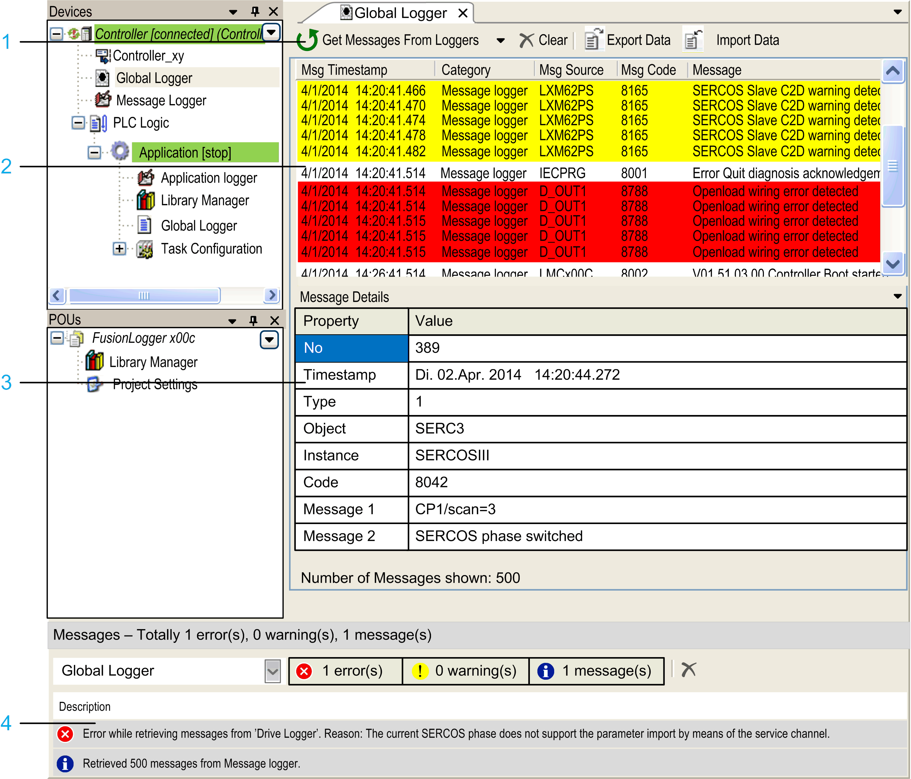

# Add Object > Global Logger...

## Overview

The Project > Add Object > Global Logger... command is available if a controller node is selected in the Devices tree. Execute the command to add one Global Logger node below the selected controller node.

Double-clicking the Global Logger node opens the Global Logger editor that displays data from various loggers of EcoStruxure Machine Expert. It allows you to view, monitor, and understand the overall state of the system and to analyze possible impacts of various events of the system components.

The global logger displays data of the following loggers:

* Application logger
* CODESYS logger
* Drive logger
* Message logger
* Safe logger

The Global Logger editor provides the following functions:

* Displaying messages of various loggers with additional information (such as time stamp, category, source).
* Filtering messages.
* Exporting and importing data to or from XML files.

## Global Logger Editor

The Global Logger editor consists of the following parts:

**1** Toolbar

**2** Logger messages list

**3** Logger messages details

**4** Messages view

## Global Logger Toolbar

The Global Logger toolbar provides the following buttons:

| Button | Description |
| --- | --- |
| Get messages from loggers | Click the button to load the messages of the supported and selected loggers.  Click the arrow right to this button to open the list of available logger sources.  When the Global Logger editor is opened for the first time, the logger messages list is empty. Click the arrow right to this button to open the list of available logger sources and select those from which you want to retrieve data.  Once selected, the Global Logger tries to retrieve data from the selected loggers. |
| Clear | Clears the logger messages list. |
| Export Data | Opens a Save as dialog box to save the messages from the Global Logger to an XML file. This also applies to messages that are filtered out. |
| Import Data | Opens a Windows Open dialog box to import messages from an XML file that had previously been exported from the Global Logger.  The import of data overwrites the content of the Global Logger. |

## Logger Messages List

The logger messages list displays information for each message.

| Information | Description |
| --- | --- |
| Msg Timestamp | Time stamp that was created by the logger when retrieving the message.  The time stamp has the format MM/DD/YYYY HH:MM:SS.mmm. |
| Category | Identifies the logger and logger adapters of the message.  A logger can have several logger adapters. The drive logger, for example, has one logger adapter for each drive. |
| Msg Source | Source of the logger message in the logger.  A logger can have different submodules that create logger messages (for example, different safety-related nodes in the Safe logger). This field displays the original name of the source. |
| Msg Code | The unique message code of each logger (except the CODESYS logger). |
| Message | Original message text as retrieved from the logger. |
| Number of Messages shown | The total number of messages that are displayed in the logger messages list (displayed at the bottom of the logger messages list). |

Definition of colors for highlighted lines in the logger messages list:

| Color | Description |
| --- | --- |
| White | Indicates an information message. |
| Yellow | Indicates an advisory message. |
| Red | Indicates an alert message. |
| Gray | Indicates a selected information message. |
| Orange | Indicates a selected advisory message. |
| Dark red | Indicates a selected alert message. |

Each logger has different levels for categorizing the messages according to the severity. The Global Logger maps the different levels to three categories in order to provide consistent information.

The following table represents the mapping of the different logger levels to the three categories of the Global Logger:

| Global logger | Application logger | CODESYS logger | Drive logger | Message logger | Safe logger |
| --- | --- | --- | --- | --- | --- |
| Information | Type 1 | Informations | Diagnostic class 1 | None  Info | Nothing  User  Action  External  Event  Status Message  Debug Message |
| Advisory | Type 2 | Warnings | Diagnostic class 2 | Warning | Warning |
| Alert | Type 3 | Errors  Exceptions | Diagnostic class 3 | Error | Exception  Critical  Exception  Emergency Message |

## Logger Message Details

The Message Details section displays additional, logger-specific information on the message selected in the logger messages list. The content varies, depending on the logger source of the message.

The Message Details section can be hidden/displayed by using the Filter icon.

## Messages View

The category Global Logger of the Message [view](D-SE-0083922.html#D-SE-0083922) provides information about the progress, for example the number of retrieved messages per logger, or errors detected while retrieving data.

EIO0000002860.10