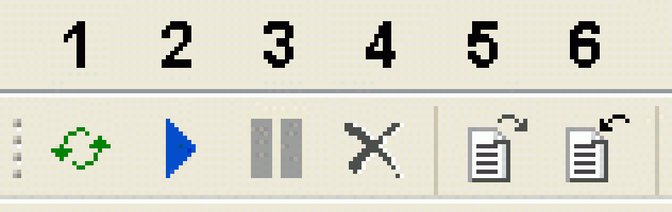
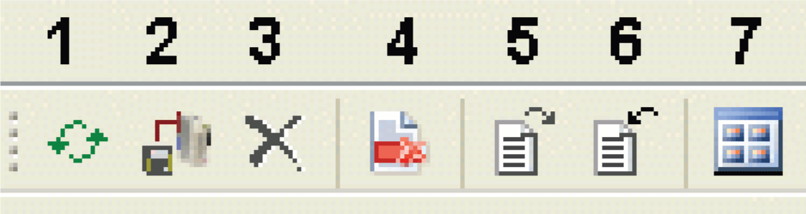

# Add Object > Application Logger...

## Overview

The Project > Add Object > Application Logger... command is available if the Application node is selected in the Devices tree. Execute the command to add one Application Logger node below the selected Application node and to open the Application Logger editor.

The Application Logger displays logging information for the application that is provided by the ApplicationLogger or the ApplicationLogger2 library. For further information, refer to the [*ApplicationLogger Library Guide*](../../../../../api/crossBook?lang=en-US&virtualBookName=PD.Lib.ApplicationLogger&topicID=D_SE_0077692) or the [*ApplicationLogger2 Library Guide*](../../../../../api/crossBook?lang=en-US&virtualBookName=APL2LG&topicID=) in the online help.

The Application Logger editor consists of two tabs:

* Messages tab: Displays the logger messages.
* Logger Points tab: Displays the logger points that are sources that trigger the associated messages.

## Information Provided by the Messages Tab

The Messages tab displays the following information for each message:

| Information | Description |
| --- | --- |
| ID | Internal identification number of the message which determines the (default) order of the messages. |
| Timestamp | Time when the message was generated. |
| Message | Text of the message. |
| ID Logger Point | Internal identification number of the logger point that is the source that triggered the message:  The ID Logger Point corresponds to the ID value of the logger point in the Logger Points tab. |
| Logger Point | Name of the logger point that has triggered the message:  The Logger Point values are hyperlinks: clicking a Logger Point name opens the Logger Points tab. The logger point associated with the respective message is highlighted. |
| Type | Type of the logger point that has triggered the message (for example, function block name). |
| Source | Namespace of the library that has triggered the message. |
| Log Level | Logger level indicating the type and level of severity of the logger message as defined in the enumeration `ET_LogLevel` of the ApplicationLogger or ApplicationLogger2 library (for example, `Exception`, `Warning`, `DebugMessage`). |
| Diag | Diagnostic information that is provided to the input i\_etDiag of the method FB\_LoggerPoint.AddLogEntry() from the ApplicationLogger library.  NOTE: This column is displayed only if the ApplicationLogger and ApplicationLogger2 libraries are used in your application. |
| DiagExt / DiagCode | Diagnostic information that is provided by the input i\_udiDiagExt or i\_udiDiagCode of the method FB\_LoggerPoint.AddLogEntry from the ApplicationLogger or ApplicationLogger2 library. |

Click the filter icon in the header of a column to open a dialog box that allows you to apply a filter criterion on the selected column.

## Icons of the Messages Tab

The Messages tab provides the following icons:

| Item | Icon name and description |
| --- | --- |
| 1 | Load messages and logger points  Loads the messages from the connected controller and refreshes the content of the Messages tab. |
| 2 | Automatically load new messages  Starts loading the latest messages automatically from the connected controller every 5 seconds. |
| 3 | Stop automatically loading new messages  Stops the Automatically load new messages function. |
| 4 | Clear all messages of view  Clears the content of the Messages tab. |
| 5 | Export messages and logger points  Opens a Save As dialog box for exporting messages and logger points to an XML file.  You can export the messages and logger points that are stored in the message buffer. This includes filtered out messages and logger points. |
| 6 | Import messages and logger points  Opens an Open dialog box for importing messages and logger points from an XML file.  Importing messages and logger points overwrites the messages and logger points in the Application Logger. |

## Information Provided by the Logger Points Tab

The Logger Points tab displays the following information for each logger point that is the source that has triggered the associated message:

| Information | Description |
| --- | --- |
| ID | Internal identification number of the logger point which determines the (default) order of the logger points. |
| Name | Name of the logger point (as defined in method RegisterLoggerPoint).  The Name value is a hyperlink: clicking a logger point Name opens the Messages tab. The message associated with the respective logger point is highlighted. |
| Type | Type of the logger point (for example, function block name) (as defined in method RegisterLoggerPoint). |
| Source | Name of the source that has triggered the message (as defined in method RegisterLoggerPoint).  In case the message has been generated by a POU of a Schneider Electric library, the library name space is displayed as Source. |
| Log Level | Logger level indicating the type and level of severity of the logger message as defined in the enumeration `ET_LogLevel` of the ApplicationLogger or ApplicationLogger2 library (for example, `Exception`, `Warning`, `DebugMessage`). |

Click the filter icon in the header of a column to open a dialog box that allows you to apply a filter criterion on the selected column.

## Icons of the Logger Points Tab

The Logger Points tab provides the following icons:

| Item | Description |
| --- | --- |
| 1 | Load logger points  Loads the logger points from the connected controller and refreshes the content of the Logger Points tab. |
| 2 | Set log level of logger points  Writes the log level modifications to the controller.  Alternatively, use the shortcut Ctrl + F7. |
| 3 | Clear all logger points of view  Clears the content of the Logger Points tab. |
| 4 | Discard all changes  Discards the log level modifications. |
| 5 | Export messages and logger points  Opens a Save As dialog box for exporting messages and logger points to an XML file.  You can export the messages and logger points that are stored in the message buffer. This includes filtered out messages and logger points. |
| 6 | Import messages and logger points  Opens an Open dialog box for importing messages and logger points from an XML file.  Importing messages and logger points overwrites the messages and logger points in the Application Logger. |
| 7 | Switch between tree and list view  Toggles between tree view and list view. The expansion state of the latest tree view is stored.  The tree view (default view) helps you to locate the logger point in your application. |

## Activating/Deactivating Logger Points

Each row in the Logger Points tab has a check box for activating or deactivating the logger point. When a logger point is deactivated, the log level is set to `Nothing` (for further information, refer to `ET_LogLevel` of the ApplicationLogger or ApplicationLogger2 library).

When you activate a logger point, the log level is either set to the last log level that had applied before the logger point was deactivated, or to a default log level.

Right-click a row to display the contextual menu with the following commands:

* Activate child Logger Points
* Deactivate child Logger Points
* Activate logging for all Logger Points
* Deactivate logging for all Logger Points

To display the parent/child relationship, activate the tree view using the Switch between tree and list view button.

## Modifying the Log Level of a Logger Point

To modify the log level of a logger point, double-click a cell in the Log Level column. A box is displayed allowing you to select the log level.

To write the log level modifications to the controller, click the Set log level of logger points icon, or use the shortcut Ctrl + F7. The logging behavior of the affected logger points is modified immediately.

## Discarding the Modifications

To undo log level modifications, click the Discard all changes icon.

EIO0000002860.10