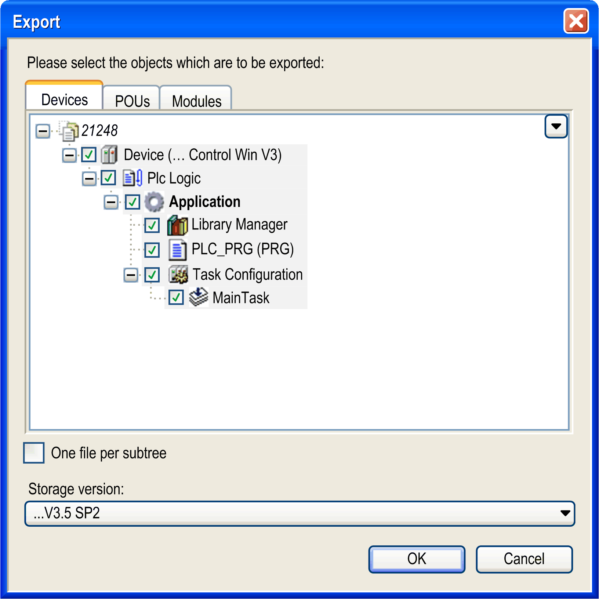

# Export as XML

## Overview

Use the Project > Export as XML command to export particular objects or a total tree to one or several external files. Export files are created in XML format and by default have the extension *.export*.

NOTE: You can export objects in an XML file according to PLCopen format: [**Export PLCopenXML...**](D-SE-0083972.html#D-SE-0083972) .

The command opens the Export dialog box. Select the desired Devices or POUs. Child objects of a selected object (for example actions below a program object) are automatically selected as well. You can select or deselect the objects individually.

NOTE: To export DTMs, right-click the device node in the Devices tree and click Advanced Configuration. Execute the command Export DTM from the contextual menu.

If the option One file per subtree is activated, then a separate export file is generated for each subtree directly available below the root node and containing selected objects. As an example, see two subtrees in the figure below. If the option is deactivated, only one export file containing the selected objects is generated.

Storage version: Select a version of EcoStruxure Machine Expert from the list. When you close the dialog box by clicking OK, the objects are exported in a format so that they can be reimported with the selected version.

After having selected the objects and option, a dialog box for defining the target folder for the export files and - if only one file will be created - for defining the file name opens. After having closed this dialog box, the export will be completed.

Export dialog box

You can reimport export files into a project by executing the [**Import from XML**](D-SE-0083969.html#D-SE-0083969) command.

EIO0000002860.10