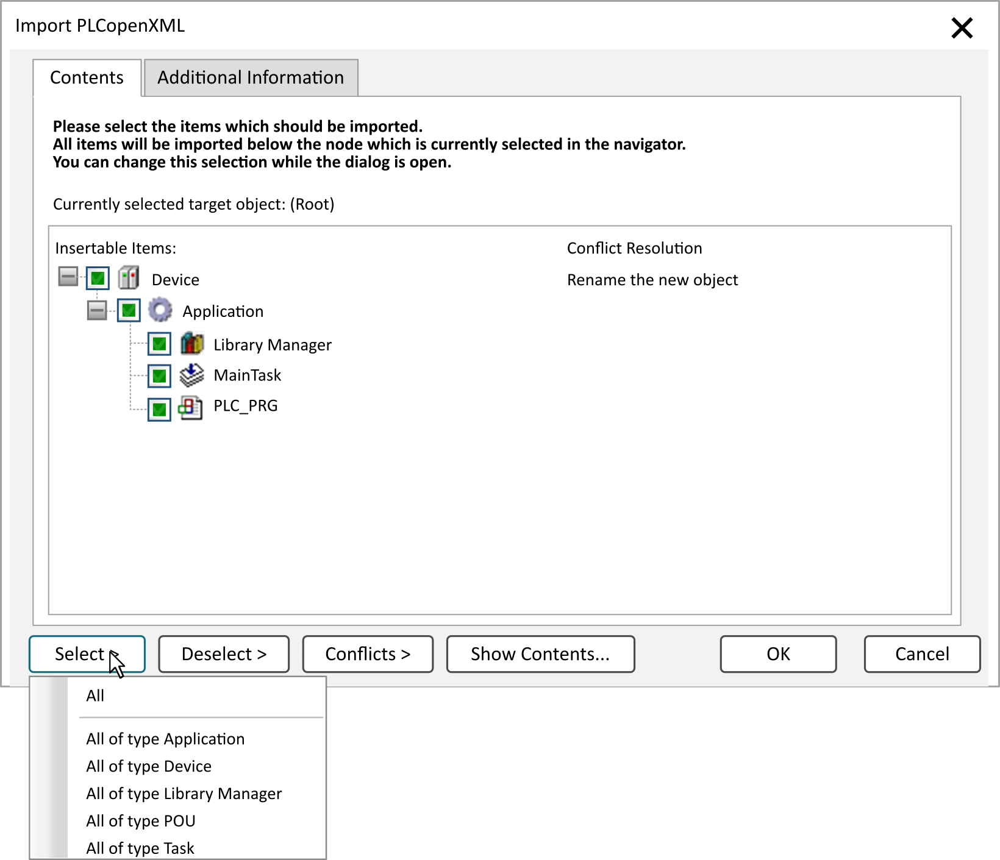

# Import PLCopenXML...

## Overview

The Project > Import PLCopenXML command allows you to import the content of an XML file describing objects in PLCopen format. You can create the file from a project by executing the [**Export PLCopenXML...**](D-SE-0083972.html#D-SE-0083972) command.

NOTE: If the import file, in addition to the basic information, contains the declarations (formatting and comments) in plain text (refer to [PLCopenXML](D-SE-0084058.html#D-SE-0084058)), the information given by the plain text overwrites that given by the regular format.

The command opens the Windows dialog box for browsing a file. The filter is automatically set to PLCopen xml files (\*.xml). Select the desired file and confirm by clicking OK. The Import PLCopenXML dialog box opens. It provides two tabs: Contents and Additional Information.

NOTE: The PLCopenXML schema does not allow having both `VAR_GLOBAL` and `VAR_GLOBAL` `CONSTANT` blocks in one variable list. If you have completed an export of such a mixed list, after reimport the `VAR_GLOBAL CONSTANT` variables will be defined as `VAR_GLOBALS`. In order to avoid this situation, you must separate the variables into two lists before exporting. See [**Export PLCopenXML...**](D-SE-0083972.html#D-SE-0083972).

## Contents Tab

Example of an Import PLCopenXML dialog box

Depending on the object selected in the navigators (Currently selected target object), this dialog box lists the objects or entries from the XML file which can be inserted at this position (Insertable items). You can select those that should be imported (as is possible due to the prescribed dependencies between certain object types) by setting or removing a checkmark in the box preceding the particular entry.

| Button | Description |
| --- | --- |
| Select > | From the list provided by this button, you can either select All objects or select objects belonging to specific object types, such as All of type Application. |
| Deselect > | From the list provided by this button, you can either deselect All objects or deselect objects belonging to specific object types, such as All of type Application. |
| Conflicts > | From the list provided by this button, apply one of the commands to solve the detected conflicts. Also refer to the description of the commands of the Conflict Resolution column in the paragraph [Contents Tab](#D-SE-0083973__D-SE-0083973.3). |
| Show Contents... | Opens a dialog box that displays the objects of the XML file. |

From the Conflict Resolution column select one of the following commands to solve the conflict for each item:

|  |  |
| --- | --- |
| Replace the existing object | The existing object is removed and replaced by the imported one. |
| Rename the new object | The new object is inserted with the name extended by \_<n>, where n is a running number, which is 1 at the first import of a related object.  Example: PLC\_PRG -> PLC\_PRG\_1 |
| Skip the new object | The new object is not imported. |

After you have selected the desired objects, click OK to insert the objects in the project.

## Additional Information Tab

This tab shows the following information read from the file header and content header of the PLCopen XML file:

|  |  |
| --- | --- |
| File header | company name, company URL, product name, product version, product release, creation date/time, content description |
| Content header | name (project name), version, modification date/time, organization, author, language, comment |

EIO0000002860.10