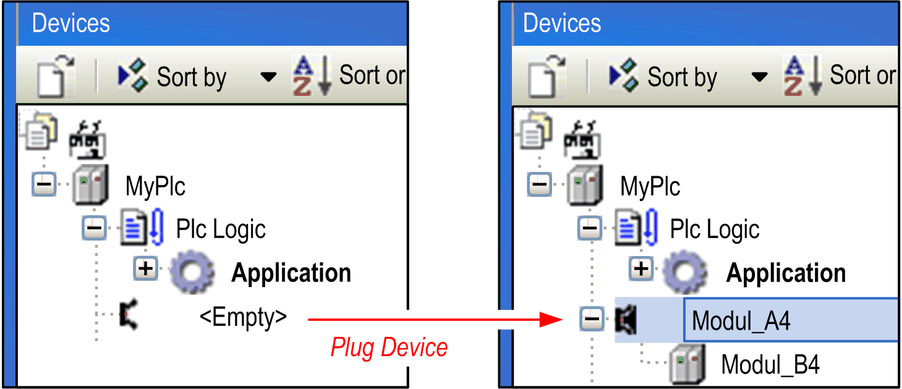

# Plug Device ...

## Overview

Use the Project > Plug Device... command to plug a [device](../../../../../api/crossBook?lang=en-US&virtualBookName=SoMProg&topicID=D_SE_0083356) object, representing a hardware module, to the currently selected slot in the Devices tree. An empty slot is identified by icon  and entry <Empty>. An already occupied slot displays icon  and the device name.

The command opens the [**Add Device**](../../../../../api/crossBook?lang=en-US&virtualBookName=SoMProg&topicID=D_SE_0083370) dialog box. It allows you to choose a device available for the selected position. In case of an occupied slot, the existing entry will be replaced.

EIO0000002860.10