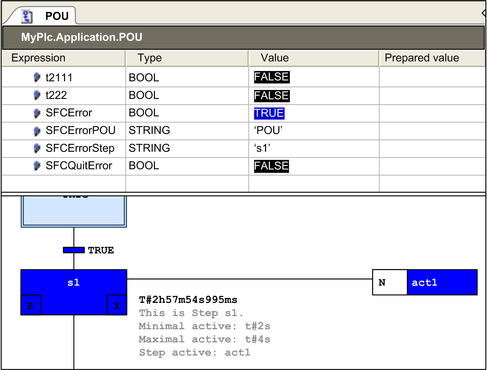

# Sequential Function Chart (SFC)

## Overview

The Project Settings > SFC dialog box allows you to define default settings for SFC objects. These settings are automatically assigned to new SFC object in its [**Properties**](D-SE-0083921.html#D-SE-0083921__D-SE-0083921.13).

NOTE: Use the Apply to all button to apply the modifications made in this dialog box to the existing SFC objects. By doing so, the option Use default is selected in the SFC tab of the [**Properties**](D-SE-0083921.html#D-SE-0083921__D-SE-0083921.13).

The settings for layout and view are specified in the Tools > Options > SFC Editor [dialog box](D-SE-0084059.html#D-SE-0084059).

## Build Tab

Code generation

|  |  |
| --- | --- |
| Calculate active transactions only | When the option Calculate active transactions only is activated, code is only generated for the active transitions. |

## Flags Tab (Variables)

The Flags tab lists the flags which are implicitly created variables for monitoring and controlling the processing in an SFC diagram. A short description is provided in this dialog box. For detailed information about the flags, refer to the description of the [*Implicit variables - SFC Flags*](../../../../../api/crossBook?lang=en-US&virtualBookName=SoMProg&topicID=D_SE_0083505).

You can activate the automatic declaration (Declare) and use (Use) for each flag variable by selecting the respective check box. These settings are then used as the default settings for new SFC objects.

NOTE: An automatically declared flag variable is visible in the declaration part of the SFC editor in online mode.

## Example of SFC Error Flag in the Online Mode of the Editor

In step `s1` in the SFC object `POU`, a timeout was recorded by the `SFCError` flag.

SFC flags in online mode:

EIO0000002860.10