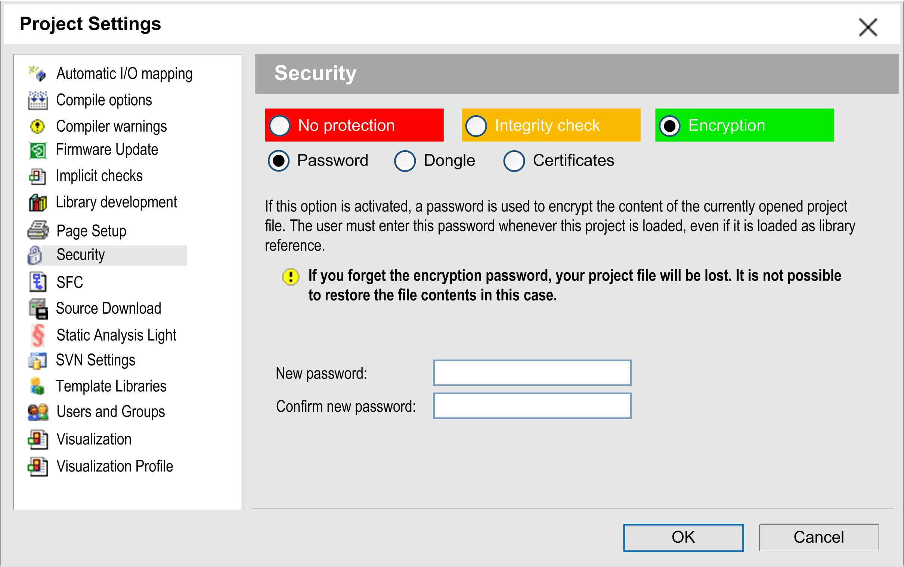

# Project Settings - Security

## Overview

Security dialog box:

Use the upper options to decide if you want to protect the open project from unauthorized access:

| Option | Description |
| --- | --- |
| No protection | When selected, the project file is not protected from unauthorized access and data manipulation. The following options in the dialog box are disabled.  NOTE: To help protect your project from unauthorized access, select the option Encryption. |
| Integrity check | When selected, the project file is stored in a proprietary format. The integrity of the file is verified each time the project is loaded.  NOTE: The file is incompatible with EcoStruxure Machine Expert V1.2 and earlier versions.  This option is selected by default when you create a new project or library.  NOTE: The project file is not encrypted. To help protect your project from unauthorized access, select the option Encryption. |
| Encryption | When selected, the project file will be encrypted. Select the encryption option (Password, Dongle, Certificates) that suits your needs. |

NOTE: The project recovery function provided in the Tools > Options > Load and Save [dialog box](D-SE-0084045.html#D-SE-0084045) is only available when the option No protection is selected.

## Protection with Password

For defining a project password, activate the Password option.

Enter the password in the edit fields New Password and Confirm new password. If the project is saved with these settings, you will need to enter the password later when you are going to reload the project, even when it should get loaded as a library reference. The Encryption Password dialog box will open in this case.

If you do not remember the encryption password, the project cannot be opened any more. File contents cannot be restored in this case.

NOTE: Store the encryption password in a safe place to be able to open the protected project.

You can use the Project Settings dialog box for modifying the password. In this case, you must enter the Current password before you are allowed to enter a new one in the edit fields New Password and Confirm new password.

## Protection with Dongle

To protect the project by dongle, make sure that the hardware dongle is connected to your computer, activate the Dongle option, and proceed as follows:

| Step | Action |
| --- | --- |
| 1 | Click the Add button.  **Result**: The Add Registered Dongle dialog box opens. |
| 2 | Select the dongle from the Dongle list. If you want to provide further information, you can enter an optional Comment. |
| 3 | Click OK.  **Result**: The Add Registered Dongle dialog box closes and the selected dongle is added to the list of Registered dongles in the Project Settings - Security dialog box. |
| 4 | Click OK.  **Result**: The dongle is assigned to the project. It must be connected to the PC in order to open the project. This applies even if the project is loaded as a library reference |

In case the dongle used for encrypting the project gets lost, the project can no longer be opened. File contents cannot be restored in this case.

NOTE: Store the dongle in a safe place to be able to open the protected project.

## Protection with Certificates

To protect the project by certificates, activate the Certificates option, and proceed as described in the [*How To Protect Your Source Code User Guide*](../../../../../api/crossBook?lang=en-US&virtualBookName=HowProSec&topicID=D_SE_0099370).

NOTE: You need a private key to open the project after it has been encrypted with a public key.

NOTE: In case your private key certificate gets lost or the certificate becomes outdated, the project cannot be opened any more. File contents cannot be restored in this case.

NOTE: Store the private key certificate in a safe place and manage the certificates carefully to be able to open the protected project.

EIO0000002860.10