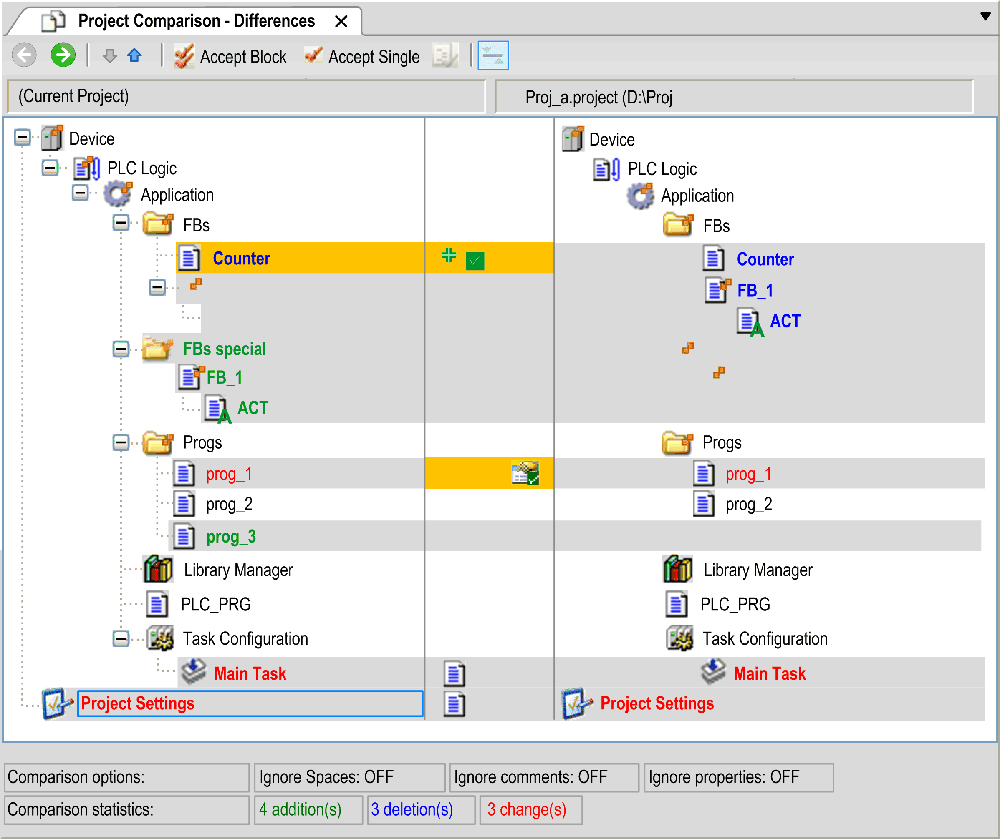
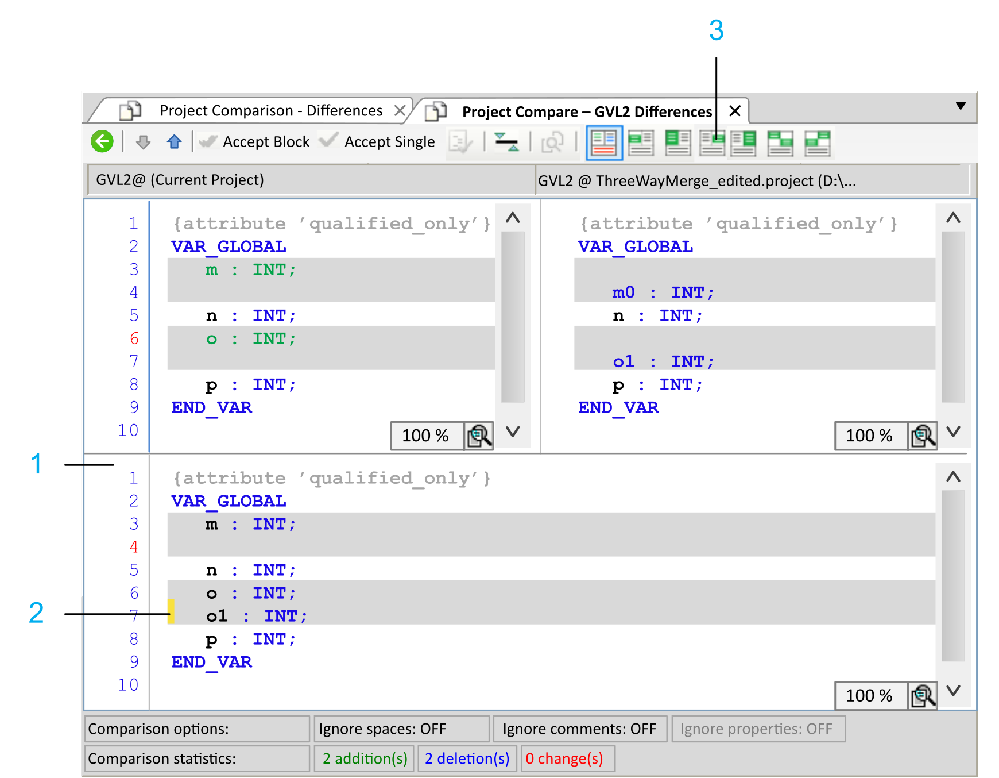

# Project Comparison - Differences View / Commit accepted changes Command

## Overview

The result of the comparison is represented in the Project Comparison - Differences view. The left part of the view represents the project that is currently open. The right part of the view shows the reference project that is used for the comparison:

Each line that contains a colored entry is highlighted in gray.

Meaning of the unit colors:

| Color | Meaning |
| --- | --- |
| Black | Identical units. |
| Object name with | The child objects are different. |
| Highlighted gray | The units are different. |
| Highlighted gray with bold blue font | The unit exists in the reference project only. |
| Highlighted gray with bold green font | The unit exists in the Current Project only (not in the reference project). |
| Highlighted gray with red font and | The unit has different properties. |
| Highlighted gray with red font and | Access rights of the units are different. |
| Highlighted gray with bold red font and | Implementation of the units is different.  Double-click the line to display the object-specific compare view. |
| Highlighted yellow | The unit is activated for acceptance. |
| Highlighted yellow and | Adding the reference unit to the open project is activated. |
| Highlighted yellow and | Deleting unit (in the Current Project) is activated. |
| Highlighted yellow and | Acceptance of the properties of the reference project is activated. |
| Highlighted yellow with red font and | Acceptance of the access rights of the reference project is activated. |
| Highlighted gray with bold red font and | Acceptance of the implementation of the reference project is activated. |

Information provided in the Project Comparison - Differences view:

| Element | Description |
| --- | --- |
| Comparison options | Comparison options defined in the Project Comparison [dialog box](D-SE-0083938.html#D-SE-0083938). |
| Comparison statistics | Number of added, deleted, and modified units in the Current Project, as compared to the reference project.  Change means differences of a unit available in both projects. |

## Working in the Compare Mode

The toolbar on top of the compare results provides a set of functions to edit the comparison:

| Element | Description |
| --- | --- |
|  | To obtain detailed information on discrepancies of units marked in bold red, click the green arrow right button from the toolbar. The Project Comparison -<object name> Differences view opens in read-only mode. It displays the contents of the two versions in detailed view opposed to each other. The elements that differ are listed in colors as described above.   * In case of a POU, its appearance in the associated text or graphic editor will be displayed on the left for the Current Project, and on the right for the reference project. The smallest entities compared to each other are lines (ST, IL), networks, (FBD, LD) or elements (CFC, SFC). * In case of a device, the variable entities such as address, parameters, or the mapping are listed in a table. The left part of the table shows the Current Project and the right part shows the entities of the reference device. You cannot edit the two displayed versions within this comparison, however you can accept the reference version instead of the current one (see the Accept Block button description). |
|  | Return to the compare results. |
|  | The cursor jumps to the next unit of the Devices tree, which displays the differences. |
|  | The cursor jumps to the precedent unit displaying the differences. |
| Accept Block button | The version of a block contained in the reference project will be accepted for the Current Project as well. The direction of the acceptance goes from the reference project to the Current Project, not vice versa.  In the Project Comparison -<object name> Differences view (see the Green arrow right button description), a block consists of the entity (line, network, element) the cursor is placed on as well as of the preceding and subsequent entities, which have the same difference marking (for example subsequent lines). After accepting a block within the Project Comparison -<object name> Differences view, the block will display as highlighted yellow in the current version. In the compare results view however, a block consists of the unit the cursor is placed on as well as of the subordinated units. Having accepted a changed block within the compare results view will highlight the associated units of the Current Project in yellow, and add a check mark to them. Accepting a block newly inserted in the current version will delete it (marked by a small red plus sign), whereas accepting a block deleted in the current version will reinsert it into the current version (marked by a small green plus sign). When you replace a single entity with the Accept Single button, you will be asked if you want to take over these modifications to the detailed view. A repeated click on the Accept Block button cancels the modifications made during its last execution. |
| Accept Single button | The unit (compare results view) or entity on which the cursor is placed will be accepted in the version contained in the reference project for the Current Project. The direction of the acceptance goes from the reference project to the Current Project, not vice versa.  After accepting an entity within the Project Comparison -<object name> Differences view, the entity will appear highlighted yellow in the current version. When returning to the compare results view, you are asked if you want to confirm the modifications. If the two versions are identical, they will now be displayed in regular black in the compare results. However, having accepted a single unit within the compare results view will highlight in yellow its name in the Current Project as well as the name of all other units the specified unit is depending on. In addition, a check mark is added after their names. Accepting a newly inserted unit in the current version will delete it and the subordinated units and mark the corresponding lines by a small red plus sign. Accepting a unit deleted in the current version will reinsert it and all other units the specified one is depending on into the current version and mark their names by a small green plus sign. When you enter a unit, you will be asked if you want to confirm these modifications to the detailed view. A repeated click on the Accept Single button cancels the modifications made during its last execution. |
|  | The folder, access rights, or object properties for the unit the cursor is placed on will be accepted for the Current Project such as they are set in the reference version. The direction of the acceptance goes from the reference project to the Current Project, not vice versa.  A collection of objects is displayed. You can select folders, access rights, or object properties in the Accept dialog box. Afterwards, the associated unit will be highlighted in yellow and there will be check marks added to the icons representing folder, access rights, or object properties. |
|  | This button is only available in the Project Comparison -<object name> Differences view.  It allows you to switch between two display modes:   * Different entities (lines, networks, elements) are displayed in red and are marked as modifications. * In the Current Project, the units are displayed as recently added, in the reference project, they are displayed as deleted.  NOTE: Depending on the display mode, detected differences in the statistics are counted as modified, inserted, or deleted. |
|  | This button allows you to open or close a third section (below the current and reference project sections) within the Project Comparison -<object name> Differences view.  It displays the result of the actions you have taken to resolve the detected differences. For details, refer to the next paragraph [Third Section in the Project Comparison - Differences View](#D-SE-0083939__ThirdSectionInTheProjectComparison--3F1C9133). |

## Third Section in the Project Comparison - Differences View

Click the  button to toggle the display of a third comparison/merging section, referred to as the merge editor herein. Initially it displays the content of the Current project. The section is only displayed for objects supporting textual view (like the declaration view of GVLs, DUTs or POUs, and implementation view of ST POUs). In this section free editing is also allowed.

| Legend Item | Description |
| 1 | Merge editor |
| 2 | Line highlighted after you have clicked the Use right line button. |
| 3 | Button Use right line |

The following buttons are available in the toolbar and are enabled only in case the cursor was set in one of the gray areas (line / block) and to which the buttons are then applicable:

| Element | Description |
| --- | --- |
|  | Click this button to replace the selected line in the merge editor with the (left) line from the Current Project. |
|  | Click this button to replace the selected block in the merge editor with the (left) block from the Current Project. |
|  | Click this button to replace the selected line in the merge editor with the (right) line from the reference project. |
|  | Click this button to replace the selected block in the merge editor with the (right) block from the reference project. |
|  | Click this button to replace the selected block in the merge editor with the (left) block from the Current Project followed by the (right) block from the reference project.  NOTE: This button is only enabled if the display mode has not been toggled with the  button. |
|  | Click this button to replace the selected block in the merge editor with the (right) block from the reference project followed by the (left) block from the Current Project.  NOTE: This button is only enabled if the display mode has not been toggled with the  button. |

NOTE: Modifications taken over from the reference project are marked with a yellow bar at the beginning of the corresponding lines in the merge editor.

NOTE: Modifications entered manually in the merge editor are marked with a red bar at the beginning of the corresponding lines.

## Completing the Compare Mode

To finish the compare mode, click the X button of the Project Comparison - Differences tab. A message is displayed, prompting whether you want to commit the modifications.

Click Yes to modify the contents, properties, or access rights of the objects highlighted in yellow in the Current Project, adapting them to the reference project. The project compare view is closed.

## Accept Dialog Box

The Accept dialog box provides the following elements for accepting metadata:

| Element | Description |
| --- | --- |
| Access rights | If this option is selected, the modifications of the access rights will be accepted. |
| Accepted groups | Grouping with access rights accepted by the reference project. A group is accepted if it is present in both projects with different access rights.  Example: `Group_A` |
| Unaccepted groups (missing in a project) | The group is not accepted if it is not present in one of the two projects. |
| Properties | If this option is selected, the properties will be accepted.  This is only available if the properties of the reference object and object are different. |
| OK | Click OK to accept the settings. |

## Commit accepted changes Command

After the modifications of the project comparison have been accepted, execute the Project > Commit accepted changes command. The modifications will be applied to the Current project. To apply the modifications permanently, execute the File > Save Project command.

## Special Cases

Modifications in the Visualization Manager affect the project settings. As a consequence, both objects are marked as modified.

Hotkey settings for action type Open dialog:

Parameter list and parameter name in the hotkey configuration must match the parameters in the concerned dialog box. Only then any modifications of particular values can be accepted individually. Otherwise, the hotkey settings can only be accepted as block or not at all.

EIO0000002860.10