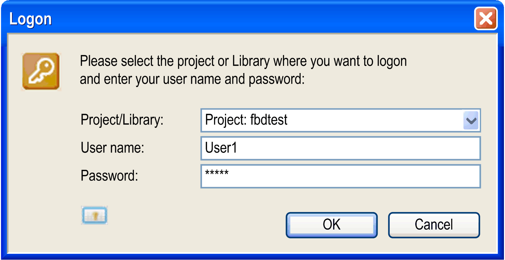
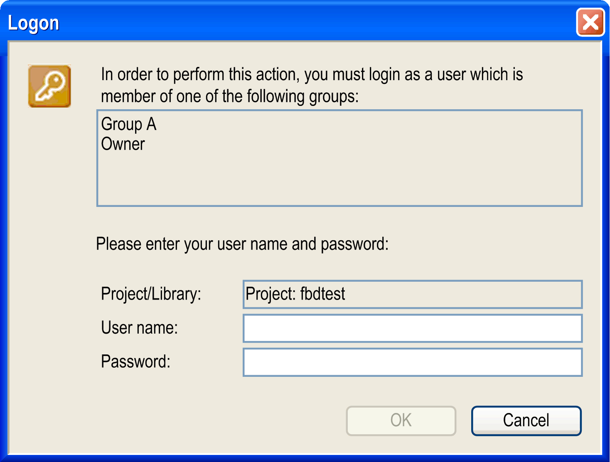

# Logon

## Overview

The Project > User Management > User Logon... command opens the Logon dialog box for logging on to a project or library via a defined user account.

Logging on with a certain user account means to log on with those object access rights which are granted to the group to which the user belongs. The configuration of user accounts and groups is performed in the Project Settings > Users and Groups [subdialog](../../../../../api/crossBook?lang=en-US&virtualBookName=D-SE-0083959.html#D-SE-0083959). For an overview on user management and access rights, refer to the Users and Groups [view of the device editor](../../SoMProg&topicID=D_SE_0083876).

To log on, select the project or an included library from the selection list in the Project/Library field. Enter User name and Password of a valid user account, noticing that each project or library has its own user and access right management. Log on by clicking OK.

If another user is logged on the project, the currently logged-in user is logged out by the new log-on action.

## Implicit Logon

When you are logged on to a project or library and try to perform an action for which you have no rights, the following Logon dialog box is displayed. It allows you to log on with another user account that has the appropriate rights.

Logon dialog box on a non-permissible action

The upper part of the dialog box displays all groups which are provided with the necessary rights for the desired action. If you have a user account for one of these groups, you can log on with the appropriate user name and password and perform the desired action.

The status bar displays which user is currently logged on the project (for example: Current user: User1).

NOTE: For a quick access to the Logon or Logoff dialog box, double-click the status bar.

EIO0000002860.10