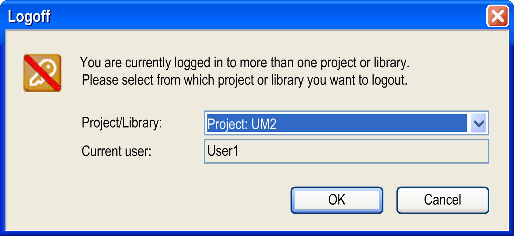

# Logoff

## Overview

The Project > User Management > User Logoff command logs off the currently [logged on](D-SE-0083976.html#D-SE-0083976) user. If no user had been logged on to the currently opened project or to a referenced library, an appropriate message will display when trying to log off.

If the user is currently logged on to more than one project or referenced library (not necessarily with the same user account), the following Logoff dialog box will display when trying to log off:

Logoff dialog box

From the Project/Library selection list, choose those project/library for which you want to log off. The name of the Current user is displayed just for information purposes.

The status bar displays which user is currently logged on the project.

NOTE: For a quick access to the Logon or Logoff dialog box, double-click the status bar.

EIO0000002860.10