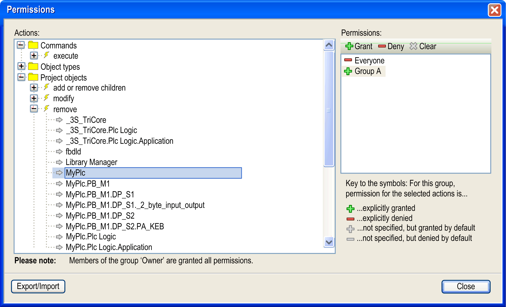

# Permissions...

## Overview

The Project > User Management > Permissions... command opens the Permissions dialog box for configuring the rights to work on objects to perform commands in the open project or to modify the user management configuration. The rights concerning objects can also be configured in the [Properties](D-SE-0083921.html#D-SE-0083921) dialog box of the object.

In a new project, only the username **Owner** (group **Owner**) has the permission to modify the users, groups, and permission configuration. You can log on to the project ([**Logon**](D-SE-0083976.html#D-SE-0083976)) with username **Owner** and empty password to assign this permission to another group.

NOTE: The changes made in this dialog box will be applied immediately.

The Actions window displays the rights. These are the actions which can be performed on any object of the project. The tree is structured in the following way:

*  Top-level see the names of some categories, which have been set up just for optical structuring the right management. The rights are grouped regarding the following actions: Execution of Commands, the creation of Object Types, the viewing, editing, removing, and handling of child objects of Project Objects and the configuration of User accounts, groups, and permissions.

  NOTE: If you assign rights in the categories Object Types or Project Objects, you must also grant the rights for the appropriate Commands that relate to the objects you intend to modify.
* Below each category node there are nodes for the particular actions (yellow flash icon) which can be performed on the command, user account, group, object type, or project object.

Possible actions:

|  |  |
| --- | --- |
| execute | Execution of a menu command. |
| create | Creating a new object in the project. |
| add or remove children | Adding or removing child objects to an existing object. |
| modify | Editing an object in an editor or editing the users, groups, and permission configuration. |
| remove | Deleting or cutting an object.  NOTE: To grant the right for removing an object, make sure that the add or remove children right is granted to the parent of this object. |
| view | Viewing an object in an editor. |

* Below each action node, find the possible targets (gray arrow icon) of the respective action. These can be project objects or the users, groups, and permission configuration.

The Permissions window provides a list of the available user groups (except the **Owner** group) and a toolbar for configuring rights to a group.

Select the group and configure its permissions.

To the left of each group name one of the following icons indicates the assigned permission concerning the target which is selected in the Actions window:

|  |  |
| --- | --- |
| + (green) | The actions for the targets selected in the Actions window are granted for the selected group. |
| - (red) | The actions for the targets selected in the Actions window are denied for the selected group. |
| + (gray) | The right to perform the actions which are selected for the selected targets in the Actions window has not been granted explicitly, but is granted by default, for example because the corresponding right has been granted to the father object. Example: The group has received the right for object myplc, thus by default it also has got it for object myplc.pb\_1. Basically, granted is the default setting for all rights which have not been explicitly configured differently. Note, however, the exception: If rights are explicitly granted to a user group, these rights are used instead of the default rights. |
| - (gray) | The right to perform the actions which are selected for the selected targets in the Actions window, has not been denied explicitly, but is denied by default, for example in case because the corresponding right has been assigned to the father object. |
| If multiple actions are selected in the Actions window, which does not have unique settings referring to the selected group, no icon is displayed. | |

To configure the rights for a group, select the desired actions and targets in the Actions window and the desired group in the Permissions window. Then click the appropriate button in the toolbar of the Permissions window:

|  |  |
| --- | --- |
| Grant (green +) | explicit granting |
| Deny (red -) | explicit denying |
| Clear (gray X) | The granted right for the actions selected in the Actions window will be deleted. It is set back to the default. |

## Exporting / Importing Permissions

To export / import permissions, click the Export/Import button and select a command from the list:

| Command | Description |
| --- | --- |
| Export all permissions... | Permission states of the current project that are set to explicitly granted or explicitly denied are exported to a file with the extension \*.perms. |
| Export selected permissions... | Permissions selected in the Actions window are exported to a file with the extension \*.perms. |
| Import permissions... | The contents of a \*.perms file is merged into the current permission set. Groups included in the file which are not defined in the project are ignored. Permissions are identified by their names, not by the internal IDs. |

EIO0000002860.10