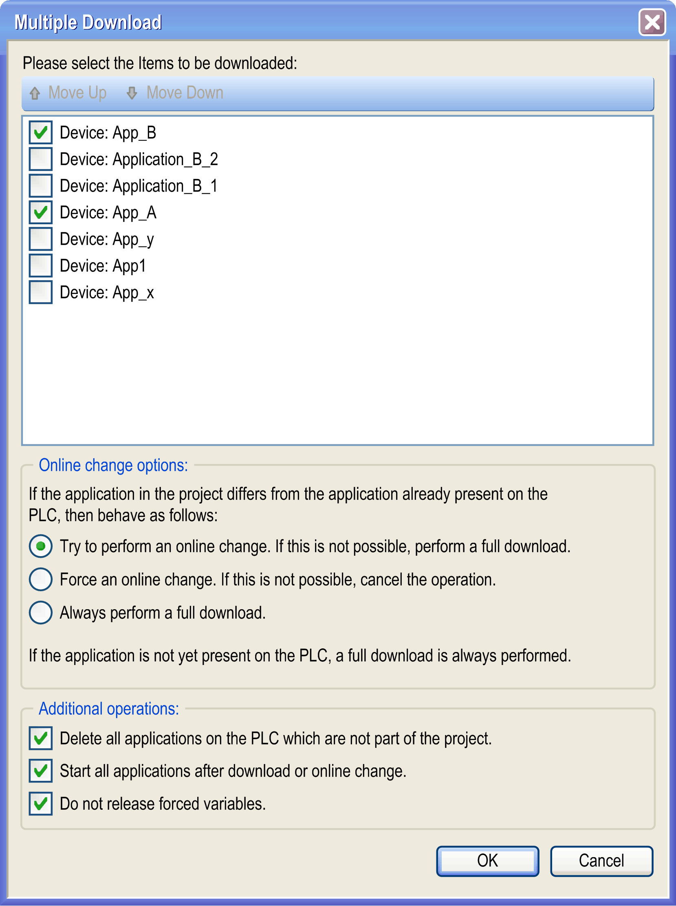
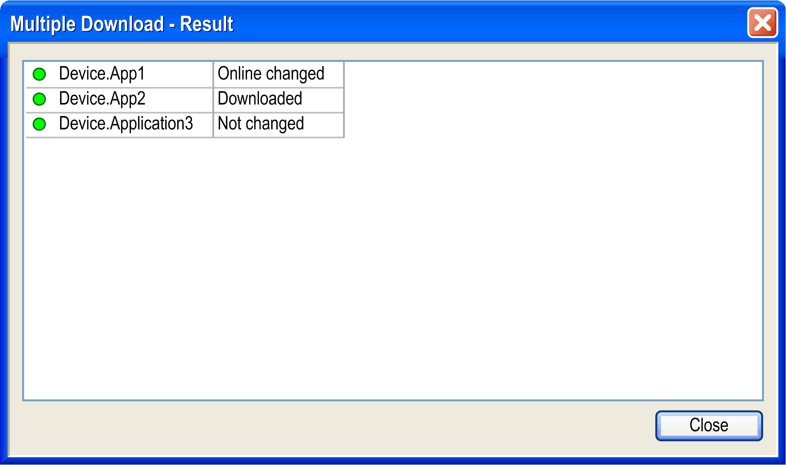

# Multiple Download...

## Overview

The Online > Multiple Download... command is available in online as well as in offline mode. It includes a [build](../../../../../api/crossBook?lang=en-US&virtualBookName=D-SE-0083979.html#D-SE-0083979) and [code generation](../../SoMProg&topicID=D_SE_0083443) run of all applications contained in the project that have been selected. Besides a syntactical check (build process) of these applications, the related application codes will be generated and loaded to the related controller. In the project folder for each of the applications selected for download, a corresponding [compile information file](../../../../../api/crossBook?lang=en-US&virtualBookName=SoMProg&topicID=D_SE_0083443) *<projectname>.<devicename>.<application ID>.compileinfo* will be created.

After you have executed the Multiple Download... command, a list of all applications contained in the project will be provided within the following dialog box:



You can select 1 or multiple applications, even if they will not be downloaded to the same device. By default, either all top-level applications or the applications last time selected are activated.

NOTE: The selected applications will be downloaded in the same order as they are listed in the dialog box. Basically, this is an alphabetical listing. It can cause problems in case there are dependencies between the applications. Therefore, change the download order of the applications with the help of the Move Up and Move Down buttons, if necessary.

See in the following paragraph an example of a hierarchy of applications in the Applications tree, which by default will result in a download order as shown in the dialog box above.

Example of applications in the Applications tree

```
App_A
  - App_x
  - App_y
    - App1
App_B
  - Application_B_1
  - Application_B_2
```

In case an application selected for download is differing from a previous version that has already been downloaded to the controller before, you can choose among the following options:

| Option | Description |
| --- | --- |
| Try to perform an online change. If this is not possible, perform a full download. | By default, this option is selected. The modified parts of the selected applications will be changed on the controller and only the newly created parts of the selected applications will be downloaded to the controller. |
| Force an online change. If this is not possible, cancel the operation. | If an online change for (at least 1 of) the selected applications is not possible (for example if the command Clean all or Clean Application had been performed before), the download will not be executed. |
| Always perform a full download. | Regardless of the versions already existing on the controller, all parts of the selected applications will be reloaded to the controller. |

For applications that are not yet present on the controller, a full download will be carried out automatically.

In addition, you may decide (by activating the corresponding checkbox)

* whether existing applications that are no longer part of the project should be deleted on the controller.
* whether the selected applications should be started after the download / online change has been performed.

The Start all applications after download or online change option restarts all download targets in the RUNNING state, provided their respective Run/Stop inputs are commanding the RUNNING state, but irrespective of their last controller state before the multiple download was initiated. Deselect this option if you do not want all targeted controllers to restart in the RUNNING state. In addition, before using the Multiple Download option, test the changes to your application program in a virtual or non-production environment and confirm that the targeted controllers and attached equipment assume their expected conditions in the RUNNING state.

| WARNING | |
| --- | --- |
|  | UNINTENDED EQUIPMENT OPERATION  Always verify that your application program will operate as expected for all targeted controllers and equipment before issuing the “Multiple Download…” command with the “Start all applications after download or online change” option selected.  Failure to follow these instructions can result in death, serious injury, or equipment damage. |

NOTE: During a multiple download, unlike a normal download, EcoStruxure Machine Expert does not offer the option to create a Boot application. You can manually create a Boot application at any time by selecting Create boot application in the Online menu on all targeted controllers (the controller must be in the STOPPED state for this operation).

Be aware that variables of type PERSISTENT will generally not get initialized. Instead, if the data layout has been changed, they will become initialized automatically.

With the option Do not release forced variables activated, download is inhibited if an application with forced variables is already located on the controller, and if the implementation of this application has been changed. The message Error: Skipped because one or more variables are forced is displayed for this application in the dialog box Multiple Download - Result.

After confirming your settings in the dialog by clicking OK, at first a syntactical check of all selected applications will be performed. From this point forward, each application communication with the related device has to be verified before the download will be executed.

The download is considered complete after a list of the selected applications is displayed with detailed information on the operations performed for each application.

Dialog box Multiple Download - Result



If the option Secure online mode is activated in the Communication Settings of the respective device, you have to confirm after calling this command.

## Download to an HMI or HMI Controller

If you use the Multiple Download... command to download an application to an HMI or HMI controller, keep in mind that the Vijeo-Designer Runtime is not automatically updated with this process.

To upgrade the Vijeo-Designer Runtime manually, execute the command Tools > External Tools, and select Download Firmware HMI to launch the Vijeo-Designer Runtime Installer.

To perform a multiple download to an HMI controller downloading both the controller application and the HMI application, the option Always perform a full download must be selected.

## Downloading Configurations to DTM Devices

The Multiple Download dialog box allows you to download configurations to DTM devices.

In the list of items to be downloaded, a DTM application is listed in the format:

<controller name>:<protocol manager name>:All attached devices

Example: MyController: Industrial\_Ethernet\_Manager: All attached devices

NOTE: Before you download a configuration to a DTM device, verify that your DTM device is in a state that allows this.

Specific drives, for example, do not allow downloading configurations while they are in operational state. Consider deselecting the Start all applications after download or online change option in case your controller application puts the DTM device in a state that prevents the download of the configuration.

EIO0000002860.10