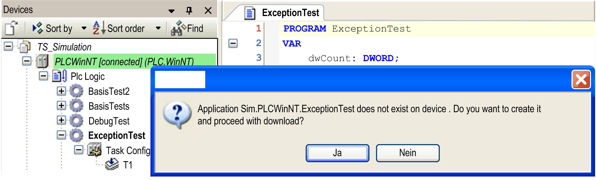

# Simulation

## Overview

The Online > Simulation command is available in online mode to enable and disable the simulation mode of the programming system. In simulation mode, the application can be run and debugged on a simulation target which is always available within the programming system.

If the command is called from the Online menu, the active application is affected.

If the command is called from the contextual menu when a controller object is selected in the Devices tree, then the selected application is affected, whether it is set to active status or not.

When the command Simulation is enabled, the device entry in the Devices tree is displayed in italics and at the first [login](../../../../../api/crossBook?lang=en-US&virtualBookName=D-SE-0083993.html#D-SE-0083993) with the [active application](../../SoMProg&topicID=D_SE_0083435) you are asked whether application *Sim.<devicename>.<applicationname>* should be created and loaded to the simulation target. No communication settings are required. See the following image for an example; command Online > Login has been performed for the currently active application ExceptionTest:

Example: Log in to the simulation target

After successful login, the red triangle icon beside the device icon indicates the simulation mode. You can use the respective [online commands](D-SE-0083992.html#D-SE-0083992) to test the application.

To switch off the simulation mode, first log out and then perform the Simulation command again. The check mark in front of the command disappears. The controller node in the Devices tree is displayed again in regular font style (non-italics) and you can log in to a real device.

## Differences Between Simulation Mode and Operation with a Physical Controller

|  | Simulation | Physical controller |
| --- | --- | --- |
| FPU (Floating Point Unit): rounding error | * Uses the FPU of the PC. * Different configuration of FPU exceptions. | * Uses the FPU of the controller or an FPU emulation. * Different configuration of FPU exceptions. |
| Handling of exceptions | Exception handling of the Windows Runtime system. | Exception handling of the controller. |
| External libraries (Cmp/Sys/CAA/OEM/…) | * Only a few external Cmp/Sys libraries are physically available. * Different implementation/behavior of the Sys libraries (simulation in contrast to the physical controller). * An Unresolved Reference error detected upon download is ignored. It is possible to download the application to the simulator and start it. If the missing functions are called, however, they return incorrect values. | No restrictions. |
| I/O drivers | * I/O configuration is generated but not evaluated. * Fieldbus stacks are not evaluated. * I/O channels are not updated and no bus telegrams are sent. | No restrictions. |

EIO0000002860.10