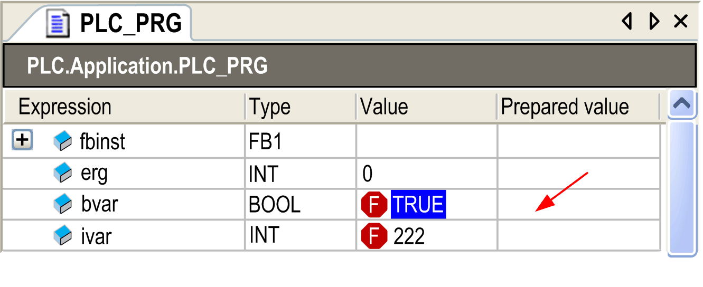

# Force Values, Prepare Value Dialog Box

## Overview

Default shortcut: F7

The Debug > Force values command is available in online mode. It affects that one or more variables of the currently active application are permanently set to user-defined values in the controller. The setting will be completed both at the beginning and at the end of a cycle.

| WARNING | |
| --- | --- |
|  | UNINTENDED EQUIPMENT OPERATION  * You must have a thorough understanding of how forcing will affect the outputs relative to the tasks being executed. * Do not attempt to force I/O that is contained in tasks that you are not certain will be executed in a timely manner, unless your intent is for the forcing to take affect at the next execution of the task whenever that may be. * If you force an output and there is no apparent affect on the physical output, do not exit the online mode without removing the forcing. * If the online mode was interrupted while forcing was active, re-establish the connection with the controller and remove the forcing.  Failure to follow these instructions can result in death, serious injury, or equipment damage. |

## Sequence of Commands in a Cycle

| Step | Action |
| --- | --- |
| 1 | Read inputs |
| 2 | Force values |
| 3 | Execute code |
| 4 | Force values |
| 5 | Write outputs |

NOTE: The command Force values [all applications] which affects all applications of a project, is not by default inserted in any menu (if needed, see the [**Customize** dialog box](D-SE-0084066.html#D-SE-0084066)).

NOTE: Also refer to the Write values command for setting a defined value only once at the beginning of a cycle.

The forcing will remain active until it is explicitly [suspended](D-SE-0084007.html#D-SE-0084007) by the user for particular or for all variables, or until the application becomes logged-out.

To prepare variables for forcing, define the desired value in online mode in one of the following places which are used for [monitoring](../../../../../api/crossBook?lang=en-US&virtualBookName=SoMProg&topicID=D_SE_0083450):

* In a [**Watch** view](../../../../../api/crossBook?lang=en-US&virtualBookName=SoMProg&topicID=D_SE_0083544) defined in the project, containing a list of variables to be monitored.
* In the online view of the object within the [declaration part of the respective editor](../../../../../api/crossBook?lang=en-US&virtualBookName=SoMProg&topicID=D_SE_0083520).
* In the online view of the object within the implementation part of the [FBD /LD/IL editor](../../../../../api/crossBook?lang=en-US&virtualBookName=SoMProg&topicID=D_SE_0083471).

A forced value is indicated by the  symbol.

The dialog box has the following functions:

* preparing a new value for a variable
* removing a prepared value
* releasing a forced variable
* releasing the variable and additionally resetting its value to the one the variable was assigned to before forcing

The dialog box opens if you click the Prepared Value field of a currently forced value. Or by clicking the inline monitoring field of the variable in the implementation part of the FBD/LD/IL editor.

Mouse-click to open the dialog box:

## Concerned Variables

The following information on the currently concerned variable is displayed:

|  |  |
| --- | --- |
| Expression | path of the variable  Example: PLC.Application.PLC\_PRG.ivar |
| Type | data type  Example: DWORD  If the expression is an array, you can double-click the Type column to open the dialog box Monitoring Range. It allows you to reduce the shown array elements to be monitored by defining the Start index and the End index of the array. |
| Current value | Example: TRUE or 23 |
| Choose one of the following options concerning What do you want to do with the variable: | |
| Prepare a new value for the next write or force operation | Depending on the data type of the variable, you can enter a new number or string you want to assign to the variable. |
| Remove preparation with a value | The prepared value for a variable will be removed. |
| Release the force, without modifying the value | The variable will be marked as <Unforce> and thus is prepared to get the current value read from the controller. |
| Release the force and restore the variable to the value it had before forcing it | The variable will be marked as <Unforce and restore> and thus is prepared to get the value it had before forcing. |

According to the chosen option, after leaving the dialog by clicking OK, the Prepared value field of the monitoring view will show a new value or <Unforce> or <Unforce and restore>. At the next Force values or Write values (for the first option) command, the prepared values will be set.

If the option Secure online mode is activated in the Communication Settings of the respective controller, you have to confirm after calling this command.

EIO0000002860.10