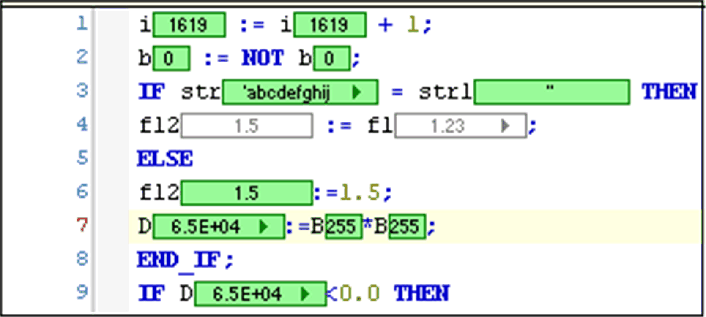
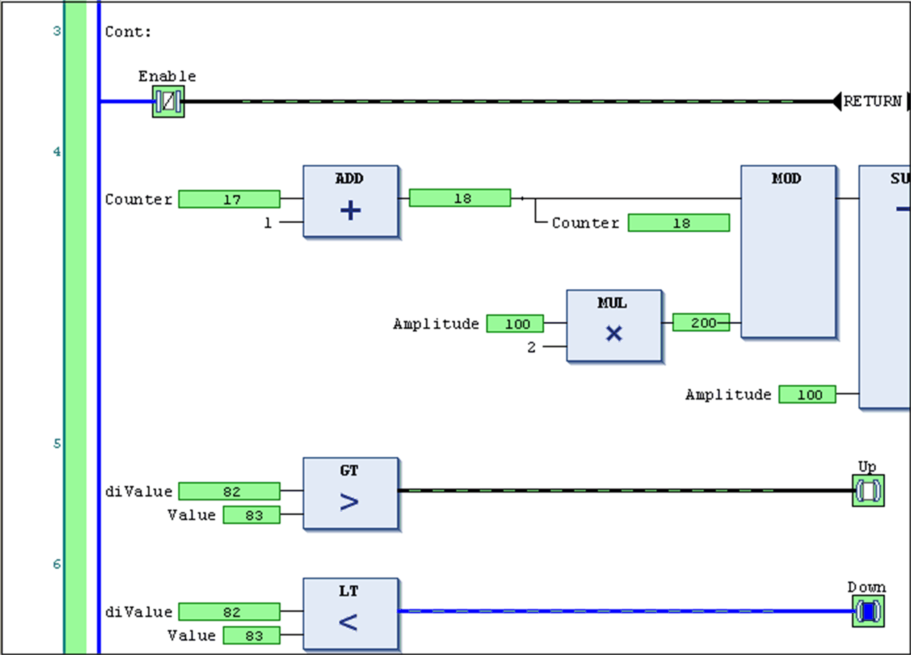
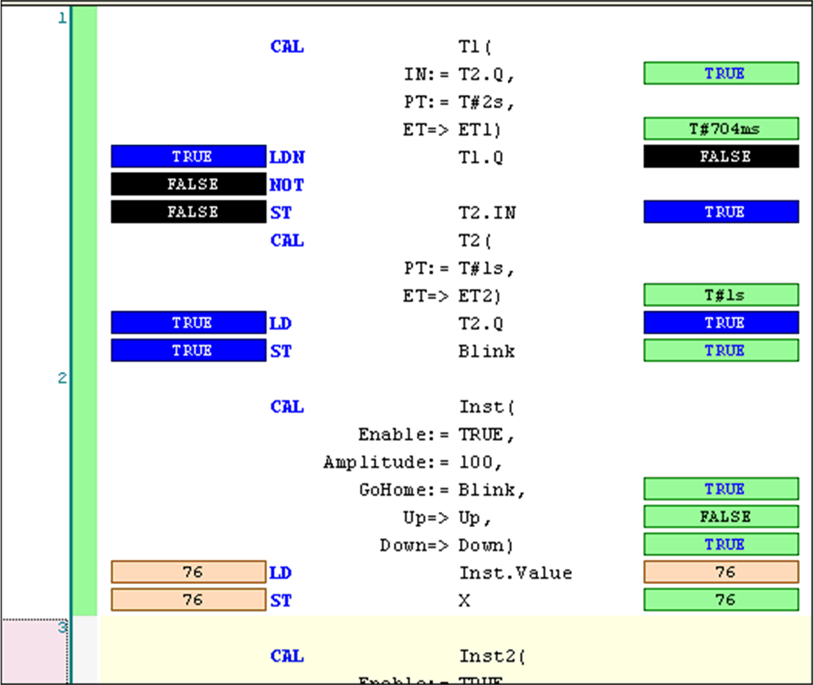

# Toggle Flow Control Mode

## Overview

The command Debug > Toggle Flow Control Mode serves to enable and disable the flow control (Powerflow) function, which is supported for the language editors ST, LD and IL.

Enabled flow control allows you to track the execution of the application program. The values of the variables, as well as the results of function calls and operations are displayed within the editor views at the respective processing location and time of their assignment. Compare this to default monitoring, where only the values between two processing cycles are displayed. The code lines or networks which are processed in the present cycle are color-coded.

Flow control command is an online option and operates in the active editor view. Flow Active is displayed in the status bar while the feature is enabled with a compatible editor.

The command opens a dialog box where you can select the task for which the flow control is to be applied from a list box. By default, the Select task automatically option is selected.

NOTE: When flow control is enabled, it increases the run time of the application. If the option Confirmed online mode is enabled in the Controller Selection [view](../../../../../api/crossBook?lang=en-US&virtualBookName=SoMProg&topicID=D_SE_0083385), then a message is displayed whenever you enable flow control to confirm whether the option should be enabled or abort the activation. When flow control is enabled, you cannot use breakpoints or step through the program.

## Representation of Flow Control in the Different Language Editors

By default, pale green is the color for indicating flow control positions. You can modify the color to be used in the Text Editor [options](D-SE-0084046.html#D-SE-0084046__D-SE-0084046.6).

In all editors, the current values of variables and of concerned inputs and outputs are displayed in boxes similar to those for the standard monitoring. For processed code, these boxes will be displayed in the color configured for flow control. For non-processed code, the monitoring boxes appear white with gray border and contents. Non-processed code displays the value as a normal monitoring value; that is, the value between two task cycles.

Example: Flow control in ST editor

In network editors, the executed networks are marked by bars in flow control color at the left margin.

In [LD](../../../../../api/crossBook?lang=en-US&virtualBookName=SoMProg&topicID=D_SE_0083471), the processed connection lines are drawn in green (or the color you have chosen for flow control); others are gray. The value on the connection is also indicated: TRUE by thick blue lines, FALSE by thick black lines, unknown or analog values by thin black lines. This can result in dashed lines combining the respective information.

Example: Flow control in LD editor

In IL, for each instruction line, two boxes are used to indicate the current values. One positioned left to the operator showing the current accumulator value, one positioned right to the operand showing the value of the operand.

Example: Flow control in IL editor

You can write values in flow control mode. However, forcing values is not allowed. Double-click the value box and enter the desired value in the Prepare Value [dialog box](D-SE-0084023.html#D-SE-0084023).

EIO0000002860.10