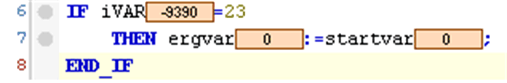
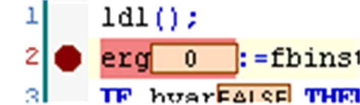
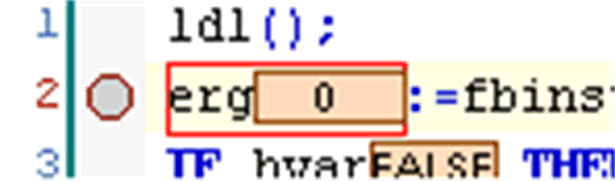
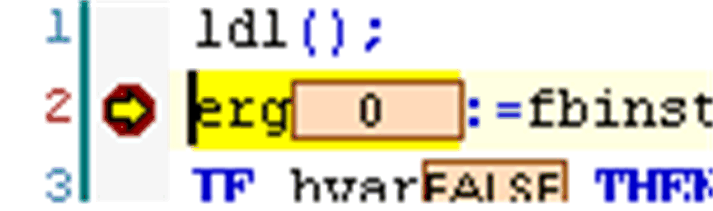

# Breakpoint Positions

## Overview

The possible [breakpoint](../../../../../api/crossBook?lang=en-US&virtualBookName=SoMProg&topicID=D_SE_0083451) positions depend on the editor. Basically they are those positions in a POU where values of variables can change or where the program flow branches out or another POU is called.

See in the following, the various symbols for indicating breakpoints in online mode.

In the ST editor, a possible breakpoint position is indicated by a gray filled circle:

NOTE: A breakpoint will be set automatically in all methods which may be called. If an interface-managed method is called, breakpoints will be set in all methods of function blocks implementing that interface and also in all derivative function blocks subscribing the method. If a method is called via a pointer on a function block, breakpoints will be set in the method of the function block and in all derivative function blocks which are subscribing to the method.

You can restrict the breakpoint positions via the Properties of each [breakpoint](D-SE-0083918.html#D-SE-0083918).

A set breakpoint is indicated by a red filled circle:

A disabled breakpoint is indicated by a gray circle with a red border:

When the program has stopped at a set breakpoint, this is indicated by a yellow arrow and yellow shaded line:

EIO0000002860.10