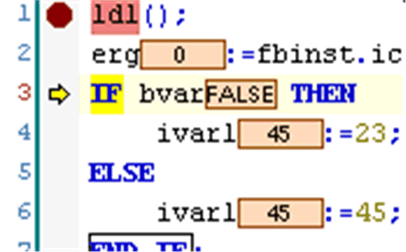

# Step Into

## Overview

Default shortcut: F8

The Debug > Step Into command can be used for [stepping](../../../../../api/crossBook?lang=en-US&virtualBookName=SoMProg&topicID=D_SE_0083451) through a program in online mode, for example for debugging purposes.

A single step will be executed. The program will stop before the next instruction. If necessary, there will be a changeover to an open POU. If the present position is a call-up of a function or of a function block, the command will proceed onto the first instruction in the called POU.

In all other situations, the command will act like [step over](D-SE-0084032.html#D-SE-0084032).

The possible halt positions during stepping depend on the editor.

The position is indicated by a yellow shading.

EIO0000002860.10