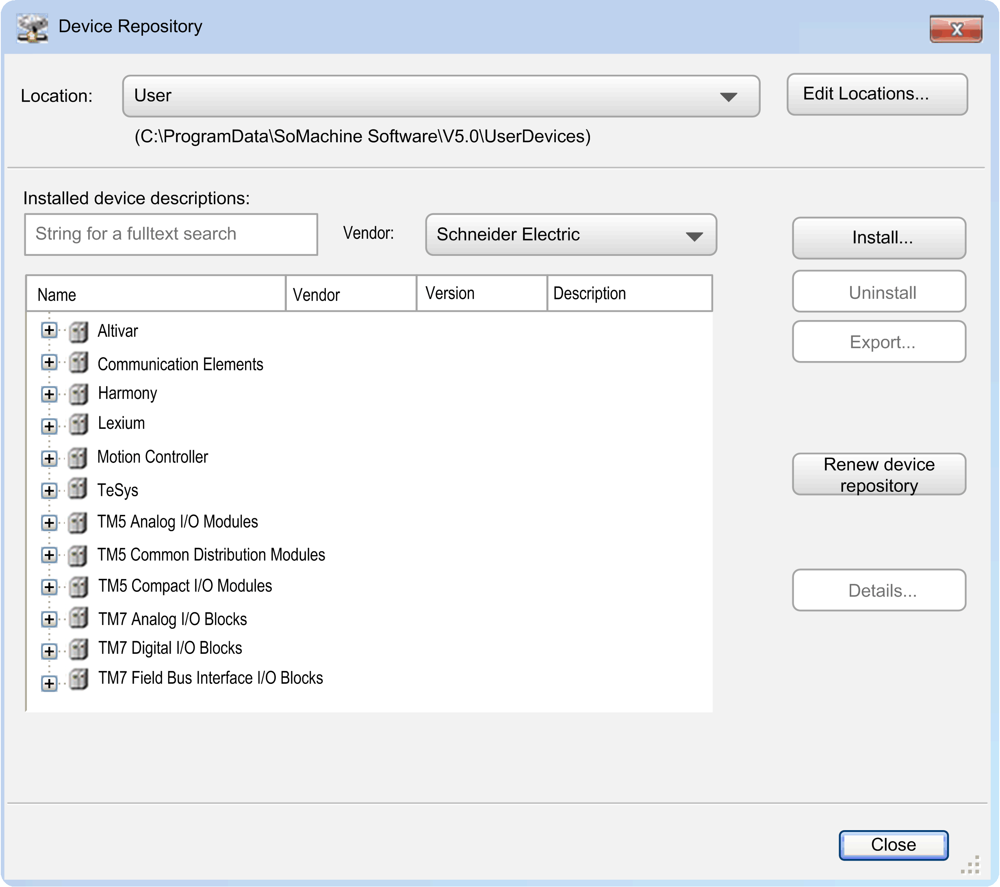
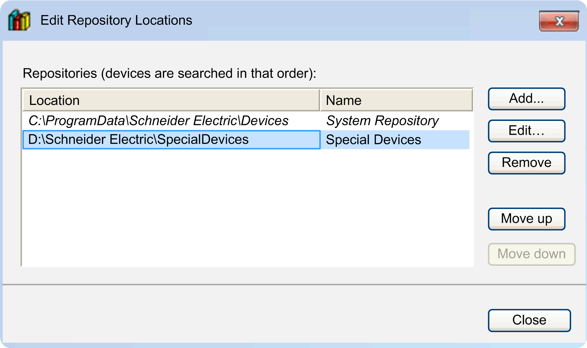
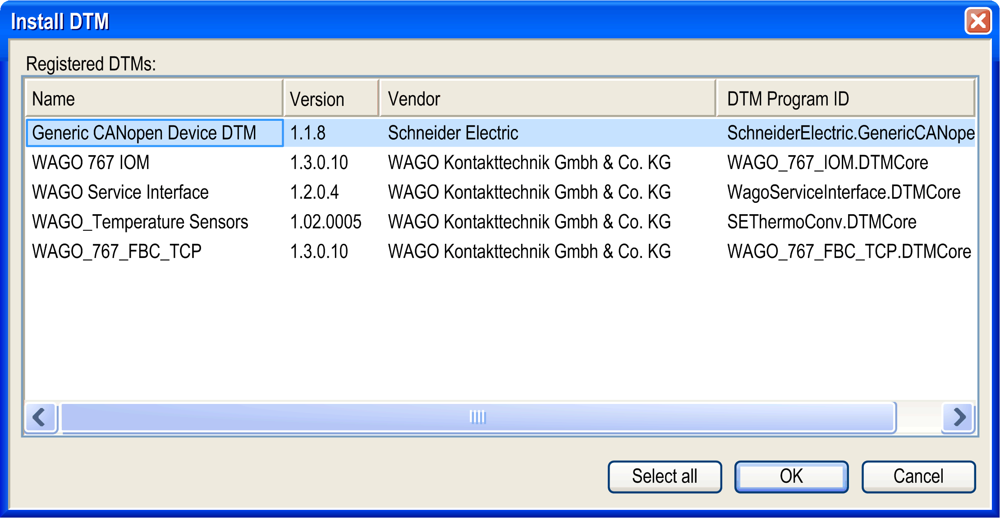
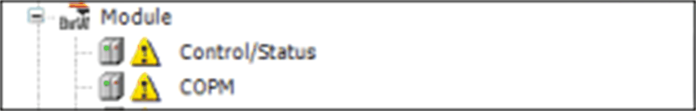

# Device Repository...

## Overview

NOTE: This functionality is only available if supported by the used feature set.

The Tools > Device Repository... command opens the Device Repository dialog box. A device repository is a database for the devices which have been installed on the local system for being available in the EcoStruxure Machine Expert development system. In the Device Repository, you can add or remove such device installations.

Device Repository dialog box

|  |  |
| --- | --- |
| Location | Device repositories can be available on multiple locations in the system. The selection list offers the currently available locations. By default, the System Repository is provided. |
| Edit Locations... | This command opens a dialog box to add, edit, or remove repository locations. |

Edit Repository Locations dialog box

Click the Move up and Move down buttons to modify the search order. Click the Add... button to open a dialog box for defining a new location.

To remove a repository location, click the Remove button.

A dialog box is displayed requesting you to confirm if you want to delete the directory from the hard disk as well.

|  |  |
| --- | --- |
| Installed device descriptions | The currently installed devices are listed in a tree structure, each showing the Name, Vendor, and Version of the device. The tree can be structured by categories (such as PLCs in the image of the Device Repository dialog box). If applicable, expand or collapse the entries by clicking the plus and minus buttons. |
| String for a fulltext search | Click this field to edit it. If you enter a character string, only those devices that include the character string are displayed in the lower view. The matching string is highlighted in yellow. |
| Vendor | Select an entry from the list to display only devices of this manufacturer. |
| Install... | Click the Install... button to install a device for being available in the programming system. The Install Device Description dialog box opens where you can browse your system for the respective device description. For the standard devices, the file filter is to be set to *\*.devdesc.xml*. But also description files, such as *\*.gsd*-files for PROFIBUS DP modules, *\*.eds*- and *dcf*-files for CAN devices, can be selected by setting the respective filter. |

As soon as you confirm the selection by clicking OK, the dialog box is closed, and the new device is added to the tree of devices in the Device Repository dialog box. Errors detected during installation (that is, missing files referenced by the device description) are reported in the lower part of the Device Repository dialog box.

NOTE: During installation, the device description files, and additional files referenced by that description are copied to an internal location. Altering the original files will have no further effects on the installed devices. In order for these modifications to take effect, the devices need to be reinstalled. It is considered good practice to increment the internal version number of a device description after it has been modified.

NOTE: The internal device repository must never be altered manually. Do not copy files to or from there. Use the Device Repository dialog box to reinstall, add, or remove devices.

|  |  |
| --- | --- |
| Uninstall | Click this button to remove (uninstall) the selected device. It will be removed from the device repository and not be available for use in the programming system any longer. |

The list of installed devices is offered in the hardware catalog when you are going to [add a device object](../../../../../api/crossBook?lang=en-US&virtualBookName=SoMProg&topicID=D_SE_0083369).

|  |  |
| --- | --- |
| Install DTM... | Click this button to scan the Windows registry for any DTM. The results are displayed in a list that allows you to select the DTMs to be added to the repository. |

Install DTM dialog box

This dialog box provides a list of the DTMs with information about Name, Version, Vendor, and DTM Program ID. To install the DTMs to the device repository, select the desired DTM and click the OK button.

NOTE: The installation of the DTMs to the Windows operating system is independent of EcoStruxure Machine Expert and must be completed separately. The installation files for the DTMs are provided by the hardware supplier.

|  |  |
| --- | --- |
| Renew Device Repository | Outdated devices are marked with a yellow sign. By use of the Renew device repository function, the devices in the device repository are updated. A dialog box is displayed requesting you to confirm if you want to continue. |

Modules with outdated device descriptions

|  |  |
| --- | --- |
| Details... | Click this button to open a dialog box for the currently selected device. It shows additional information as given by the device description file: Device name, Vendor name, Categories, Type, ID, Version, Order Number, and Description. |

EIO0000002860.10