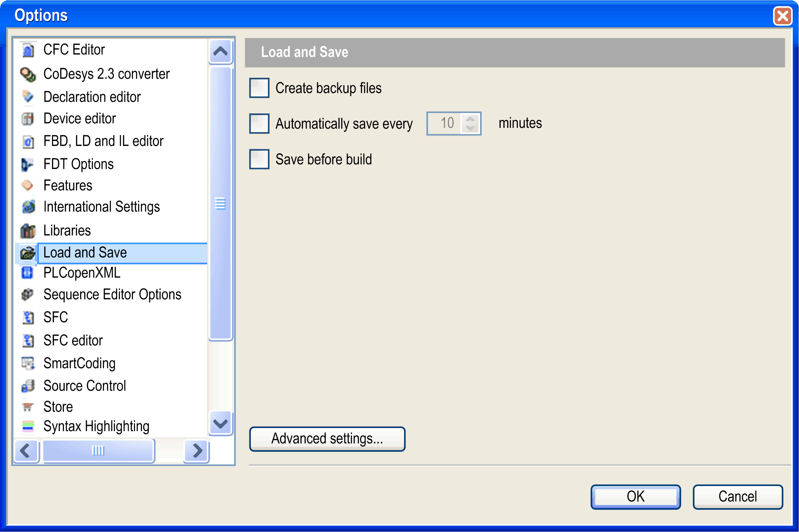
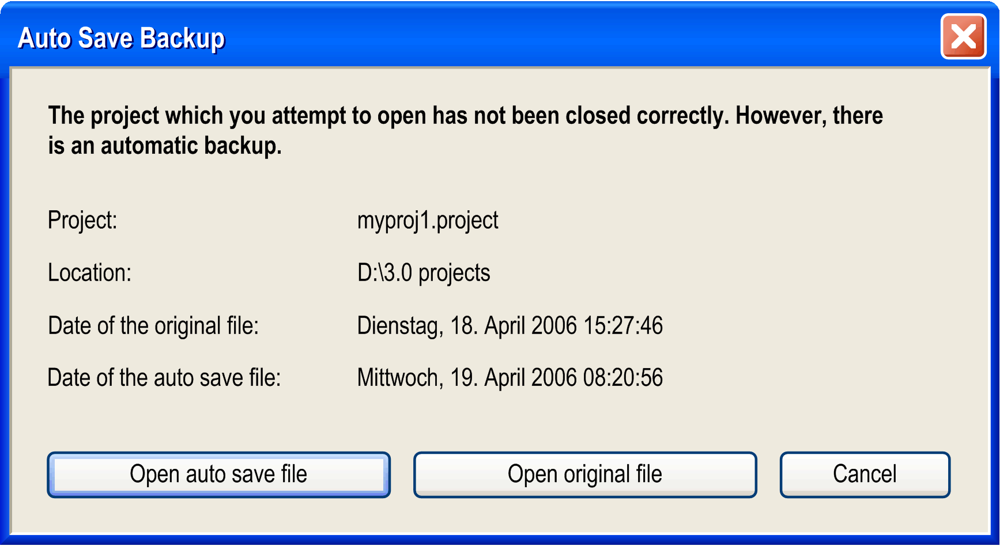

# Options, Load and Save (exclusive to \*.project and \*.library files)

## Overview

The Tools > Options > Load and Save dialog box allows settings concerning the behavior of EcoStruxure Machine Expert at loading and saving a project. This function is exclusive to \*.project and \*.library files in classic storage format. \*.fbs files in file-based storage format are automatically saved after each modification.

Options > Load and Save dialog box

|  |  |
| --- | --- |
| Create backup files | If this option is enabled, at each saving the project will not only be saved in a *<projectname>.project* file but also copied to a file *<projectname>.backup*. If needed, you can rename this backup file and reopen it in EcoStruxure Machine Expert. |
| Automatically save every ... minutes | If this option is enabled, the project will be automatically saved in the defined time intervals to a file *<projectname>.autosave* in the project directory.  If you regularly save or close the currently opened file, the associated auto save file will be deleted, unless the save file command is cancelled or terminated in error. In this case, the file will be kept. If you reopen a project for which an appropriate auto save file is found, the Auto Save Backup dialog box is displayed. You can reopen the auto save project or the saved last version. |
| Save before build | EcoStruxure Machine Expert saves the project automatically before each build run. The last saved version of the project is overwritten. |

Auto Save Backup dialog box

|  |  |
| --- | --- |
| Open auto save file | The auto save file *<projectname>.autosave* will be opened and marked as modified. An asterisk (\*) is displayed behind the file name in the title bar. |
| Open original file | The last version of the project saved will be opened. |

|  |  |
| --- | --- |
| Create project recovery information | As a prerequisite, the No protection option or the Integrity check option is selected in the Project Settings > Security [dialog box](D-SE-0083955.html#D-SE-0083955). Thus, the project is not protected against unauthorized access and data manipulation, and no integrity check is performed when the project is loaded.  If this option is enabled, a message is displayed when a project is reopened after EcoStruxure Machine Expert had stopped to operate unexpectedly beforehand. The message requests whether the unsaved data should be restored and a new project file should be created on this base. In the subsequent project comparison, it is indicated whether the changes made before the file was closed can actually be restored. |
| Advanced Settings... | Click this button to open the same-named dialog box. |

Parameters of the Advanced Settings dialog box:

|  |  |
| --- | --- |
| Project compression | |
| Level | As a prerequisite, the Integrity check option is selected in the Project Settings > Security [dialog box](D-SE-0083955.html#D-SE-0083955).  List for selecting the compression level that is used when the project is saved:   * Least compression - best speed (recommended) * Medium compression - medium speed * Most compression - worst speed |
| Load behavior | If this option is enabled (default), the loading of libraries and compile information will be done in the background while you start working on the project. |

EIO0000002860.10