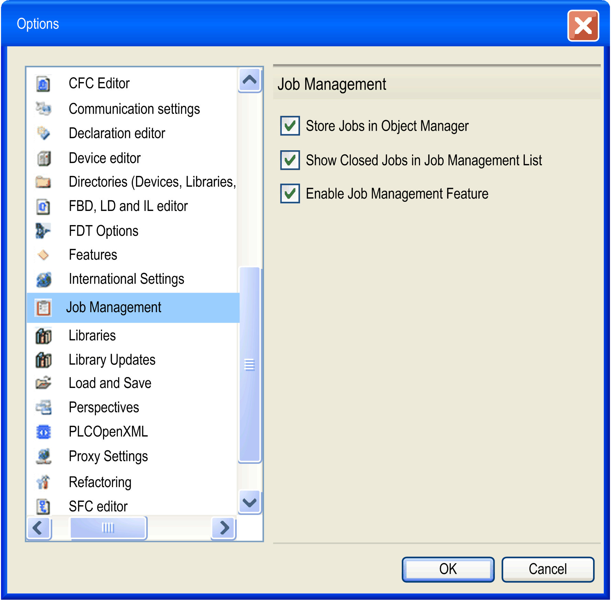

# Options, Job Management

## Overview

The Tools > Options→Job Management dialog provides settings concerning the [**Job Management**](D-SE-0083930.html#D-SE-0083930) feature.

|  |  |
| --- | --- |
| Store Jobs in Object Manager | If this option is enabled, jobs are stored in the project file, otherwise they are stored in the auxiliary files. |
| Show Closed Jobs in Job Management List | If this option is enabled, jobs with the state Closed are displayed in the [**Job Management View**](D-SE-0083930.html#D-SE-0083930__D-SE-0083930.3). |
| Enable Job Management Feature | Only if this option is enabled, the command Job List is displayed in the View menu. |

EIO0000002860.10