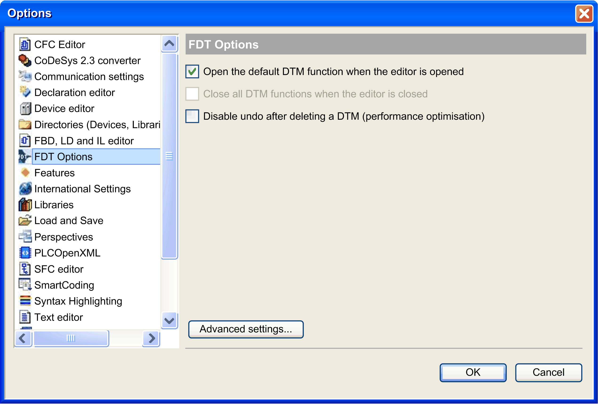

# FDT Options

## Presentation

The Tools > Options > FDT Options dialog box allows selection of options concerning the Device Type Manager (DTM) functionality.

FDT Options dialog box

This table describes the FDT Options:

| Option | Description |
| --- | --- |
| Open the default DTM function when the editor is opened | By double-clicking the device in the Devices tree:   * If activated: the DTM configuration tab is opened. * If deactivated: only the usual tabs are opened. |
| Close all DTM functions when the editor is closed | Not used. |
| Disable undo after deleting a DTM (performance optimization) | If activated, the [**Undo**](D-SE-0083915.html#D-SE-0083915__D-SE-0083915.2) command is not available after deleting a DTM. Consequently, the project size increases if a DTM is added to the project, and decreases if the DTM is subsequently deleted.  If deactivated, the Undo command is available after deleting a DTM. Consequently, the project size increases if a DTM is added to the project, but does not decrease if the DTM is subsequently deleted. |
| Advanced settings | Opens the second FDT Options window for advanced settings. |

## Advanced Settings

The table describes the advanced settings of FDT Options:

| Option | Description |
| --- | --- |
| User management according to FDT specification | Not used. |
| Check for changed DTM parameters before application login | If selected, an automatic parameter download to the devices is performed before login if parameters have been changed since the last download.  This is useful to keep consistency, but it can result in longer execution time for login (depends on DTM). |
| Set DTMs offline after application logout | If selected, the DTMs are switched to offline mode after logout from controller.  Each DTM instance occupies memory. This memory is freed up again as soon as the editor is closed. |
| Restrict DTM instance count to control memory usage | Not used. |
| Maximum number of DTM instances | Not used. |
| Minimum amount of free memory (in MB) | Not used. |
| Create temporary device description files when updating the catalog | Not used. |
| Verbose mode | If this option is activated, detailed information and messages will be displayed in the Messages view.  NOTE: Use Verbose mode for debug purposes. When this mode is active, many messages are logged in memory and thereby restrict memory availability to EcoStruxure Machine Expert. |
| Show Popups for errors reported by a DTM | If activated, the DTM reports detected errors in a pop-up window.  If deactivated, there is no detected error notification. However, if verbose mode is activated, the DTM reports its detected errors in the Messages view.  NOTE: Pop-up windows need to be confirmed. This can slow down operation (for example: for communication interruptions, if a device is not responding, a large number of pop-up messages can be displayed). |

EIO0000002860.10