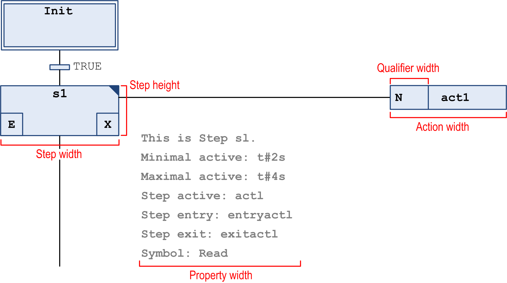
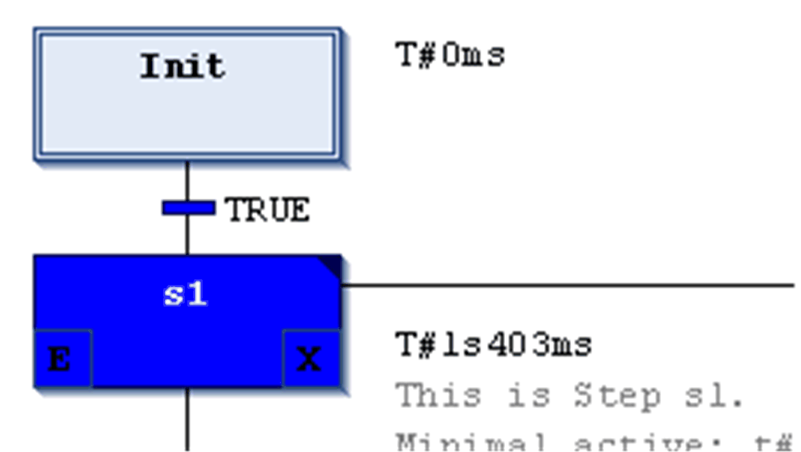
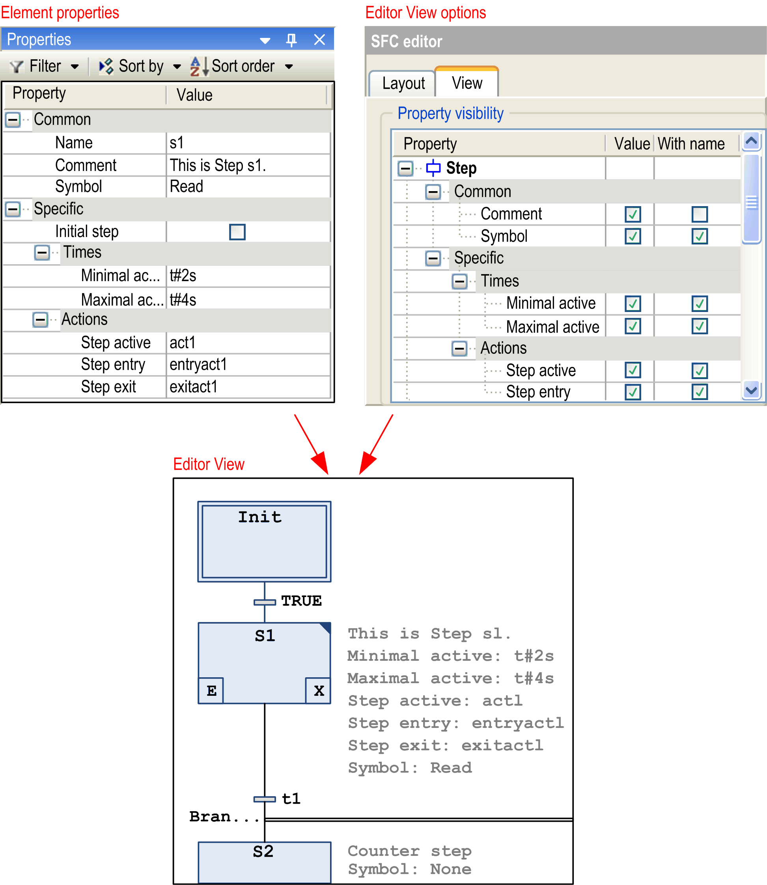

# SFC Editor

## Overview

The Tools > Options > SFC Editor dialog box provides settings concerning the editing in an SFC [editor](../../../../../api/crossBook?lang=en-US&virtualBookName=SoMProg&topicID=D_SE_0083498) (Sequential Function Chart).

## Layout Tab

The settings are to be made in grid units. One grid unit = font size currently set in the Text editor options (Text area > Font).

|  |  |
| --- | --- |
| Step height | step element height in grid units  possible values: 1...100 |
| Step width | step element width in pixels in grid units  possible values: 2...100 |
| Action width | action element display width in grid units  possible values: 2...100 |
| Qualifier width | qualifier display width in grid units  possible values: 2...100. |
| Property width | property display width in grid units  possible values: 2...100. |

These settings will affect all open SFC editors immediately.

Layout options in SFC

Options of the Default insertion method for step actions:

| Default insertion method option | Description |
| --- | --- |
| Copy reference | When you copy the step, the reference to the action objects that are called by the step are also copied. The source step and new step call the same action. |
| Duplicate implementation | The reference to the action objects that are called by the step are linked to this step. When you copy the step element, new action objects are created for the new step. The implementation is duplicated. |
| Always ask | When you insert a step action, you are prompted whether the actions of a step element should be duplicated when it is copied, or whether the reference to the existing action should be used.  NOTE: If a step already contains an embedded action, new inserted actions of this step are also embedded. Likewise, new inserted actions are not embedded when the step already contains a non-embedded action. In these cases, you are not prompted to select the duplication mode. |

Option for Embedded objects

| Option | Description |
| --- | --- |
| Show action and transition objects in the navigator | If the option is selected, action and transition objects that are embedded in the SFC block by a step are displayed as a node in the Applications tree. |

## View Tab

|  |  |
| --- | --- |
| Property visibility | Here you can define which of the [**Element Properties**](../../../../../api/crossBook?lang=en-US&virtualBookName=SoMProg&topicID=D_SE_0083502) (step attributes) should be displayed next to an element in the SFC editor view: The Common and the Specific properties for each element type are shown in the table. You can activate the checkbox in the Value field in order to display the property value right to the element in each SFC object. If you additionally activate the checkbox in the With name field, the value will be preceded by the name of the property. |
| Online | If the option Show step time is activated, in online mode, the current step time will be displayed to the right of each step element for which time [properties](../../../../../api/crossBook?lang=en-US&virtualBookName=SoMProg&topicID=D_SE_0083502) are set. |

## Example

Step time displayed in online mode

Example for step attributes

EIO0000002860.10