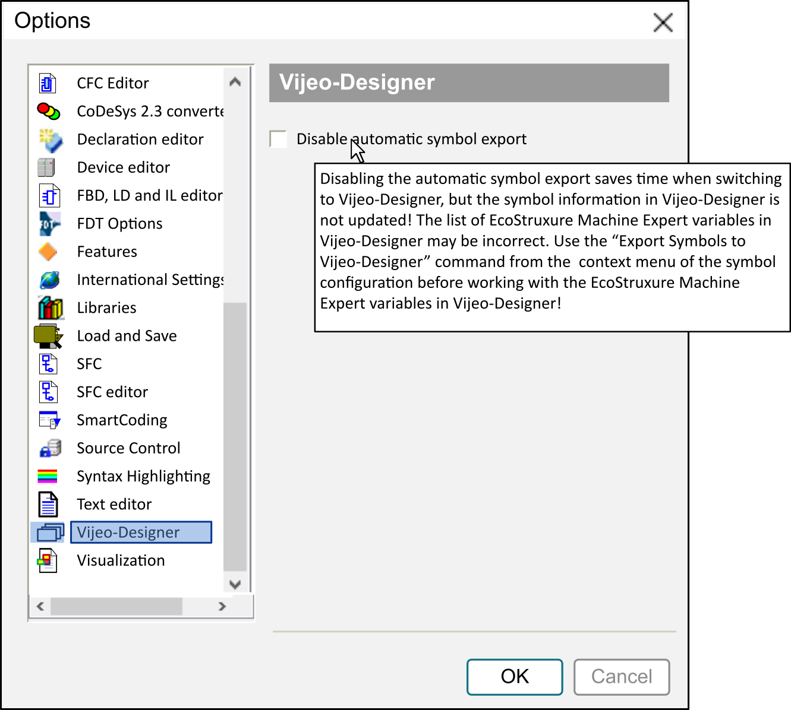

# Vijeo-Designer

## Overview

The Tools > Options > Vijeo-Designer dialog box allows you to inhibit the automatic export of EcoStruxure Machine Expert variables to Vijeo-Designer.

For further information on [EcoStruxure Machine Expert controller - HMI data exchange, refer to the appropriate chapter in the Programming Guide](../../../../../api/crossBook?lang=en-US&virtualBookName=SoMProg&topicID=D_SE_0083589).

EIO0000002860.10