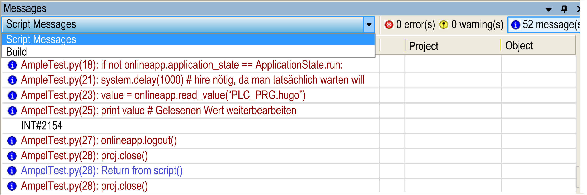

# Script

## Execute Script File

To start a script, execute the command Tools > Scripting. A dialog box opens allowing you to select the script (extension *\*.py*) and executing it by clicking the Open button.

You can also start script files from the Windows command line (`--runscript`).

For general information about script commands in EcoStruxure Machine Expert, refer to the [Script Languages chapter](../../../../../api/crossBook?lang=en-US&virtualBookName=SoMProg&topicID=D_SE_0083831).

## Enable Script Tracing

Execute the command Tools > Scripting > Enable Script Tracing to enable script tracing. A blue frame around the icon indicates that the option is activated.

If script tracing is enabled, all script command lines will be displayed in the Messages view. This option serves to observe and debug scripts.

Script tracing in Messages view

EIO0000002860.10