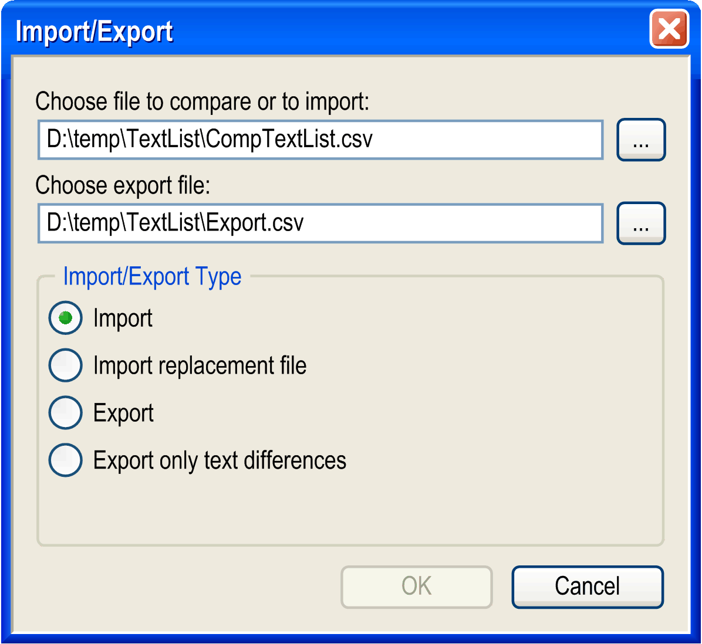

# Import/Export Textlists

## Overview

This command (category [**Text list**](D-SE-0084076.html#D-SE-0084076__D-SE-0084076.2) provides the data exchange with other programs such as Excel. The data format in use is *.csv* (comma-separated values). When executing the command the following dialog box displays:

Import/Export text lists dialog box

By entering the corresponding paths or by making use of the input assistant (...) the files to be imported, exported, or compared may be specified. Which of the actions should be executed, may be defined by activating the corresponding item in the lower part of the dialog box:

|  |  |
| --- | --- |
| Import | When importing an external file, its dataset is placed in line with the dataset of the project. The dataset in the project is adjusted according to the following rules:   * If the data content is identical, the data set will be left unchanged. * If a translation has been added to the external file, it will be added to the data set of the project as well. * If text within a translation has been modified, the modification will be overtaken in the project as well. * If translation texts are missing within the external file, the data set in the project will not be modified. * If a new line has been added to the external file, this new data record will be incorporated in the data set of the project file. * If the project contains an additional line, it will be preserved. * A modification within the Default column may be considered as insertion of new text. If however, there are text positions containing several empty spaces instead of a single one, then this will not be handled as a modification.   [**Example - Import of .csv-file**](#D-SE-0084077__D-SE-0084077.5) |
| Import replacement file | While importing a text list, a modification within the Default column is considered as an insertion of a new line. The reason is, that the Default column is serving as key for comparing the lines during import/export. Note: If texts in the column have several blanks instead of one, this is not considered as a change.  If text shall be modified within the Default column (elimination of typing mistake or supplement to existing text), a replacement file becomes necessary. |

## Example - Import of a Replacement File

| Default Old | Default New | Command |
| --- | --- | --- |
| Cancel ? | Cancel | REPLACE |
| Do you want to register ? | Do you really want to register ? | REPLACE\_AND\_REMOVE |
| Do you really want to register ? | Do you really want to register ? | REPLACE\_AND\_REMOVE |

The replacement file will be executed top/down. Thus, the change history can be accounted for.

The command defines what to do with a text line. The only command available yet is REPLACE. It will have the following effect:

Normally, the text entered in Default column will be replaced by the new text. In the example, Cancel ? will be replaced by Cancel and Do you want to register ? by Do you really want to register ?. Simultaneously, the texts of all visualization elements will be adjusted, that is, the old text entries within the visualization elements will be replaced.

In the case where the new default text is already contained in the Default field of another row of the text list, the row containing the entry to be replaced will be deleted completely. The visualization elements involved receive the corresponding entries of the remaining row with the same default entry. In the example, this will happen for the default entry Do you really want to register ?! that should be replaced by Do you really want to register ?. Due to the change history, there already a row will exist with this default entry when the related REPLACE command shall be carried out. To avoid multiple occurrences of the key, the row containing the old default text Do you really want to register ? will be deleted completely from the text list.

## Export

* Exporting text lists all modifications within the project are compared to an external file. A new export file will be created according to the following rules:

|  |  |
| --- | --- |
| 1 | If the data content is identical, the data set will be exported as it is. |
| 2 | If a translation has been added to the project file, it will be included. |
| 3 | If text within a translation has been modified, the modification in the project will be overtaken in the export file as well. |
| 4 | If translation texts are missing within the project file, the translations of the template will be used for the new data set. |
| 5 | If a new line has been added to the project, this new data record will be incorporated as a new data set of the project file. |
| 6 | If the external file contains an additional line, it will be exported again. |
| 7 | A modification within the Default column may be considered as insertion of new text. |

[**Example - Export of a .csv-file**](#D-SE-0084077__D-SE-0084077.6)

Export only text differences

* If this option is activated, only the lines differing from their corresponding line in the different versions are included in the export file. Such a difference file is suited as input for translation purposes. As the file is intended to be kept as small as possible, missing items in the actual text lists will not be treated as differences.

  [**Example - Export of text differences only**](#D-SE-0084077__D-SE-0084077.7)

  NOTE: For locating the corresponding data sets the Default column is used for the GlobalTextList and the Id column for all other text lists. Therefore, the Id column is empty for all data sets of the GlobalTextList.

## Example - Import of .csv-file

Data content of external file:

| TextList | Id | Default | Deutsch | English |
| --- | --- | --- | --- | --- |
| GlobalTextList | - | Automobile | Automobil | Automobile |
| GlobalTextList | - | Steering wheel | Lenkrad | Steering wheel |
| TextList1 | 0 | Cancel | Abbrechen | Cancel |
| TextList1 | 1 | Door | - | - |
| TextList1 | 2 | Light | - | - |

Data content of text list of project before import:

| TextList | Id | Default | Deutsch | English |
| --- | --- | --- | --- | --- |
| GlobalTextList | - | Automobile | Automobil | Automobile |
| GlobalTextList | - | Steering wheel | - | - |
| TextList1 | 0 | Cancel | Abbrechen | Abortion |
| TextList1 | 1 | Door | Tür | Door |
| TextList2 | 3 | Seat | Sitz | Seat |

During the import, all differences are incorporated into the project. The 2 lists are adapted so that the following text list will result in the project.

| TextList | Id | Default | Deutsch | English |
| --- | --- | --- | --- | --- |
| GlobalTextList | - | Automobile | Automobil | Automobile |
| GlobalTextList | - | Steering wheel | Lenkrad | Steering wheel |
| TextList1 | 0 | Cancel | Abbrechen | Cancel |
| TextList1 | 1 | Door | - | - |
| TextList1 | 2 | Light | - | - |
| TextList2 | 3 | Seat | Sitz | Seat |

## Example - Export of a .csv-file

Data set of external file:

| TextList | Id | Default | Deutsch | English |
| --- | --- | --- | --- | --- |
| GlobalTextList | - | Automobile | Automobil | Automobile |
| GlobalTextList | - | Steering wheel | - | - |
| TextList1 | 0 | Cancel | Abbrechen | Abort |
| TextList1 | 1 | Door | Tür | Door |
| TextList2 | 2 | Seat | Sitz | Seat |

Data content of text lists of project before export:

| TextList | Id | Default | Deutsch | English |
| --- | --- | --- | --- | --- |
| GlobalTextList | - | Automobile | Automobil | Automobile |
| GlobalTextList | - | Steering wheel | Lenkrad | Steering wheel |
| TextList1 | 0 | Cancel | Abbrechen | Cancel |
| TextList1 | 1 | Door | - | - |
| TextList1 | 3 | Light | - | - |
| TextList2 | - | - | - | - |

During the export, all differences are incorporated in the external file. The 2 lists are adapted so the following external file will be created.

Data content of text lists from project after export:

| TextList | Id | Default | Deutsch | English |
| --- | --- | --- | --- | --- |
| GlobalTextList | - | Automobile | Automobil | Automobile |
| GlobalTextList | - | Steering wheel | Lenkrad | Steering wheel |
| TextList1 | 0 | Cancel | Abbrechen | Cancel |
| TextList1 | 1 | Door | Tür | Door |
| TextList1 | 3 | Light | - | - |
| TextList2 | 2 | Seat | Sitz | Seat |

## Example - Export of Text Differences Only

Data content of external file:

| TextList | Id | Default | Deutsch | English |
| --- | --- | --- | --- | --- |
| GlobalTextList | - | Automobile | Automobil | Automobile |
| GlobalTextList | - | Steering wheel | - | - |
| TextList1 | 0 | Cancel | Abbrechen | Abort |
| TextList1 | 1 | Door | Tür | Door |
| TextList2 | 2 | Seat | Sitz | Seat |

Data content of text lists of project before export:

| TextList | Id | Default | Deutsch | English |
| --- | --- | --- | --- | --- |
| GlobalTextList | - | Automobile | Automobil | Automobile |
| GlobalTextList | - | Steering wheel | Lenkrad | Steering wheel |
| TextList1 | 0 | Cancel | Abbrechen | Cancel |
| TextList1 | 1 | Door | - | - |
| TextList1 | 3 | Light | - | - |
| TextList2 | - | - | - | - |

During the export all lines differing from the corresponding ones (line 2, 3 and 5 of the actual list) are included in the export file.

Data content of external file after export:

| TextList | Id | Default | Deutsch | English |
| --- | --- | --- | --- | --- |
| GlobalTextList | - | Steering wheel | Lenkrad | Steering wheel |
| TextList1 | 0 | Cancel | Abbrechen | Cancel |
| TextList1 | 3 | Light | - | - |

EIO0000002860.10