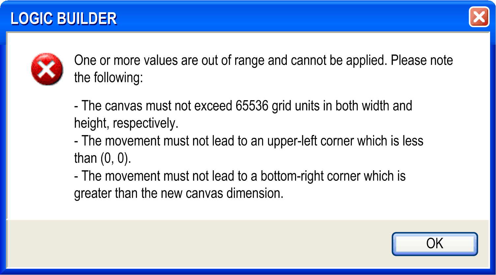

# Edit Working Sheet

## Overview

The CFC > Edit Working Sheet command opens the Edit Working Sheet dialog box for modifying the size of the working area (working sheet) of the current CFC.

The size of the working sheet is defined by the height and width of a rectangular area having its origin (X: 0, Y: 0) in the upper left corner of the editor view and including all existing CFC elements. Height and width are specified in the number of grid units whereby you cannot change the size of a grid unit. Height (Y): increasing positive values from top to bottom, width (X): increasing positive values from left to right.

The maximum size is 65536 grid units in width and height.

## Elements of the Edit Working Sheet Dialog Box

| Parameter | Description |
| --- | --- |
| Use the following dimensions | If this option is activated, the size of the worksheet will be determined by the following width and height values: |
| Width | Shows the current width in grid units.  You can edit this value. It will not be possible to enter a width smaller than that which is required by the existing elements. Increasing the value (X) will enlarge the width horizontally to the right. |
| Height | Shows the current height in grid units.  You can edit this value. It will not be possible to enter a height smaller than that which is required by the existing elements. Enlarging the value (Y) will enlarge the working sheet vertically downwards. |
| Adapt the dimensions automatically | This option is activated by default. The size of the working sheet is defined by the bottommost (height) and the rightmost (width) element borders within the editor view. The origin (X=0, Y=0) is in the upper left corner |
| Move the working sheet origin relatively | If this option is activated, the working sheet can be shifted vertically and/or horizontally by the offset values given in the following parameters.  Restrictions:  The shift may not lead to an upper left corner less than 0/0. If the option Use the following dimensions is activated in the upper part of the dialog box, the shift may not exceed the width and height defined there. If the option Adapt the dimensions automatically is activated, the shift may exceed the current dimensions and the width and height values will be updated accordingly. |
| X offset | By default this value is 0.  Entering a positive value shifts the chart to the right, thus possibly increasing the width of the working sheet. Entering a negative value shifts the chart to the left. This is only possible if there is space between the leftmost element and the left window border. |
| Y offset | By default this value is 0.  Entering a positive value shifts the chart downwards, thus possibly increasing the height of the working sheet. Entering a negative value shifts the chart upwards. This is only possible if there is space between the uppermost element and the upper window border. |

If you enter invalid sheet size values, an error message dialog box will display, also listing the given restrictions.

EIO0000002860.10