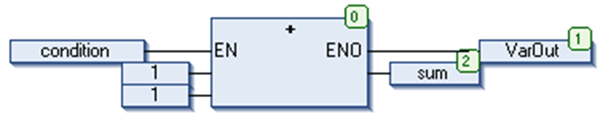
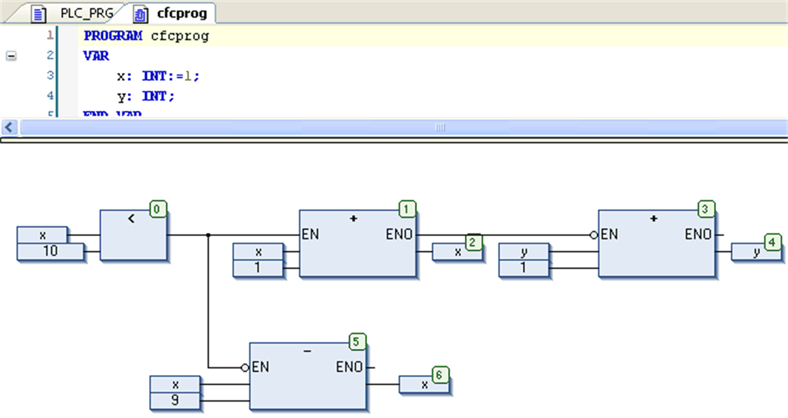

# EN/ENO

## Overview

The CFC > EN/ENO command is used to give a selected block ([cursor position 3](../../../../../api/crossBook?lang=en-US&virtualBookName=SoMProg&topicID=D_SE_0083492)) an additional boolean enable input EN and a boolean output ENO (enable out).

Example: ADD-box with EN/ENO

In this example, ADD will only be executed if the boolean variable `condition = TRUE`. VarOut will be set to TRUE after the execution of ADD. Regard that if the condition changes to FALSE, ADD will not be executed any longer and also VarOut will be set to FALSE.

The example shows how the ENO value can be used for further blocks.

For this example, initialize x with 1. The numbers in the right corner of the boxes indicate the order in which the commands are executed.

As long as x is less than 10 (0), it will be increased by one (1). As soon as x = 10, the output of LT (0) will deliver the value FALSE and SUB (5) and ADD (3) will be executed. x will be set back to the value 1 and y will increase by 1. LT (0) will be executed again as long as x is less than 10. Thus y is counting how often x passes though the value range 1 to 10.

EIO0000002860.10