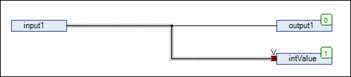
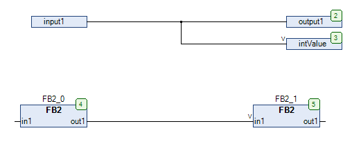

# Use Attributed Member as Input

## Overview

The Use Attributed Member as Input command is available in the contextual menu when a CFC editor is active and a (function block) input (or a link connected on it) is selected. It allows you to connect a structure member to a scalar type input.

As a prerequisite, the member of the structure that is connected to the input of the subsequent function block must be provided with the pragma `{attribute 'ProcessValue'}`. The data type of the structure member must be compatible with the data type of the subsequent input. Inputs connected in this way are flagged with the `V` symbol.

## Example 1

```
TYPE QINT :
STRUCT
    Status : STRING;
    {attribute 'ProcessValue'}
    Value1 : INT;
    Value2 : INT;
END_STRUCT
END_TYPE
```

```
PROGRAM PLC_PRG
VAR
    input1: QINT;
    output1: QINT;
    intValue: INT;
END_VAR
```



If you do not execute the command Use attributed member as input for this input (or the link connected on it), then a compiler error will be detected.

## Example 2

The following examples indicate that it is possible to connect inputs to outputs as well as function block inputs to function block outputs.

The examples are based on the following declarations:

```
        input1: QINT;
        output1: QINT;
        intValue: INT;
        FB2_0: FB2;
        FB2_1: FB2;
```

`FB2` is a function block that has `in1` declared as `INT2` and `out1` declared as `QINT`.



EIO0000002860.10