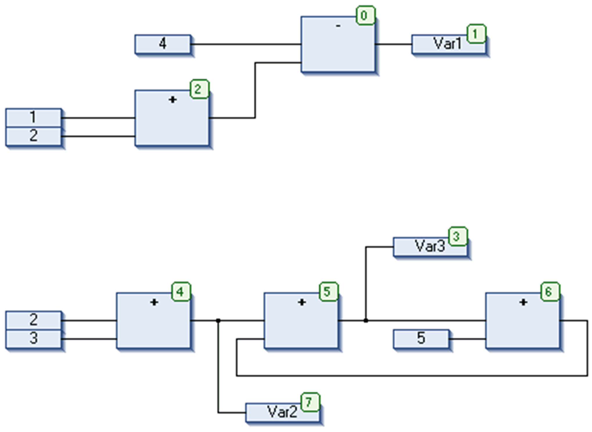
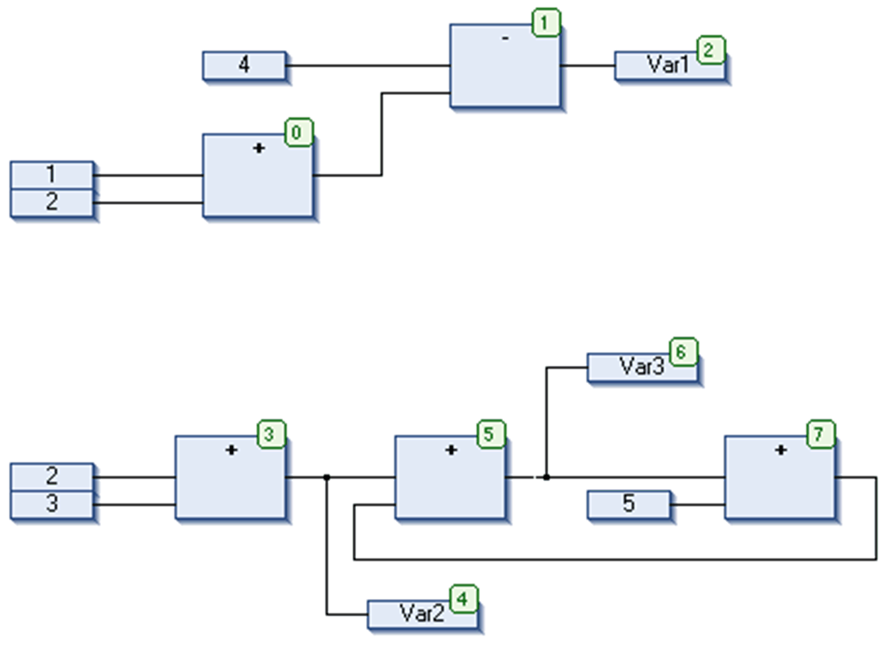

# Order by Data Flow

## Overview

The CFC > Execution Order > Order By Data Flow command affects that the [execution order](../../../../../api/crossBook?lang=en-US&virtualBookName=SoMProg&topicID=D_SE_0083494) (indicated by the element numbers in the upper right corner of an element) in the CFC Editor is determined by the data flow of the elements and not by their position (topology).

The advantage of the order according to the data flow is that an output box, which is connected to the output pin of a block, will be processed immediately after the block, which is not always so in case of a topological process flow. A topological order of processing can deliver another result in some cases than a processing by data flow. This can be recognized from the following example.

## Example

Before: Order by topology

The following arrangement results after having executed the command Order By Data Flow.

Afterwards: Processing according to data flow

When the command is executed, the following will occur internally: First the elements are ordered topographically. Then, a new sequential processing list will be created. Based on the known values of the inputs, the computer calculates which of the elements not yet numbered can be processed next. In the network shown above, the ADD block (0) could be processed immediately since the values at its inputs (1 and 2) are known. Block SUB (1) can only be processed afterwards since the result from ADD must be known first, and so on. Feedback paths are inserted last. This will result in a sequencing by data flow.

EIO0000002860.10