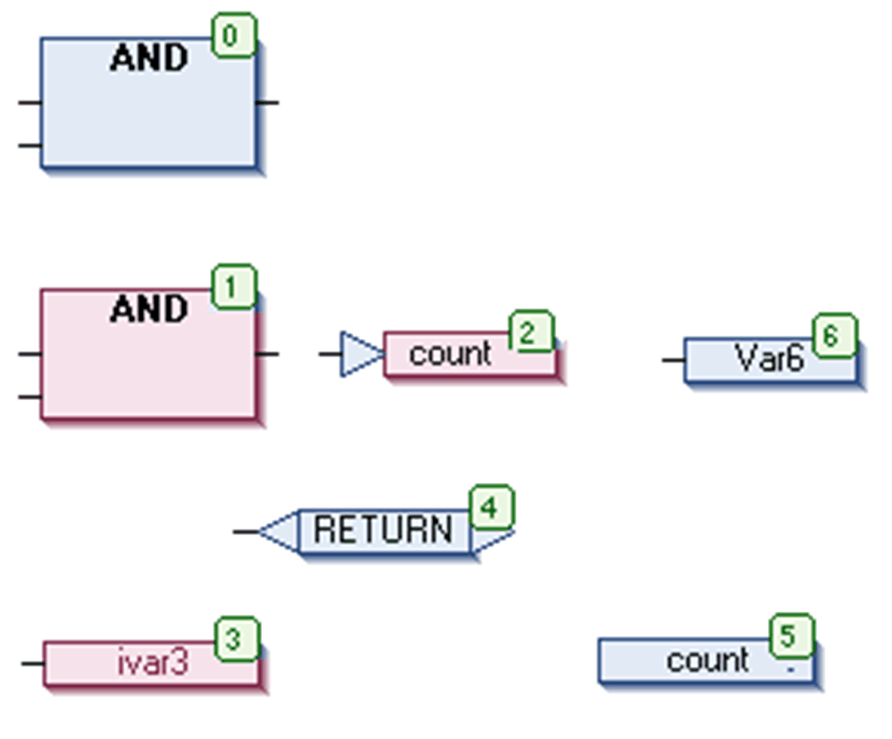
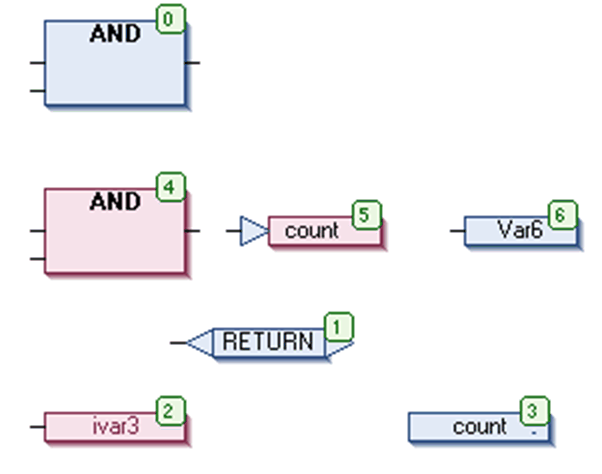

# Order by Topology

## Overview

The CFC > Execution Order > Order By Topology command affects the [execution order](../../../../../api/crossBook?lang=en-US&virtualBookName=SoMProg&topicID=D_SE_0083494) in the CFC Editor is determined by the topological order of the elements and not by the data flow.

Topological order means that the execution order that is the processing of the elements, runs from left to right and from top to bottom. The element numbers, indicating the position of an element within the processing list, increase from left to right and from top to bottom. The position of the connection lines is not relevant, only the location of the elements is important.

When the command is executed, all currently selected elements are removed from the processing list and then reinserted one-by-one in the remaining list from bottom right through to upper left. In doing so, each selected element will be entered before its topological successor and the numbers of the remaining elements will be adapted.

## Topological Arranging of Selected Elements

Sequence before:

The elements with numbers 1, 2 and 3 are selected. If now the command Order By Topology is executed, the elements will be taken out of the sequential processing list first. The subsequent reinserting will be done conversely.

First, ivar will be inserted ahead of label count, thus getting number 4, which makes RETURN fall back to 3. Then, jump count is inserted ahead of Var6 and thus falls back to number 5. This affects the label count (before falling back to number 5), output ivar3 and RETURN each to become reduced to number 1. Finally, the AND box will be reinserted ahead of the jump count and thus will become number 4. Again this affects a reduction of the numbers for each label count (before then having 4), output ivar3 and RETURN by 1.

The following new order of execution will arise.

Sequence afterwards:

A new element will be inserted in the sequential processing list ahead of its topological successor.

EIO0000002860.10