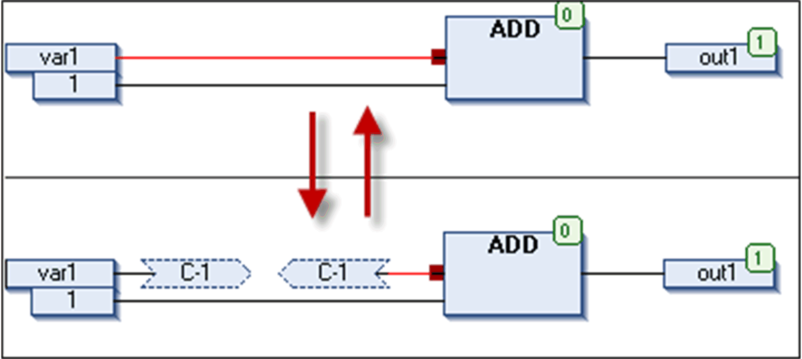
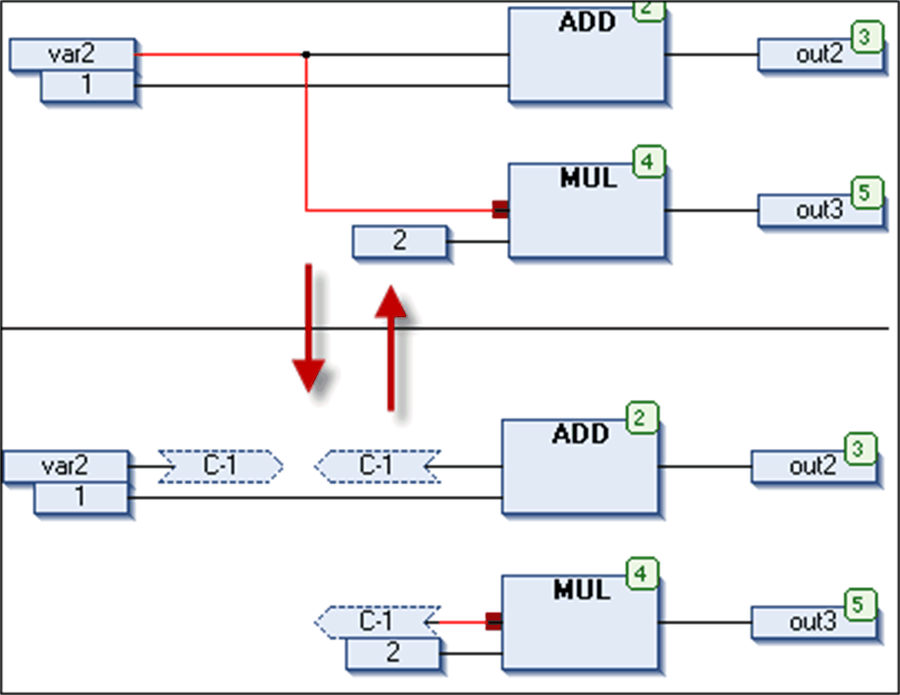
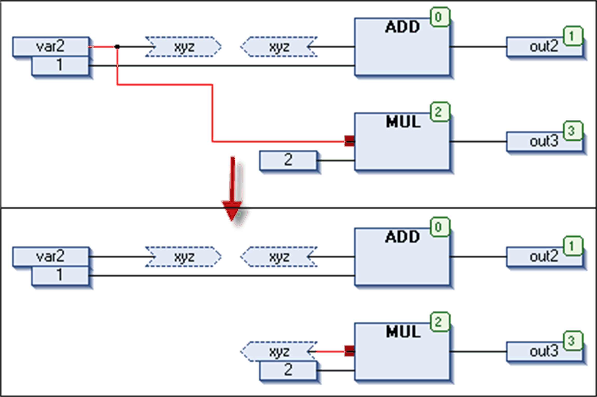

# Connection Mark

## Overview

The CFC > Connection Mark command, toggles the representation of a connection of 2 elements in a CFC between showing a line and using [connection marks](../../../../../api/crossBook?lang=en-US&virtualBookName=SoMProg&topicID=D_SE_0083493).

The command is available when 1 of the 2 connection points at the concerned elements is selected. In this case, a red filled quad appears at the input or output pin of the element. If currently a line is drawn between the elements, the command will automatically remove the line and add a Connection Mark - Source at the output of the 1 element and a Connection Mark - Sink at the input of the other element. Both by default will get the same name `C-<n>`, where `n` is a running number in order to make the name unique when multiple connection marks are used in the CFC.

See the following examples on how the conversion from a connection line to connection mark works. For the reverse conversion, the same principles are true.

Line is converted to 2 connection marks with default name

The command affects a complete connection complex

If there are already connection marks in the same connection complex, these will be kept

EIO0000002860.10