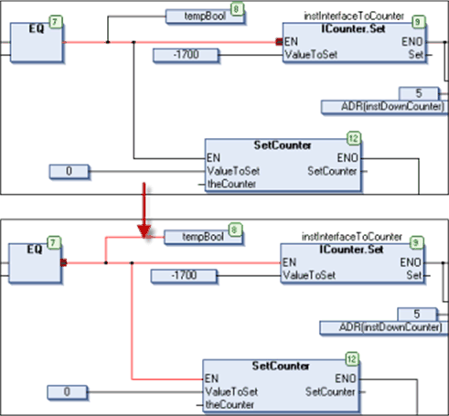

# Select Connected Pins

## Overview

Shortcut: CTRL + LEFT ARROW, CTRL + RIGHT ARROW

The CFC > Select connected pins command is only enabled when 1 of the [connected](../../../../../api/crossBook?lang=en-US&virtualBookName=SoMProg&topicID=D_SE_0083494) pins within a connection complex is selected, indicated by a red filled quad. Executing the command will show the pins connected to the selected one in a way that now this/these will be selected and indicated by a red squad. Also the concerned connection lines or connection marks will be displayed selected.

Keyboard navigation is possible: CTRL + LEFT ARROW or CTRL + RIGHT ARROW selects the next connected pin to the left or to the right of the currently selected one.

## Example

See in the following figure: Input EN of the upper IConter.Set box was selected when the command Select connected pins has been executed. After that, the connected output pin at the EQ box and the concerned connection lines within this connection complex are selected.

EIO0000002860.10