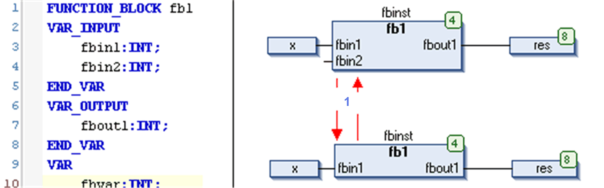

# Reset Pins

## Overview

If unused input or output pins have been removed from a box in the CFC editor, because they are not utilized, or if the interface of the POU which is represented by the box has been changed, you can use the command (CFC > Reset Pins) to restore or update the display of the pins. It can also be used to display the parameters of type [VAR\_IN\_OUT](../../../../../api/crossBook?lang=en-US&virtualBookName=SoMProg&topicID=D_SE_0083607) of a function block, which is hidden per default.

## Example

In the following example, input fbin2 of a function block instance had been deleted because it was not used. By selecting the fb1 box and executing the command Restore Pins, all inputs and outputs of the function block, as defined in its implementation, can be displayed again.

Reset pins

**1** Input fbin2 deleted and restored by the **Restore Pins** command.

EIO0000002860.10