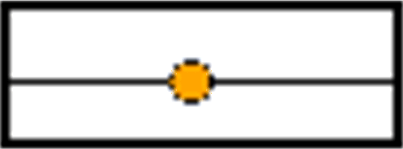

# Remove Control Point

## Overview

The CFC > Remove Control Point command can be used when working on the routing of the connections within the CFC, see [routing of connection lines](../../../../../api/crossBook?lang=en-US&virtualBookName=SoMProg&topicID=D_SE_0083494) for details.

The command deletes a control point from a connection line. When you move the mouse cursor over a line, you get displayed the currently set control points as yellow circle symbols: .

Position the cursor on the control point to be removed and execute the command.

EIO0000002860.10