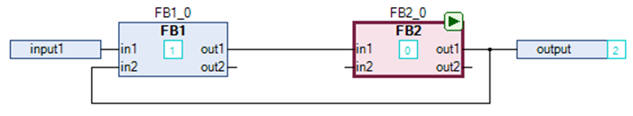

# Set Start of Feedback

## Overview

The CFC > Set Start of Feedback command is available when a CFC editor is active and the Auto Data Flow Mode option is activated in the CFC Execution Order tab of the Properties [dialog box](D-SE-0083921.html#D-SE-0083921__D-SE-0083921.26). Additionally, an element of a feedback that is included in a network of a CFC POU must be selected.

Execute the command to define the selected element as the starting point within a network with feedback. The starting point within a feedback is flagged with a  symbol in the CFC editor. This element is assigned the lowest number in the execution order within the feedback. At runtime, the processing of the feedback starts with this element.

## Example

In the example, the Set Start of Feedback command was executed on `FB2_0` as indicated by the  symbol and the execution order `0`.

EIO0000002860.10