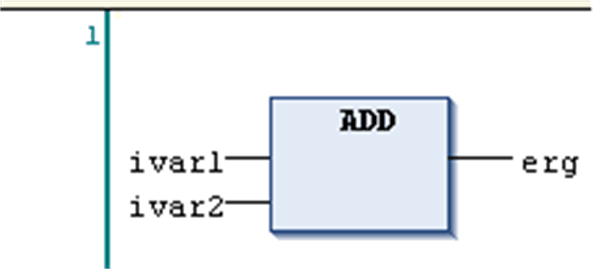
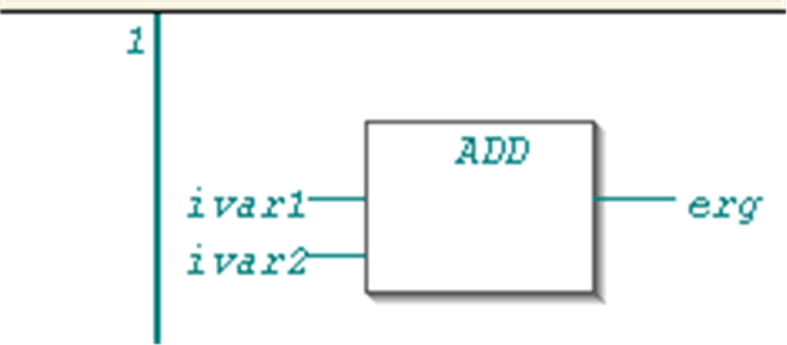

# Toggle Network Comment State

## Overview

Shortcut: CTRL + O

The FBD/LD/IL > Toggle Network Comment State command is used in FBD, LD, or IL editor to comment out a network or to set it back from comment to normal state. The command will affect the network in which the cursor is currently positioned.

A commented-out network will be displayed according to the options set for comments and will not be noticed in program processing.

Example: Network, normal state

Example: Network, comment state

NOTE: Concerning the view options for the components of FBD, LD and IL networks, consider the FBD, LD and IL editor options.

EIO0000002860.10