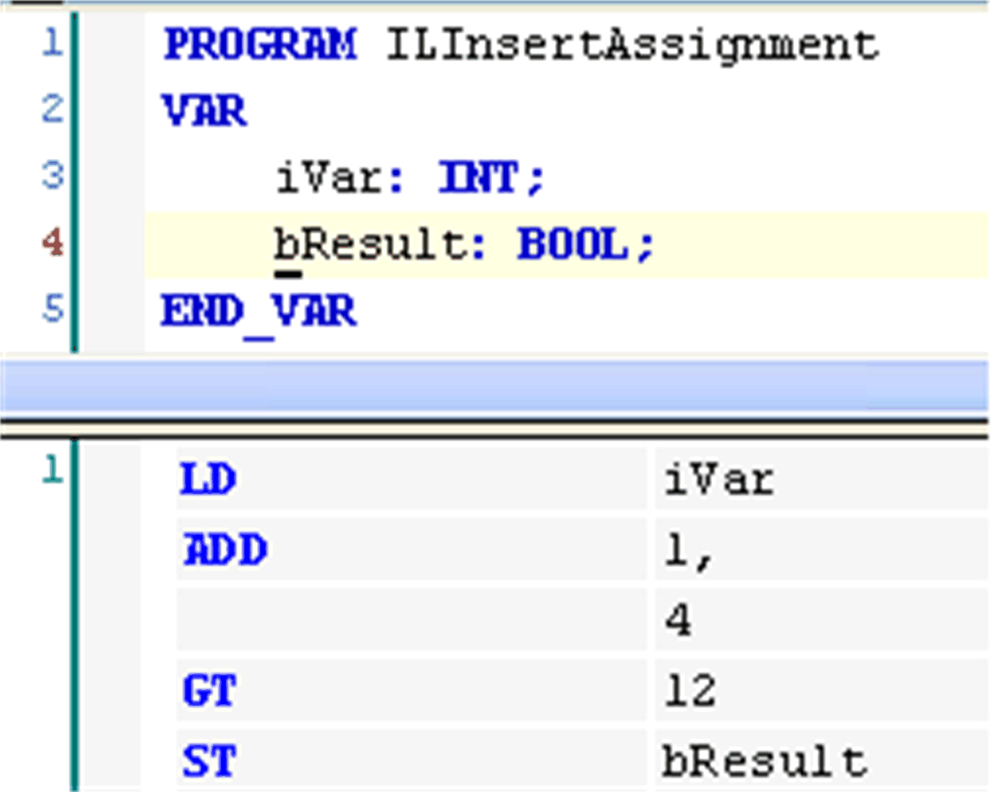

# Insert Assignment

## Overview

Shortcut: CTRL + A

The FBD/LD/IL > Insert Assignment command is used to place an assignment in an LD, FBD, or IL editor.

Depending on the selected [position](../../../../../api/crossBook?lang=en-US&virtualBookName=SoMProg&topicID=D_SE_0083469), insertion takes place directly in front of a selected input (cursor position 2), directly after a selected output (cursor position 4) or - if a whole network or subnetwork is selected - at the end of the network or subnetwork (cursor position 6 or 11).

In FBD, the assignment is inserted as a line followed by `???`. In LD, it is represented by a [coil](../../../../../api/crossBook?lang=en-US&virtualBookName=SoMProg&topicID=D_SE_0083488) and `???`:

To define the assignment, select the `???` and replace it by the name of the variable that is to be assigned. You can use the [input assistant](../../../../../api/crossBook?lang=en-US&virtualBookName=SoMProg&topicID=D_SE_0083549) for this purpose.

In IL, an assignment is programmed via the LD and ST [operators](../../../../../api/crossBook?lang=en-US&virtualBookName=SoMProg&topicID=D_SE_0083466).

## Example

Assignment in IL

NOTE: Concerning the view options for the components of FBD, LD and IL networks, consider the FBD, LD and IL editor options.

EIO0000002860.10