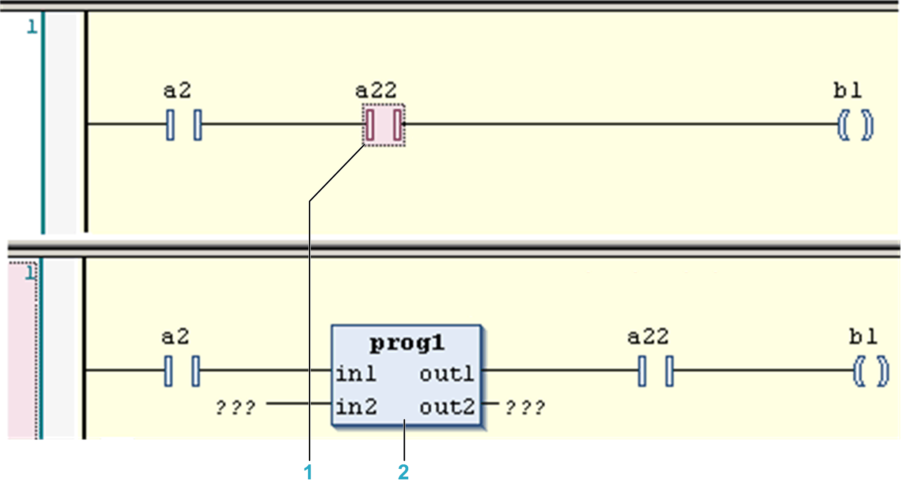
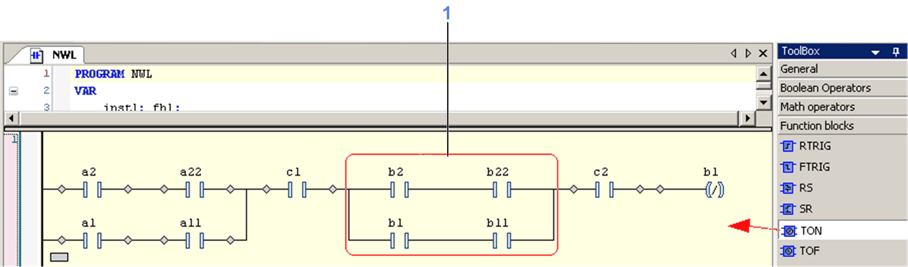
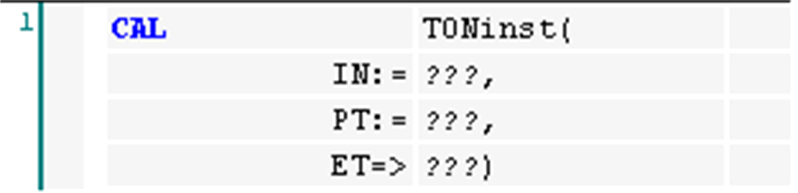

# Insert Box

## Overview

Shortcut: CTRL + B

The FBD/LD/IL > Insert Box command is used to insert a box element into a network for calling an operator, a program, a function block, a function, or an interface.

In the IL editor as far as supported the corresponding instructions will be inserted.

As soon as you choose the command, the Input Assistant [dialog box](../../../../../api/crossBook?lang=en-US&virtualBookName=SoMProg&topicID=D_SE_0083549) will open, providing the appropriate categories of POUs. Select one and confirm with OK to insert the box at the currently selected position in a network or to create the corresponding IL instructions.

Alternatively you can execute the [command](D-SE-0084110.html#D-SE-0084110) Insert Empty Box which allows you to enter the desired box type directly.

A comfortable way to add a box is to drag a box element directly from the [**ToolBox**](../../../../../api/crossBook?lang=en-US&virtualBookName=SoMProg&topicID=D_SE_0083473) or from another position within the editor. Concerning drag-and-drop of elements, refer to the chapter [*Working in the FBD and LD Editor*](../../../../../api/crossBook?lang=en-US&virtualBookName=SoMProg&topicID=D_SE_0083467).

The following paragraphs list the editor-specific characteristics for inserting a box element.

## FBD/LD Editor

Boxes of type program or function block are inserted in line. This has the effect that the processing line will be connected to the uppermost input and output of the inserted POU.

Example: Insert function block in LD

**1** Contact selected.

**2** Program box inserted.

The text within the box shows the box type (for example F\_TRIG) and is [editable](../../../../../api/crossBook?lang=en-US&virtualBookName=SoMProg&topicID=D_SE_0083469). By replacing this text by the type name of another valid module, you can replace the box by another one. An existing box can also be replaced by inserting another one at the same position. Keep in mind that if already inputs have been defined for the previously used box, these will be kept, except the new box has a lower maximum number of inputs. In this case, the last inputs will be deleted accordingly.

If provided with the respective module, and if the [option](D-SE-0084056.html#D-SE-0084056) Show box icon is activated, an icon will be displayed within the box.

Within parallel connections in an LD network, no insert positions will be offered when dragging a box element from the ToolBox. Reason: A POU call (box) needs a direct connection to the power rail.

Example: Insert positions for box element in LD network

**1** No insert positions.

* Boxes with EN/ENO: There is an extra command for inserting a box with EN input and ENO output that is described in the chapter [*Insert Box with EN/ENO*](D-SE-0084109.html#D-SE-0084109).

  NOTE: Consider the following when structuring your program: You cannot add a box element at the inputs of an EN/ENO box. If you want to use the output of a box as input of a box with EN/ENO functionality, you first must write the output to a variable and then enter this variable at the input of the EN/ENO box.
* VAR\_IN\_OUT parameters of an inserted POU box are marked with a bidirectional arrow.
* Function block boxes have an editable field above the box where you have to enter the name of the instance variable. If a box representing the instance of a function block instance gets replaced by inserting another function block type, the instance has to be redefined also. Function block boxes have an editable field above the box where you have to enter the name of the instance variable. If a box representing the instance of a function block instance gets replaced by inserting another function block type, the instance has to be redefined also.
* In functions and function blocks, the formal names of the inputs and outputs are displayed. The main output of the function (return value), however, is displayed without name.
* In case the box interface has been changed, you can update the box parameters (for example, modified number of outputs) by executing the [command](D-SE-0084140.html#D-SE-0084140) Update parameters.

  The update will not be performed automatically.
* Insert positions: The most recently inserted POU will be inserted at the currently selected position.

| If... | Then... |
| --- | --- |
| an input is currently selected ([cursor position 2](../../../../../api/crossBook?lang=en-US&virtualBookName=SoMProg&topicID=D_SE_0083469)) | the box will be inserted before this input.  Its first input and - if applicable - its first output will be linked within the existing branch. |
| an output is currently selected ([cursor position 4](../../../../../api/crossBook?lang=en-US&virtualBookName=SoMProg&topicID=D_SE_0083469)) | the box will be inserted after this output.  Its first input and - if applicable - its first output will be linked within the existing branch. |
| a box is currently selected ([cursor position 3](../../../../../api/crossBook?lang=en-US&virtualBookName=SoMProg&topicID=D_SE_0083469)) | the old element will be replaced by the new POU.  As far as possible, the connections will remain as they were before the replacement. If the old element had more inputs than the new one, then the unattachable branches will be deleted. The same holds true for the outputs. |
| a jump or a return is selected ([cursor position 3](../../../../../api/crossBook?lang=en-US&virtualBookName=SoMProg&topicID=D_SE_0083469)) | the box will be inserted before this jump or return.  Its first input and - if applicable - its first output will be linked within the existing branch. |
| a complete network or subnetwork is selected ([cursor position 6 or 11](../../../../../api/crossBook?lang=en-US&virtualBookName=SoMProg&topicID=D_SE_0083469) | then the box will be inserted following the last element of the network or subnetwork and be linked with its first input.  The output remains unconnected. |

* All box inputs that could not be linked will receive the text `???`. Select and replace this text by the name of the desired constant or variable.
* If there is already a branch to the right of an inserted box, this branch will be assigned to the first output of the box. Otherwise the outputs remain unassigned.

NOTE: Concerning the view options for the components of FBD, LD and IL networks, consider the FBD, LD and IL editor options.

## IL Editor

In IL, a box can also be inserted at any desired line. If you use the Input Assistant with the option Insert with arguments selected, the chosen POU will be displayed in form of a [CAL instruction](../../../../../api/crossBook?lang=en-US&virtualBookName=SoMProg&topicID=D_SE_0083466) and the respective input and output parameters of the chosen box element.

Example: Box inserted in IL

The box `TON` was selected via the Input Assistant. The input parameters are automatically inserted in the following lines and can be defined. In this example, the text `???` in the CAL line has already been replaced by `TONinst` (local instance of `TON`).

Boxes with EN/ENO cannot be inserted in the IL editor.

EIO0000002860.10