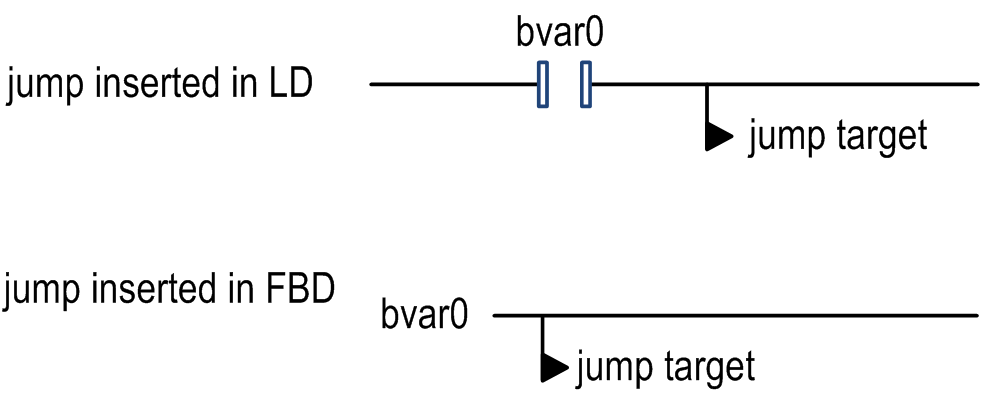
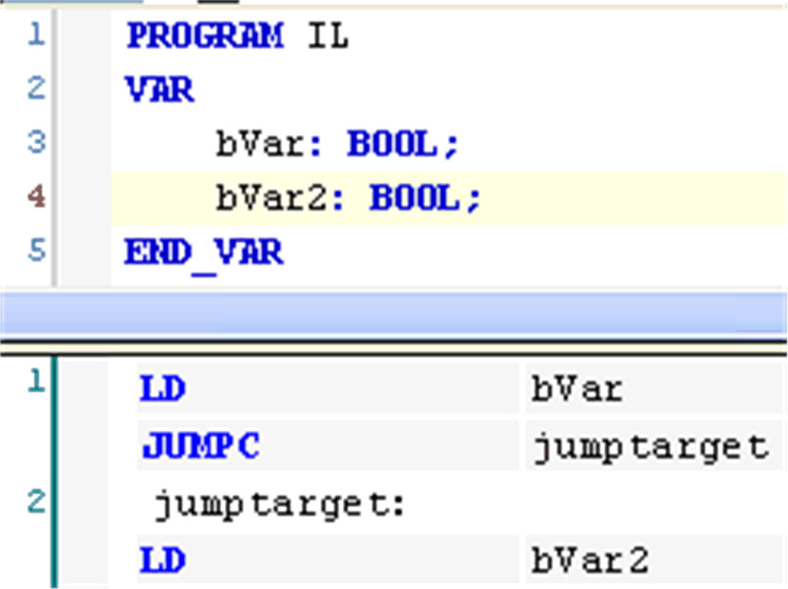
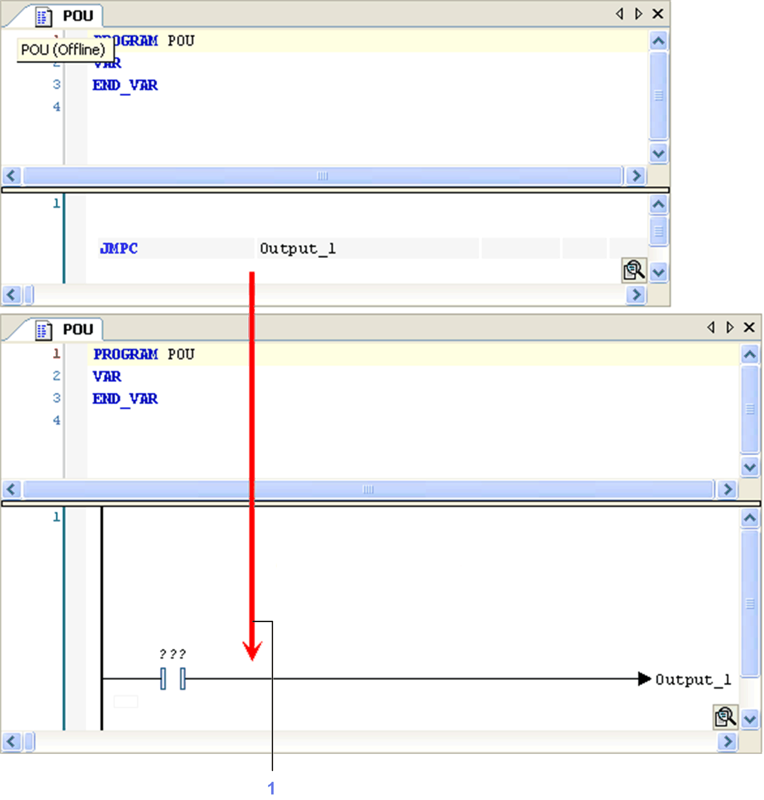

# Insert Jump

## Overview

Shortcut: CTRL + L

The FBD/LD/IL > Insert Jump command inserts a jump. The target of a jump is another network, that is the [label](../../../../../api/crossBook?lang=en-US&virtualBookName=SoMProg&topicID=D_SE_0083477) of that network.

In FBD or LD, depending on the selected [position](../../../../../api/crossBook?lang=en-US&virtualBookName=SoMProg&topicID=D_SE_0083469), insertion takes place directly in front of a selected input (cursor position 2), directly after a selected output (cursor position 4) or - if a whole network or subnetwork is selected - at the end of the network or subnetwork (cursor position 6 or 11).

For an inserted jump, a selection can be made accompanying the entered text `???`, and the jump can be replaced by the name of the label to which it is to be assigned.

In IL, a jump is programmed via the [JMP operator](../../../../../api/crossBook?lang=en-US&virtualBookName=SoMProg&topicID=D_SE_0083466) as shown in the example:

If a JMP operator, that has been inserted in IL without preceding LD, is converted to LD, a dummy operator `???` will be inserted.

Example: Conversion of JMP operator from IL to LD

NOTE: Concerning the view options for the components of FBD, LD and IL networks, consider the FBD, LD and IL editor options.

EIO0000002860.10