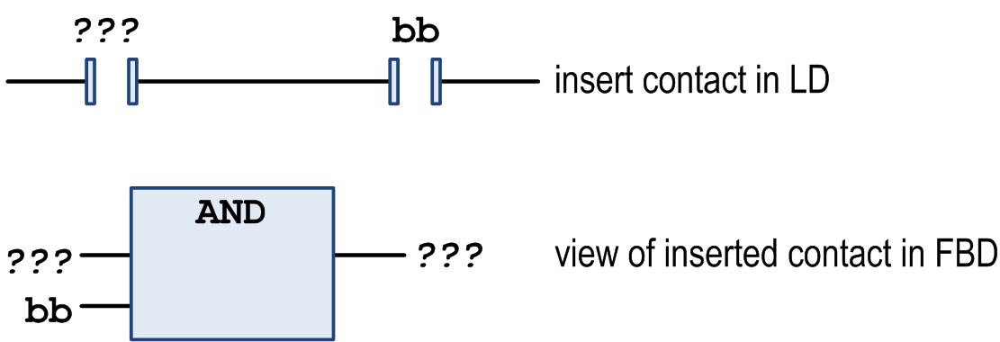
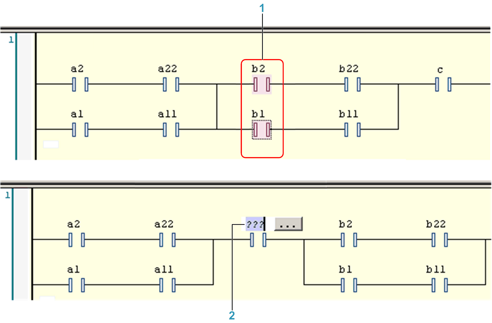

# Insert Contact

## Overview

Shortcut: CTRL + K

The FBD/LD/IL > Insert Contact command inserts a contact in an LD network. It is not available in the FBD and IL editor but will be converted appropriately when switching views.

Insert contact

The new contact will be inserted in line left to the currently selected contact or box. If the cursor position is within an existing parallel connection, the new contact element will also be inserted within.

NOTE: Alternatively, a contact element can be inserted by dragging from the [**ToolBox**](../../../../../api/crossBook?lang=en-US&virtualBookName=SoMProg&topicID=D_SE_0083473) or from another position within the editor. If you do not want to insert it within, but before, behind or between existing parallel connections, use the menu command. For this purpose, select one of the contact elements (multiselection while keeping the CTRL key pressed) in each of the branches of the parallel connection, and then execute the command.

Example

**1** Select `b1` and `b2` while keeping the CTRL key pressed.

**2** Use command **Insert Contact**.

Also refer to the commands [**Insert Contact Right**](D-SE-0084120.html#D-SE-0084120), or [**Insert Contact Parallel Above**](D-SE-0084122.html#D-SE-0084122), [**Insert Contact Parallel below**](D-SE-0084121.html#D-SE-0084121).

A new contact element is preset with the text `???`. Click this text to select it. Replace it by the name or address (depending on the current settings in the Options [dialog box for FBD, LD, and IL editors](D-SE-0084056.html#D-SE-0084056)) of the desired variable or the desired constant. You can use the Input Assistant for this purpose.

NOTE: Concerning the view options for the components of FBD, LD and IL networks, consider the FBD, LD and IL editor options.

EIO0000002860.10