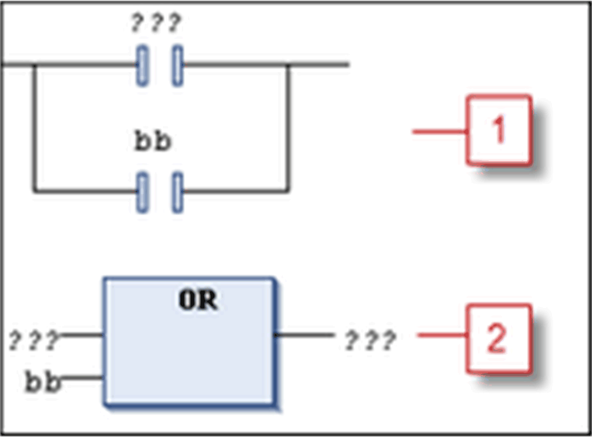

# Insert Contact Parallel Above

## Overview

Shortcut: CTRL + P

The FBD/LD/IL > Insert Contact Parallel Above command inserts a parallel contact above the currently marked position in the network (parallel connection). The command is not available in the FBD and IL editor but will be converted appropriately when switching views.

The contact is preset with the text `???`. You can click this text and change it to the name or address (depends on the settings in the Options [dialog box for FBD, LD, and IL editors](D-SE-0084056.html#D-SE-0084056)) of the desired variable or the desired constant. You can also use the Input Assistant for this purpose.

Parallel contact

**1** Inserting a parallel contact in LD (the selected position was contact `bb`)

**2** View of the inserted parallel contact in FBD

NOTE: Concerning the view options for the components of FBD, LD and IL networks, consider the FBD, LD and IL editor options.

You can program closed parallel branches in an LD network as short circuit evaluation (SCE) or OR constructs. SCE branches are displayed with double vertical lines, OR branches are displayed with single vertical lines. Also refer to the description of the [*Parallel Branch*](../../../../../api/crossBook?lang=en-US&virtualBookName=SoMProg&topicID=D_SE_0083481).

EIO0000002860.10