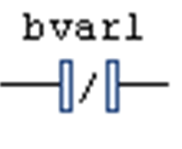

# Negation

## Overview

Shortcut: CTRL + N

The FBD/LD/IL > Negation command is used in FBD or LD to toggle the negation of an input, an output, a jump or a `RETURN` instruction. It is not available in the IL editor, where the corresponding modifiers have to be used appropriately.

NOTE: If the view is switched from FBD or LD to IL view and back, it can happen that the negations of some constructs are set back because an unambiguous conversion is not possible.

At boxes, jumps or returns, the symbol for the negation is a small circle at the respective input or output connection.

A negated contact in LD is indicated by a slash in the contact symbol:

To negate a contact or coil, select the element ( [cursor position 8 or 9](../../../../../api/crossBook?lang=en-US&virtualBookName=SoMProg&topicID=D_SE_0083469)) and execute the command. Also consider that the [**ToolBox**](../../../../../api/crossBook?lang=en-US&virtualBookName=SoMProg&topicID=D_SE_0083473) provides negated contact elements for inserting by drag and drop in the Ladder elements group.

To negate an input or output, place the cursor at [cursor position 2 or 4](../../../../../api/crossBook?lang=en-US&virtualBookName=SoMProg&topicID=D_SE_0083469).

To negate a jump or `RETURN` instruction, select the last preceding output ([cursor position 4](../../../../../api/crossBook?lang=en-US&virtualBookName=SoMProg&topicID=D_SE_0083469)).

To cancel the negation of an element, use the same cursor positions and also execute the Negate command.

NOTE: Concerning the view options for the components of FBD, LD and IL networks, consider the FBD, LD and IL editor options.

EIO0000002860.10