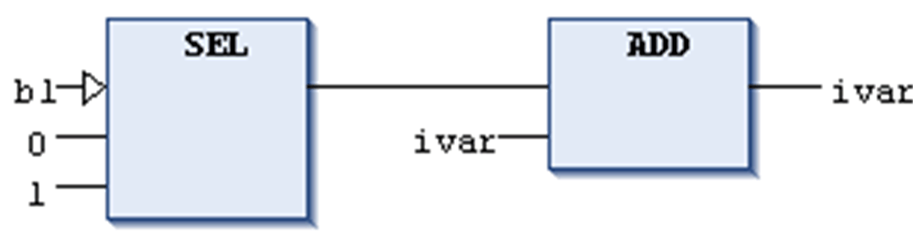

# Edge Detection

## Overview

Shortcut: CTRL + E

The FBD/LD/IL > Edge Detection command is used in FBD or LD to insert an edge detection element at a boolean input. This corresponds to inserting an `R_TRIG` function block for detecting a rising edge (FALSE -> TRUE) or an `F_TRIG` function block for detecting a falling edge (TRUE -> FALSE).

When the command is performed repeatedly at the same insert position, the inserted element will toggle between rising edge detection, falling edge detection and none.

Example: edge detection at `SEL` operator

In this example, an edge detection element has been inserted when the first input (`b1`) of the `SEL` box was selected. The `SEL` operator will have output `1` each time a rising edge is detected at its input.

The command is not available in the IL editor. A network containing an edge detection will be kept unmodified after conversion from FBD/LD to IL.

NOTE: Concerning the view options for the components of FBD, LD and IL networks, consider the FBD, LD and IL editor options.

EIO0000002860.10