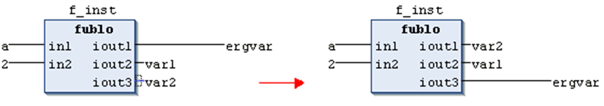

# Set Output Connection

## Overview

Shortcut: CTRL + W

The FBD/LD/IL > Set Output Connection command can be used in FBD or LD with boxes which have multiple outputs to determine the output which should be connected to the network processing line.

Keep in mind the shift of the output assignments in case of changing the output connection.

Example: set output connection at `out3`

NOTE: Concerning the view options for the components of FBD, LD and IL networks, consider the FBD, LD and IL editor options.

EIO0000002860.10