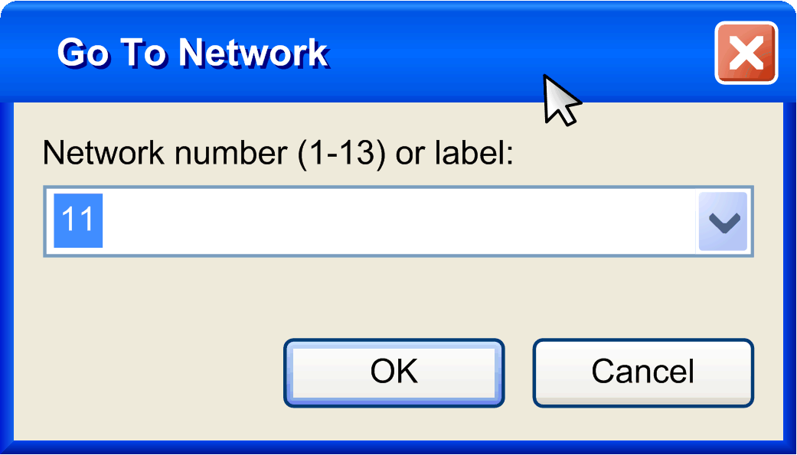

# Go to...

## Presentation

The FBD/LD/IL > Go to... command is available when a FBD, LD or IL network is focused. It opens the dialog box Go To Network, where you can enter the number of the network to which you want to go. Alternatively, you can type or select from the list the label of the network.

EIO0000002860.10