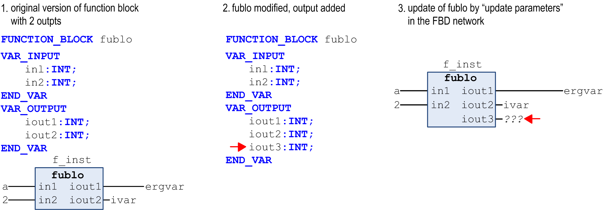

# Update Parameters

## Overview

Shortcut: CTRL + U

The FBD/LD/IL > Update Parameters command can be used in FBD, LD, or IL editor to update the parameters (inputs, outputs) of a box, which is already inserted in a network, after having changed its interface, for example by adding an output.

The already defined connections of inputs and outputs remain unchanged. If an input or output is added, this will get the text `???` and can be assigned.

Example: update parameters

EIO0000002860.10