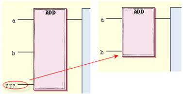

# Remove Unused FB Call Parameters

## Overview

The FBD/LD/IL > Remove Unused FB Call Parameters command is available only for implementation in FBD. Its execution removes the unassigned entries or exits of the function block box focused. Unassigned means those entries or exits whose assignments are empty or marked by `???`. However, the minimum number of necessary in- or outputs of the box will be maintained.

The figure illustrates how an unused entry is removed:

EIO0000002860.10